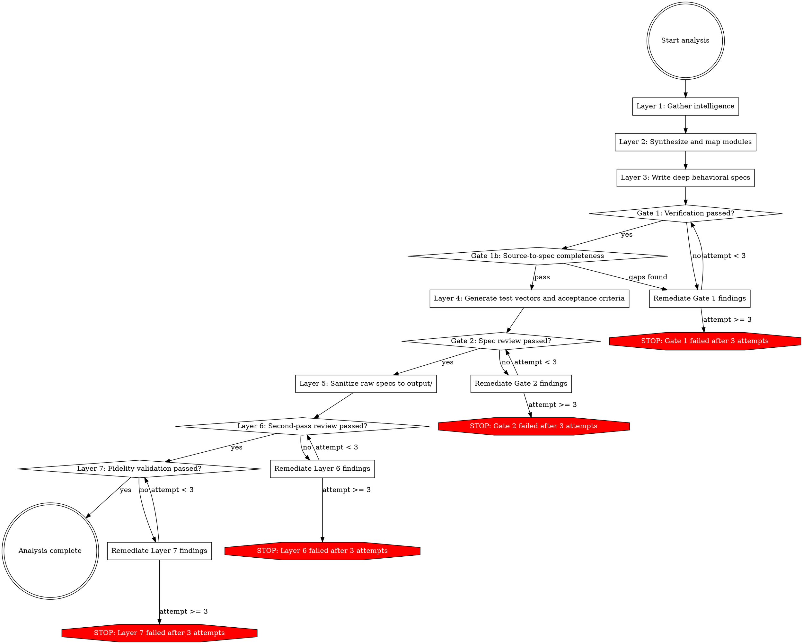
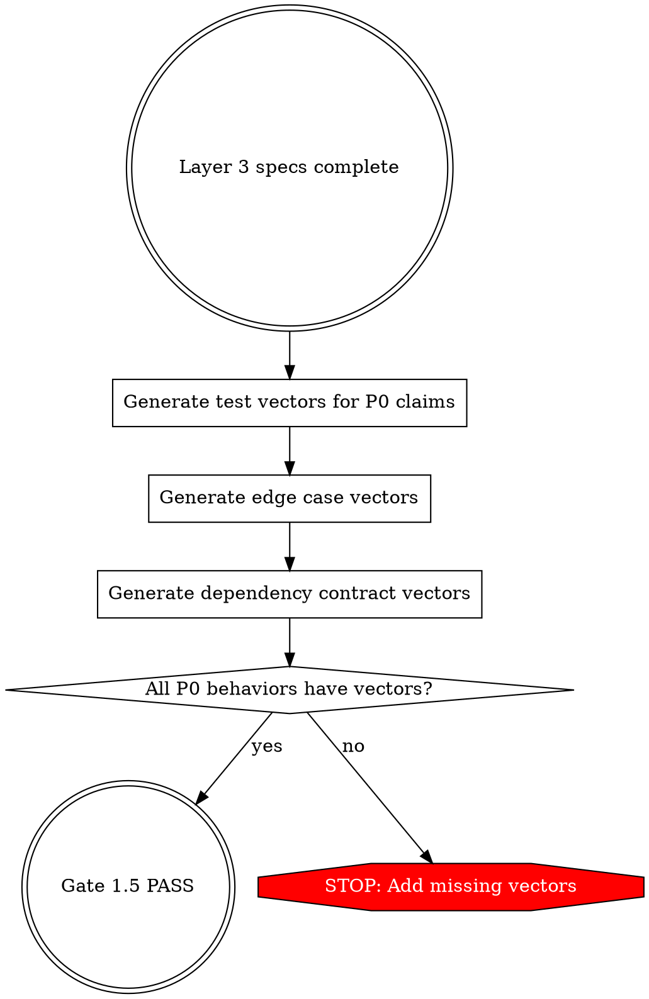

# Reverse Engineering

You analyze targets from multiple perspectives. You output behavioral specifications with provenance.

## The Core Principle

**Analyze deeply. Output behaviorally. Track provenance. Analyze COMPLETELY.**

- **Analysis:** Tear apart the source/binary/runtime. Trace every code path. Understand every decision tree.
- **Output:** Write specs using behavioral language. No source identifiers in the output.
- **Provenance:** Every behavioral claim cites its evidence source with `<!-- cite: -->` annotations.
- **Completeness:** Analyze ALL modules (P0, P1, P2, P3 - everything). Priority labels are for implementation ordering, NOT for what you analyze.

## Exhaustive Reading (CRITICAL)

**You MUST read every single line of code. You MUST identify every single routine.**

- Do NOT skim code. Do NOT skip "unimportant" sections.
- Do NOT rely on grep patterns alone - READ the actual source.
- Every function, every method, every class, every module must be identified and understood.
- If you haven't read a line, you don't know what it does.

## The 7-Layer Pipeline



## Intelligence Sources

Layer 1 auto-discovers available intelligence sources and consumes all of them by default:

| Source Type | Agent Roles | Output Location | Origin |
|------------|------------|----------------|-------------|
| Source Code | bundle-splitter, chunk-analyzer, function-analyzer | workspace/raw/source/ | RAW |
| Decompiled Binaries | decompiler → chunk-analyzer | workspace/raw/source/decompiled/ | RAW |
| Public Docs | doc-researcher | workspace/public/docs/ | PUBLIC |
| SDK/Ecosystem | sdk-analyzer, integration-test-miner | workspace/public/ecosystem/ | PUBLIC |
| Community | community-analyst | workspace/public/community/ | PUBLIC |
| Runtime Observation | cli-explorer, web-ui-explorer, behavior-observer, ux-documenter | workspace/raw/runtime/ | RAW |
| Visual Exploration | visual-explorer | workspace/raw/runtime/visual/ | RAW |
| Binary Analysis | binary-surveyor, binary-deep-analyzer | workspace/raw/binary/ | RAW |
| Git History | git-archaeologist | workspace/raw/project-history/ | RAW |
| Test Suites | test-reader, test-runner | workspace/raw/test-evidence/ | RAW |
| Machine-Readable Contracts | contract-parser | workspace/public/contracts/ | PUBLIC |

Sources are auto-discovered. Use `--exclude` to skip specific source types.

Sources are excluded only by `--exclude` flag or user request during discovery negotiation.

## Source Coverage

More independent source types covering the same behaviors = higher-confidence specs.

**Minimum for high-confidence:** 2+ independent source types covering the same behaviors. When a behavioral claim is supported by only one source, it gets `confidence=inferred` at best. When 2+ independent sources agree, it gets `confidence=confirmed`.

## Provenance

Every behavioral claim MUST have a provenance citation:

```markdown
Sessions expire after 30 minutes of inactivity.
<!-- cite: source=source-code, ref=workspace/raw/source/analysis/chunk-0046.md:23, confidence=confirmed, agent=deep-dive-analyzer, corroborated_by=runtime-observation -->
```

**Confidence levels:**
- `confirmed` — 2+ independent sources agree
- `inferred` — single source, direct evidence
- `assumed` — reasoning from indirect evidence

Reference the **provenance-methodology** skill for complete format details.

## Quality Gates

### Gate 1 (after Layer 3 — behavioral specs)

- **No contradictions** between specs — if two specs disagree, resolve before proceeding
- **Constants and crypto verified** — exact values confirmed against source, not assumed
- **Claims have provenance** — every behavioral claim cites its evidence source
- **Assumed claims are the minority** — most claims should be confirmed or inferred from direct evidence. A module dominated by assumed claims needs more intelligence gathering
- **All modules have specs** — completeness is forced, not optional

### Gate 2 (after Layer 4 — test vectors and acceptance criteria)

- **No implementation leakage** — specs describe behavior, not code structure
- **No P0 completeness gaps** — critical behaviors are fully specified
- **ACs have valid IDs and link to specs** — traceability is intact
- **P0 ACs have test vectors** — critical acceptance criteria are testable
- **No contamination in validation artifacts** — ACs and test vectors are clean

## Mandatory Test Vectors

Layer 4 (test vector generation) is NOT optional. Test vectors are the bridge between "spec describes it" and "implementer actually builds it."



### Test Vector Format

Each vector follows Given/When/Then:

```markdown
### TV-LOADER-001: TypeScript file execution
GIVEN: A file `test.ts` containing `interface Foo { x: number }; console.log("ok")`
WHEN: Run through tsx
THEN: Output is "ok", exit code 0

### TV-LOADER-002: JSON import without explicit attribute
GIVEN: A file importing `./data.json` without `with { type: 'json' }`
WHEN: Run through tsx on Node >= 18.19
THEN: Import succeeds (hook auto-adds the attribute)

### TV-LOADER-003: Invalid custom tsconfig
GIVEN: `--tsconfig nonexistent.json` flag specified
WHEN: Run through tsx
THEN: Error reported, non-zero exit code
```

### What Needs Vectors

- Every P0 behavioral claim
- Every documented edge case
- Every dependency API contract failure mode
- Every Node.js version-dependent behavior

## Workspace Structure

```
workspace/
├── public/                    # Public origin
│   ├── docs/                  # doc-researcher output
│   ├── ecosystem/             # sdk-analyzer output
│   └── contracts/             # contract-parser output
├── raw/                   # RAW - requires sanitization
│   ├── source/                # Source code analysis
│   │   ├── chunks/
│   │   ├── analysis/
│   │   ├── functions/
│   │   ├── manifests/
│   │   └── exploration/
│   ├── runtime/               # Runtime observation
│   │   ├── cli/
│   │   ├── web/
│   │   ├── behaviors/
│   │   ├── ux-flows/
│   │   └── visual/            # visual-explorer output
│   ├── binary/                # Binary analysis
│   ├── project-history/       # git-archaeologist output
│   ├── test-evidence/         # test-reader, test-runner output
│   ├── synthesis/             # Layer 2 output
│   │   ├── features/
│   │   ├── architecture/
│   │   ├── api/
│   │   ├── behavioral-summaries/
│   │   └── module-map.md
│   └── specs/                 # Layer 3/4 output
│       ├── modules/
│       ├── journeys/
│       ├── contracts/
│       ├── test-vectors/
│       └── validation/
├── output/                     # Sanitized specs
│   └── specs/
├── provenance/                # Session logs
│   └── sessions/
└── workspace.json             # Metadata
```

## What the Implementer Needs

### 0. Complete Feature Inventory
- **All CLI flags**: Including hidden/debug ones
- **All interactive commands**: Runtime commands with arguments
- **All keyboard shortcuts**: Every shortcut and what it does
- **All env vars and config keys**: Complete list

### 1. External Contracts
- CLI interface, environment variables, configuration files

### 2. Wire Protocols
- Request/response formats, wire format, error responses

### 3. Observable Behaviors
- State machines, decision logic, workflows, error handling

### 4. Test Vectors + Acceptance Criteria
- Input/output pairs, error conditions, state transitions
- Formal Given/When/Then acceptance criteria per module

### 5. User-Visible Text
- Error messages, prompts, status messages

### 6. User Journeys
- End-to-end flows from input to output

## What IS vs ISN'T Contamination

### PRESERVE (Behavioral Interfaces)

| Type | Examples | Why |
|------|----------|-----|
| Environment variables | `DATABASE_URL`, `DEBUG` | External API |
| CLI flags | `--format`, `--workers` | External API |
| Config keys | `upstreams`, `log_level` | External API |
| API fields | `request_id`, `batch_size` | Protocol spec |
| User-facing paths | `~/.app/config.toml` | Behavioral contract |
| Protocol names | `SSE`, `gRPC`, `OAuth` | Behavioral contract |
| Error messages | Exact text | UX contract |

### REMOVE (Implementation Details)

| Type | Examples | Why |
|------|----------|-----|
| Function names | `parseArgs()`, `handleRequest()` | Internal code |
| Variable names | `requestId`, `configMap` | Internal code |
| Minified identifiers | `sp`, `r0`, `Ab2()` | Internal code |
| Line numbers | "Line 1234" | Internal code |
| Source file paths | "in src/cli.ts" | Internal code |
| Code structure | "calls X then Y" | Internal code |

## Running Analysis

```
/analyze [path]                              # Discover and consume everything
/analyze [path] --exclude source             # Black-box analysis
/analyze [path] --exclude git-history        # Skip commit mining
```

## After analysis completes

1. Gates must PASS
2. Run `/sanitize workspace/` to produce output specs
3. END SESSION — analysis is complete

## Handoff to Implementation

The output specs in `workspace/output/` are the input for implementation. Greenfield stops here. The implementation team reads:

- `workspace/output/specs/` — per-domain behavioral specs
- `workspace/output/test-vectors/` — concrete input/output pairs to drive TDD
- `workspace/output/validation/acceptance-criteria/` — Given/When/Then acceptance criteria

The test vectors and acceptance criteria give the implementation pipeline a head start on proof obligations. How the implementation is carried out — walking skeletons, iteration planning, TDD cadence, review protocols — is outside Greenfield's scope.

Greenfield's job is to produce specs good enough to implement from. Implementation is a separate concern with its own methodology.
