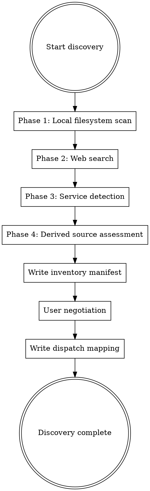

# Autonomous Discovery

Discover and inventory every intelligence source available for the target product. Produce a manifest that downstream agents use to plan their analysis.

## The Core Principle

**Find everything. Catalog it. Ask the user what you missed.**

Discovery is the first thing that runs in Layer 1. Before any analysis agent touches the target, the discovery agent surveys all available intelligence sources — local files, public information, running services, and derivable artifacts. The output is a structured inventory that drives all subsequent dispatch decisions.

## When This Skill Applies

This skill is loaded by `analyzer` agents dispatched with the `discovery-agent` role. It runs once at the start of Layer 1, before any analysis mode agents are dispatched.

## Four-Phase Discovery



---

## Phase 1: Local Filesystem Scan

Survey the target path and its surrounding context. Read directory structures, detect file types, and catalog everything that could feed analysis.

### 1.1 Source Code Detection

Detect source code by file extension. Do not assume a single language — multi-language projects are common.

| Language Family | Extensions |
|----------------|------------|
| JavaScript/TypeScript | `.js`, `.jsx`, `.ts`, `.tsx`, `.mjs`, `.cjs`, `.mts`, `.cts` |
| Python | `.py`, `.pyx`, `.pxd`, `.pyi` |
| Rust | `.rs` |
| Go | `.go` |
| Java/Kotlin | `.java`, `.kt`, `.kts` |
| C/C++ | `.c`, `.h`, `.cpp`, `.hpp`, `.cc`, `.hh`, `.cxx`, `.hxx` |
| C# | `.cs`, `.csx` |
| Ruby | `.rb`, `.rake`, `.gemspec` |
| Swift | `.swift` |
| PHP | `.php` |
| Elixir/Erlang | `.ex`, `.exs`, `.erl`, `.hrl` |
| Scala | `.scala`, `.sc` |
| Dart | `.dart` |
| Lua | `.lua` |
| Shell | `.sh`, `.bash`, `.zsh`, `.fish` |
| Zig | `.zig` |

```bash
# Count source files by extension
find "$TARGET_PATH" -type f \( \
  -name "*.js" -o -name "*.ts" -o -name "*.jsx" -o -name "*.tsx" \
  -o -name "*.py" -o -name "*.rs" -o -name "*.go" \
  -o -name "*.java" -o -name "*.kt" -o -name "*.c" -o -name "*.cpp" \
  -o -name "*.cs" -o -name "*.rb" -o -name "*.swift" -o -name "*.php" \
  -o -name "*.ex" -o -name "*.scala" -o -name "*.dart" \
  -o -name "*.sh" -o -name "*.lua" -o -name "*.zig" \
\) | sed 's/.*\.//' | sort | uniq -c | sort -rn
```

Record the primary language (most files), secondary languages, and total source file count.

### 1.2 Binary Detection

Identify compiled artifacts by magic bytes and file extension.

| Binary Type | Detection Method |
|-------------|-----------------|
| ELF (Linux native) | `file` output contains "ELF" |
| Mach-O (macOS native) | `file` output contains "Mach-O" |
| PE (Windows native) | `file` output contains "PE32" or "PE32+" |
| JVM (`.jar`, `.war`, `.class`) | Extension + `file` confirms "Java archive" or "compiled Java" |
| .NET (`.dll`, managed `.exe`) | `file` output contains "Mono/.Net assembly" or PE with IL metadata |
| Python bytecode (`.pyc`, `.pyo`) | Extension + magic number check |
| WebAssembly (`.wasm`) | Extension + `file` confirms "WebAssembly" |
| Electron/ASAR | `.asar` extension |

```bash
# Find binaries by magic
find "$TARGET_PATH" -type f \( \
  -name "*.jar" -o -name "*.war" -o -name "*.class" \
  -o -name "*.dll" -o -name "*.exe" -o -name "*.so" -o -name "*.dylib" \
  -o -name "*.pyc" -o -name "*.pyo" \
  -o -name "*.wasm" -o -name "*.asar" \
\) 2>/dev/null | head -50

# For extensionless binaries, check file type on executables
find "$TARGET_PATH" -type f -perm +111 ! -name "*.*" -exec file {} \; 2>/dev/null | \
  grep -E "ELF|Mach-O|PE32" | head -20
```

### 1.3 Test Suite Detection

Detect test infrastructure by directory conventions and framework markers.

#### Directory Conventions

| Pattern | Likely Framework |
|---------|-----------------|
| `__tests__/` | Jest (JavaScript) |
| `test/`, `tests/` | Generic (any language) |
| `spec/`, `specs/` | RSpec (Ruby), Jasmine (JS) |
| `*_test.go` files | Go testing |
| `test_*.py`, `*_test.py` files | pytest |
| `cypress/`, `cypress.config.*` | Cypress |
| `e2e/`, `playwright.config.*` | Playwright |
| `integration/` | Integration test suite |
| `fixtures/`, `cassettes/` | Test fixtures / HTTP recordings |

#### Framework Markers

Check build/config files for test framework dependencies:

```bash
# JavaScript: package.json
grep -l '"jest"\|"vitest"\|"mocha"\|"ava"\|"tap"\|"playwright"\|"cypress"\|"@testing-library"' \
  "$TARGET_PATH"/package.json "$TARGET_PATH"/*/package.json 2>/dev/null

# Python: pyproject.toml, setup.cfg, tox.ini, pytest.ini
grep -rl "pytest\|unittest\|nose2\|tox" \
  "$TARGET_PATH"/pyproject.toml "$TARGET_PATH"/setup.cfg \
  "$TARGET_PATH"/tox.ini "$TARGET_PATH"/pytest.ini 2>/dev/null

# Ruby: Gemfile
grep -l "rspec\|minitest\|cucumber" "$TARGET_PATH"/Gemfile 2>/dev/null

# Java/Kotlin: pom.xml, build.gradle
grep -l "junit\|testng\|mockito\|spock" \
  "$TARGET_PATH"/pom.xml "$TARGET_PATH"/build.gradle "$TARGET_PATH"/build.gradle.kts 2>/dev/null

# Rust: look for #[cfg(test)] or #[test] in source
grep -rl '#\[cfg(test)\]\|#\[test\]' "$TARGET_PATH"/src/ 2>/dev/null | head -5

# Go: look for _test.go files
find "$TARGET_PATH" -name "*_test.go" | head -5

# C#: look for test project patterns
find "$TARGET_PATH" -name "*.csproj" -exec grep -l "Microsoft.NET.Test.Sdk\|xunit\|nunit\|MSTest" {} \; 2>/dev/null
```

Record: framework name, estimated test count (file count), test types present (unit, integration, e2e).

### 1.4 Documentation Detection

```bash
# README files
find "$TARGET_PATH" -maxdepth 2 -iname "readme*" -type f 2>/dev/null

# Documentation directories
find "$TARGET_PATH" -maxdepth 2 -type d \( \
  -iname "docs" -o -iname "doc" -o -iname "documentation" \
  -o -iname "wiki" -o -iname "guide" -o -iname "guides" \
\) 2>/dev/null

# Generated documentation
find "$TARGET_PATH" -maxdepth 3 -type d \( \
  -iname "javadoc" -o -iname "typedoc" -o -iname "rustdoc" \
  -o -iname "godoc" -o -iname "apidoc" -o -iname "_build" \
  -o -iname "site" \
\) 2>/dev/null

# Man pages
find "$TARGET_PATH" -name "*.1" -o -name "*.5" -o -name "*.8" 2>/dev/null | head -10

# Changelog / release notes
find "$TARGET_PATH" -maxdepth 2 -iname "changelog*" -o -iname "changes*" \
  -o -iname "release-notes*" -o -iname "history*" 2>/dev/null
```

### 1.5 Configuration and Build Files

| Category | Files |
|----------|-------|
| Package manifests | `package.json`, `Cargo.toml`, `go.mod`, `pyproject.toml`, `setup.py`, `Gemfile`, `pom.xml`, `build.gradle`, `*.csproj`, `Package.swift`, `pubspec.yaml`, `mix.exs`, `composer.json` |
| Build systems | `Makefile`, `CMakeLists.txt`, `Dockerfile`, `docker-compose.yml`, `Justfile`, `Taskfile.yml`, `Rakefile`, `BUILD`, `WORKSPACE` (Bazel) |
| CI/CD | `.github/workflows/`, `.gitlab-ci.yml`, `.circleci/`, `Jenkinsfile`, `.travis.yml`, `azure-pipelines.yml`, `bitbucket-pipelines.yml` |
| Linting/formatting | `.eslintrc*`, `.prettierrc*`, `rustfmt.toml`, `.flake8`, `.rubocop.yml`, `.editorconfig` |
| Env/config | `.env`, `.env.example`, `*.config.js`, `*.config.ts`, `config/`, `settings/` |

```bash
# Package manifests
find "$TARGET_PATH" -maxdepth 2 \( \
  -name "package.json" -o -name "Cargo.toml" -o -name "go.mod" \
  -o -name "pyproject.toml" -o -name "setup.py" -o -name "Gemfile" \
  -o -name "pom.xml" -o -name "build.gradle" -o -name "*.csproj" \
  -o -name "Package.swift" -o -name "pubspec.yaml" -o -name "mix.exs" \
  -o -name "composer.json" \
\) -type f 2>/dev/null

# Build/CI files
find "$TARGET_PATH" -maxdepth 3 \( \
  -name "Makefile" -o -name "Dockerfile" -o -name "docker-compose.yml" \
  -o -name "docker-compose.yaml" -o -name "Justfile" \
  -o -name "Jenkinsfile" -o -name ".gitlab-ci.yml" \
  -o -name ".travis.yml" \
\) -type f 2>/dev/null

find "$TARGET_PATH" -maxdepth 3 -path "*/.github/workflows/*.yml" -type f 2>/dev/null
```

### 1.6 Machine-Readable Contracts

| Contract Type | File Patterns |
|---------------|--------------|
| OpenAPI / Swagger | `openapi.json`, `openapi.yaml`, `swagger.json`, `swagger.yaml`, `*.openapi.*` |
| GraphQL | `schema.graphql`, `*.graphql`, `*.gql`, `schema.gql` |
| Protocol Buffers | `*.proto` |
| JSON Schema | `*.schema.json`, files containing `"$schema"` |
| gRPC service definitions | `*.proto` containing `service` keyword |
| AsyncAPI | `asyncapi.json`, `asyncapi.yaml` |
| WSDL | `*.wsdl` |
| TypeScript declarations | `*.d.ts` (especially in `types/` or `@types/`) |

```bash
# API contracts
find "$TARGET_PATH" -type f \( \
  -name "openapi.*" -o -name "swagger.*" \
  -o -name "*.graphql" -o -name "*.gql" \
  -o -name "*.proto" \
  -o -name "*.schema.json" \
  -o -name "asyncapi.*" -o -name "*.wsdl" \
\) 2>/dev/null

# TypeScript declarations (type contracts)
find "$TARGET_PATH" -name "*.d.ts" -not -path "*/node_modules/*" 2>/dev/null | head -20
```

### 1.7 Version Control

```bash
# Git repository detection
if [ -d "$TARGET_PATH/.git" ]; then
  echo "Git repository detected"

  # Commit count and history span
  git -C "$TARGET_PATH" rev-list --count HEAD 2>/dev/null
  git -C "$TARGET_PATH" log --format="%ai" --reverse | head -1  # first commit
  git -C "$TARGET_PATH" log --format="%ai" -1                   # latest commit

  # Branch count
  git -C "$TARGET_PATH" branch -a --list 2>/dev/null | wc -l

  # Remote platform detection
  REMOTE_URL=$(git -C "$TARGET_PATH" remote get-url origin 2>/dev/null)
  echo "$REMOTE_URL" | grep -oE "github\.com|gitlab\.com|bitbucket\.org|codeberg\.org|sr\.ht" || echo "Unknown platform or no remote"

  # Contributors
  git -C "$TARGET_PATH" shortlog -sn --no-merges HEAD 2>/dev/null | head -10

  # Tags (releases)
  git -C "$TARGET_PATH" tag --list 2>/dev/null | tail -10
fi
```

---

## Phase 2: Web Search

Search the public internet for information about the target product. This phase requires knowing the product name — extract it from package manifests, README, or the directory name.

### 2.1 Product Identification

Before searching, determine the product name and any aliases:

```bash
# From package.json
grep '"name"' "$TARGET_PATH/package.json" 2>/dev/null | head -1

# From Cargo.toml
grep '^name\s*=' "$TARGET_PATH/Cargo.toml" 2>/dev/null | head -1

# From pyproject.toml or setup.py
grep 'name\s*=' "$TARGET_PATH/pyproject.toml" 2>/dev/null | head -1

# From go.mod
head -1 "$TARGET_PATH/go.mod" 2>/dev/null

# From README title
head -5 "$TARGET_PATH/README.md" 2>/dev/null | grep -E "^#"

# Fallback: directory name
basename "$TARGET_PATH"
```

### 2.2 Official Documentation

Search for official documentation and API references using WebSearch:

| # | Search Query | Purpose |
|---|-------------|---------|
| 1 | `{product} documentation` | Main docs site |
| 2 | `{product} API reference` | API surface |
| 3 | `{product} getting started` | Setup and first use |
| 4 | `{product} configuration reference` | Config keys, defaults |
| 5 | `{product} CLI reference` | Commands, flags |

Record the documentation site URL and whether it appears comprehensive or sparse.

### 2.3 Package Registry Entries

Search relevant package registries based on the languages detected in Phase 1:

| Registry | URL Pattern |
|----------|------------|
| npm | `https://www.npmjs.com/package/{name}` |
| PyPI | `https://pypi.org/project/{name}` |
| crates.io | `https://crates.io/crates/{name}` |
| Maven Central | `https://search.maven.org/artifact/{group}/{name}` |
| NuGet | `https://www.nuget.org/packages/{name}` |
| RubyGems | `https://rubygems.org/gems/{name}` |
| pkg.go.dev | `https://pkg.go.dev/{module-path}` |
| Hex.pm | `https://hex.pm/packages/{name}` |
| Packagist | `https://packagist.org/packages/{vendor}/{name}` |
| pub.dev | `https://pub.dev/packages/{name}` |

Record: registry URL, version, download count, last publish date.

### 2.4 Community Content

| # | Search Query | Purpose |
|---|-------------|---------|
| 1 | `{product} site:stackoverflow.com` | Community Q&A |
| 2 | `{product} site:github.com issues` | Issue tracker |
| 3 | `{product} tutorial` | Community tutorials |
| 4 | `{product} blog` | Blog posts |

For discovery purposes, you do not need to deeply analyze this content. Record whether each category has substantial results (many hits) or sparse results (few or none). The `doc-researcher` and `community-analyst` agents will do deep extraction later.

### 2.5 Third-Party Libraries and Plugins

| # | Search Query | Purpose |
|---|-------------|---------|
| 1 | `{product} SDK` or `{product} client library` | Official/community SDKs |
| 2 | `{product} plugin` or `{product} extension` | Plugin ecosystem |
| 3 | `{product} integration` | Third-party integrations |

Record: whether an SDK ecosystem exists, approximate size, which languages are covered.

---

## Phase 3: Service Detection

Determine whether the target is a running service or can be started as one.

### 3.1 Port Scanning

If the target appears to be a server (presence of `server`, `listen`, `bind`, `port` in source or config):

```bash
# Check common development ports
for port in 80 443 3000 3001 4000 5000 5173 5432 6379 8000 8080 8443 8888 9090 27017; do
  (echo >/dev/tcp/localhost/$port) 2>/dev/null && echo "Port $port: OPEN"
done
```

### 3.2 Health Endpoints

For any open ports found, probe standard health endpoints:

```bash
for port in $OPEN_PORTS; do
  curl -s -o /dev/null -w "%{http_code}" "http://localhost:$port/health" 2>/dev/null
  curl -s -o /dev/null -w "%{http_code}" "http://localhost:$port/healthz" 2>/dev/null
  curl -s -o /dev/null -w "%{http_code}" "http://localhost:$port/api/health" 2>/dev/null
  curl -s -o /dev/null -w "%{http_code}" "http://localhost:$port/" 2>/dev/null
done
```

### 3.3 Process Detection

```bash
# Check if the target is already running
ps aux | grep -i "$(basename "$TARGET_PATH")" | grep -v grep

# Check for known server processes
ps aux | grep -E "node|python|ruby|java|dotnet|go " | grep -v grep | head -10
```

### 3.4 Container Runtime Availability

```bash
# Docker
docker info >/dev/null 2>&1 && echo "Docker: available" || echo "Docker: not available"
docker ps 2>/dev/null | grep -i "$(basename "$TARGET_PATH")" | head -5

# Podman
podman info >/dev/null 2>&1 && echo "Podman: available" || echo "Podman: not available"

# Docker Compose
docker compose version >/dev/null 2>&1 && echo "Docker Compose: available" || echo "Docker Compose: not available"
```

Record: container runtime available (docker/podman/none), existing containers related to the target, whether docker-compose.yml or similar exists.

---

## Phase 4: Derived Source Assessment

Assess what additional intelligence sources can be created from what already exists.

### 4.1 Minified Code Recovery

If Phase 1 found minified JavaScript bundles (few lines, many bytes per file):

| Source | Derived Artifact | Method | Quality |
|--------|-----------------|--------|---------|
| Minified `.js` | Beautified source | `js-beautify` | Lossless formatting recovery |
| `.js.map` source maps | Original source | Source map extraction | Near-original if maps are present |
| Minified CSS | Beautified CSS | `css-beautify` | Lossless formatting recovery |

```bash
# Check for source maps
find "$TARGET_PATH" -name "*.js.map" -o -name "*.css.map" 2>/dev/null | head -10

# Check if JS files reference source maps
grep -rl "sourceMappingURL" "$TARGET_PATH" --include="*.js" 2>/dev/null | head -10
```

### 4.2 Binary Decompilation Potential

Based on binaries found in Phase 1, assess decompilation feasibility:

| Binary Type | Decompilation Quality | Tool Required |
|-------------|----------------------|---------------|
| JVM (`.jar`, `.class`) | Very high (near-source) | CFR, Procyon, FernFlower |
| .NET (managed `.dll`) | Very high (near-source) | ILSpy (`ilspycmd`) |
| Python (`.pyc`) | Very high (near-source) | uncompyle6, decompyle3 |
| Electron (`.asar`) | Lossless (bundled source) | `npx asar extract` |
| WebAssembly (`.wasm`) | Limited (WAT text format) | `wasm2wat` |
| Native ELF/Mach-O/PE | Low (disassembly only) | Ghidra, radare2 |

### 4.3 Bundle Splitting Potential

If webpack, esbuild, rollup, or parcel bundles are detected:

```bash
# Detect bundler
head -50 "$TARGET_PATH"/dist/*.js 2>/dev/null | grep -oE "webpack|esbuild|rollup|parcel" | head -1

# Check for multiple entry points
find "$TARGET_PATH" -path "*/dist/*" -name "*.js" -not -name "*.min.js" 2>/dev/null | wc -l
```

### 4.4 Database Schema Extraction

If database files or migration directories exist:

```bash
# SQL migrations
find "$TARGET_PATH" -type d -name "migrations" -o -name "migrate" 2>/dev/null
find "$TARGET_PATH" -name "*.sql" 2>/dev/null | head -10

# ORM schema files
find "$TARGET_PATH" -name "schema.prisma" -o -name "schema.rb" 2>/dev/null
find "$TARGET_PATH" -path "*/models/*.py" -o -path "*/entities/*.ts" 2>/dev/null | head -10

# SQLite databases
find "$TARGET_PATH" -name "*.db" -o -name "*.sqlite" -o -name "*.sqlite3" 2>/dev/null | head -5
```

---

## Inventory Manifest

After all four phases complete, write the inventory to `workspace/inventory.md`.

### Format

```markdown
# Intelligence Source Inventory

## Metadata
- **Target:** {product name}
- **Target path:** {absolute path}
- **Discovery agent:** discovery-agent
- **Date:** {ISO 8601}
- **Phases completed:** 1, 2, 3, 4

---

## Source Code

| Language | File Count | Location | Analytical Value |
|----------|-----------|----------|-----------------|
| TypeScript | 247 | src/ | PRIMARY — main application logic |
| JavaScript | 34 | scripts/, config/ | SUPPORTING — build and config |
| ... | ... | ... | ... |

## Binaries

| Type | Count | Location | Decompilation Potential |
|------|-------|----------|------------------------|
| ... | ... | ... | ... |

## Test Suites

| Framework | Type | File Count | Location |
|-----------|------|-----------|----------|
| Jest | unit | 89 | __tests__/ |
| Playwright | e2e | 12 | e2e/ |
| ... | ... | ... | ... |

## Documentation

| Type | Location | Notes |
|------|----------|-------|
| README | ./README.md | 450 lines, comprehensive |
| API docs | docs/api/ | Generated TypeDoc |
| ... | ... | ... |

## Configuration and Build

| File | Purpose |
|------|---------|
| package.json | Node.js manifest, scripts, dependencies |
| Dockerfile | Container build definition |
| ... | ... |

## Machine-Readable Contracts

| Type | File | Notes |
|------|------|-------|
| OpenAPI 3.0 | api/openapi.yaml | 2400 lines, comprehensive |
| GraphQL schema | schema.graphql | 180 types |
| ... | ... | ... |

## Version Control

| Property | Value |
|----------|-------|
| VCS | git |
| Commits | 1,847 |
| Branches | 12 |
| Tags/releases | 34 |
| Remote platform | GitHub |
| Contributors | 8 |
| History span | 2021-03-15 to 2024-11-20 |

## Public Information (Web Search)

| Category | Availability | Notes |
|----------|-------------|-------|
| Official docs | Yes — docs.example.com | Comprehensive API reference |
| Package registry | npm — 45k weekly downloads | Active maintenance |
| Community Q&A | ~120 Stack Overflow questions | Moderate community |
| Tutorials | 8+ blog posts found | Several recent |
| Third-party SDKs | 3 community libraries (Python, Go, Ruby) | Active ecosystem |
| Plugins/extensions | VS Code extension, 2 CLI plugins | Small plugin ecosystem |

## Running Services

| Port | Service | Health |
|------|---------|--------|
| 3000 | Dev server | 200 OK at /health |
| 5432 | PostgreSQL | Accepting connections |

## Container Runtime

| Runtime | Available | Target Containers |
|---------|-----------|-------------------|
| Docker | Yes | app (running), db (running) |
| Docker Compose | Yes | docker-compose.yml with 3 services |

## Derived Sources (Can Be Created)

| Source | Method | Expected Quality |
|--------|--------|-----------------|
| Beautified dist/main.js | js-beautify | Lossless formatting |
| Source maps → original source | source map extraction | Near-original |
| JVM class files → Java source | CFR decompiler | Very high |
| SQL schema from migrations | Migration replay | Definitive |

---

## Summary

- **Primary intelligence sources:** {list the most valuable sources}
- **Secondary sources:** {supporting sources}
- **Gaps:** {what is missing or unavailable}
- **Recommended analysis modes:** {which modes should run based on what was found}
```

Adapt the tables to match what was actually found. Omit sections that have no entries (e.g., if there are no binaries, omit the Binaries table). Do not fabricate entries.

---

## User Negotiation

After writing the inventory manifest, present it to the user and ask:

> Here is what I found. The inventory is at `workspace/inventory.md`.
>
> **Key findings:**
> - {summary of most significant sources}
> - {notable gaps or surprises}
>
> **Recommended analysis modes:** {modes}
>
> Two questions:
> 1. **Is there anything else I should look at?** Other repositories, deployed instances, internal documentation, API keys for authenticated endpoints, etc.
> 2. **Is anything off-limits?** Files, directories, or services I should NOT analyze (proprietary dependencies, third-party code you don't own, production databases, etc.).

Wait for the user's response. Update `workspace/inventory.md` with any additions or exclusions they provide. Mark excluded items clearly:

```markdown
## Exclusions (User-Specified)

| Item | Reason |
|------|--------|
| vendor/ | Third-party code, not owned |
| .env | Contains production secrets |
```

---

## Dispatch Mapping

After the inventory is finalized (including user feedback), write a dispatch mapping table to the end of `workspace/inventory.md`. This table tells the orchestrator which agent roles and skills to assign to each source type.

```markdown
## Dispatch Mapping

| Source Type | Agent Role | Skill | Priority | Input Path |
|-------------|-----------|-------|----------|------------|
| Source code (structured) | chunk-analyzer, function-analyzer | source-analysis | P0 | src/ |
| Source code (bundled/minified) | bundle-splitter → chunk-analyzer → function-analyzer | source-analysis | P0 | dist/ |
| Official documentation | doc-researcher | doc-research | P0 | (web) docs.example.com |
| Community content | community-analyst | community-intelligence | P1 | (web) search results |
| SDK ecosystem | sdk-analyzer, integration-test-miner | ecosystem-analysis | P1 | (web) npm/PyPI/GitHub |
| Test suites | chunk-analyzer | source-analysis | P0 | __tests__/, e2e/ |
| Runtime (CLI) | cli-explorer | runtime-observation | P1 | container |
| Runtime (Web UI) | web-ui-explorer | runtime-observation | P1 | container |
| Runtime (Behavior) | behavior-observer | runtime-observation | P2 | container |
| Binaries (managed) | binary-surveyor → source-analysis handoff | binary-analysis | P2 | lib/*.jar |
| Binaries (native) | binary-surveyor, binary-deep-analyzer | binary-analysis | P3 | bin/ |
| OpenAPI spec | doc-researcher | doc-research | P0 | api/openapi.yaml |
| GraphQL schema | doc-researcher | doc-research | P0 | schema.graphql |
| Protobuf definitions | doc-researcher | doc-research | P1 | proto/ |
| Derived: beautified bundles | bundle-splitter | source-analysis | P0 | (created from dist/) |
| Derived: decompiled binaries | binary-surveyor → source-analysis | binary-analysis | P2 | (created from binaries) |
```

Adapt this table to the actual sources found. Only include rows for source types that exist in the inventory. Priority levels:

- **P0** — Primary intelligence sources. Analysis cannot proceed without these.
- **P1** — High-value supplementary sources. Significantly improve coverage and confidence.
- **P2** — Useful corroborating sources. Fill gaps and confirm claims from P0/P1 sources.
- **P3** — Low-yield sources. Only analyze if time permits and other sources leave gaps.

---

## Output Structure

```
workspace/
└── inventory.md          # Complete inventory manifest with dispatch mapping
```

The inventory is a single file. It is the first artifact written to the workspace and drives all subsequent agent dispatch decisions.

## Rules

1. **Scan before you search.** Phase 1 (local filesystem) always runs before Phase 2 (web search). Local files are the ground truth about what exists.
2. **Do not analyze, only catalog.** Discovery identifies sources; it does not read or interpret them. That is the job of downstream analysis agents.
3. **Record absence as well as presence.** If there are no tests, no docs, no binaries — say so explicitly. Gaps in the inventory are as important as entries.
4. **Respect user boundaries.** If the user marks something off-limits, exclude it from the inventory and ensure no downstream agent touches it.
5. **Be concrete.** File counts, directory paths, port numbers, URLs. Vague inventories produce vague analysis plans.
6. **One pass, not exhaustive.** Discovery is a survey, not a deep audit. Spend minutes, not hours. Downstream agents will do the exhaustive reading.
