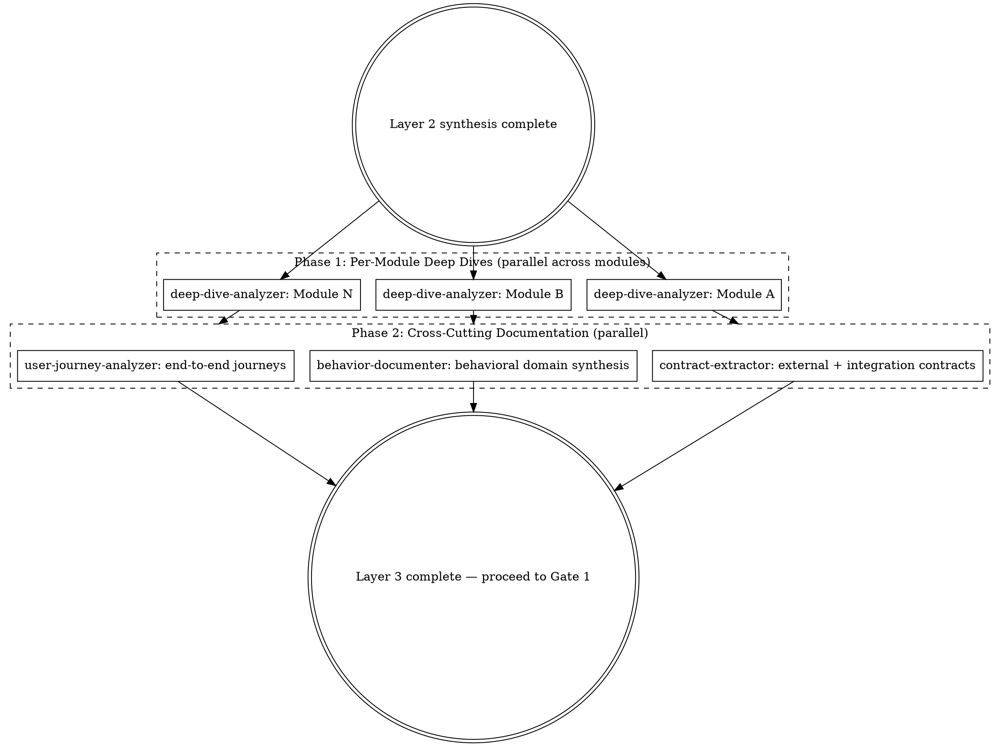
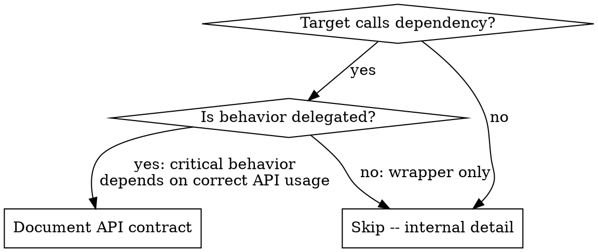
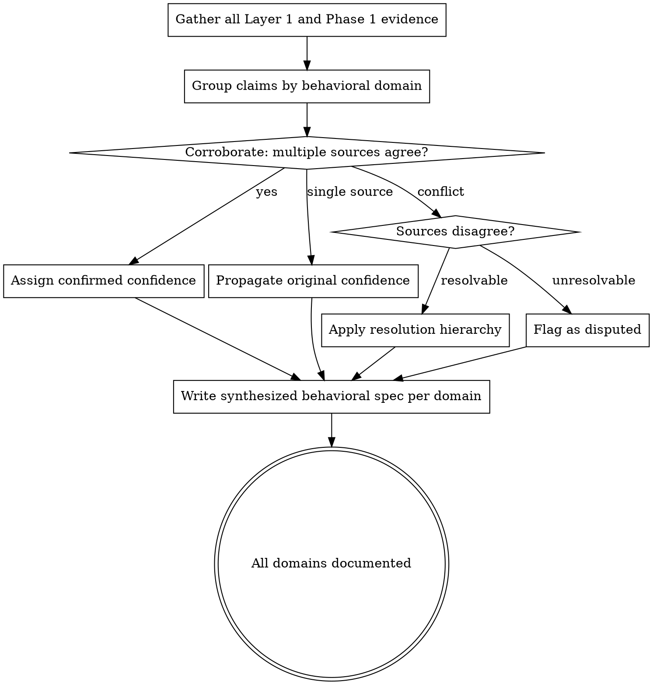
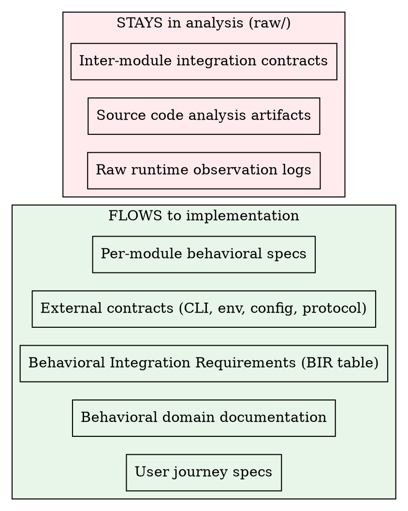

# Behavioral Spec Writing

Layer 3 transforms Layer 2 synthesis (module map, feature inventory, architecture doc, API surface, behavioral summaries) into specifications detailed enough that a developer can reimplement the target WITHOUT seeing the original code. This skill carries all methodology for deep-dive-analyzer, contract-extractor, behavior-documenter, and user-journey-analyzer.

## Layer 3 Pipeline Overview



**Phase 1** runs deep-dive-analyzer in parallel across every module from the module map. Each instance produces a per-module behavioral specification.

**Phase 2** runs three agents in parallel. They consume Phase 1 output plus Layer 2 synthesis to produce contracts, behavioral documentation, and user journeys.

---

## Input Sources

### Required (from Layer 2 synthesis)

| Path | What It Contains |
|------|-----------------|
| `workspace/raw/synthesis/module-map.md` | Module inventory: name, description, priority, dependencies |
| `workspace/raw/synthesis/features/` | Feature inventory across all sources |
| `workspace/raw/synthesis/architecture/` | Architecture document: component relationships |
| `workspace/raw/synthesis/api/` | API surface: all discovered interfaces |
| `workspace/raw/synthesis/behavioral-summaries/` | Merged intelligence from all Layer 1 modes |
| `workspace/raw/synthesis/reimplementation-essentials.md` | Compact summary for the implementer: happy path, edge cases, dependency contracts |

### Consulted (from Layer 1 raw intelligence)

| Path | What It Contains | Origin |
|------|-----------------|-------------|
| `workspace/raw/source/analysis/` | Source code analysis (chunk analysis, function analysis) | RAW |
| `workspace/public/docs/` | Official documentation findings | PUBLIC |
| `workspace/public/ecosystem/` | SDK and ecosystem analysis | PUBLIC |
| `workspace/public/community/` | Community intelligence (forums, tutorials, issues) | PUBLIC |
| `workspace/raw/runtime/` | Runtime observations (CLI, web UI, behavior) | RAW |
| `workspace/raw/binary/` | Binary analysis findings | RAW |

Claims supported by multiple independent intelligence sources earn `confirmed` confidence.

---

## Per-Module Behavioral Specification (deep-dive-analyzer)

This is the primary Layer 3 deliverable. Each module in the module map gets a complete behavioral specification written to `workspace/raw/specs/modules/{module-name}.md`.

### Black Box Methodology (CRITICAL)

You read source code to understand behavior. You NEVER reference source code in specs.

Even though you analyze code, your output must read as if you only observed the system externally. The test: **"Can someone implement this from my spec alone, never having seen the source?"**

#### What You NEVER Include (Implementation Details)

| Contamination | Example | Why Forbidden |
|--------------|---------|---------------|
| Internal function names | `parseArgs()`, `loadConfig()` | Implementation detail |
| Internal variable names | `_configKey`, `configMap` | Implementation detail |
| Internal class names | `ConfigLoader`, `SettingsReader` | Implementation detail |
| Minified identifiers | `a()`, `x1`, `Qz`, `sp`, `r0` | Implementation detail |
| Line numbers | "at line 234" | Implementation detail |
| Source file paths | "in src/cli.ts" | Implementation detail |
| Code structure | "calls X then Y" | Implementation detail |
| Module counts | "52 modules", "8 components" | Structural leak |
| IPC channel names | `task-completed`, `sync-channel` | Internal messaging |
| Store property names | `store.documentBody`, `useActiveDocument` | State management internals |
| Feature flag names | `FF_NEW_INDEX_FORMAT`, `ff_batch_commit_v2`, `isEnabled('feature')` | Internal gating — describe what the gate controls, not its name |
| Telemetry event names | `request_rate_limited`, `job_timeout_warning` | Internal analytics — describe what is measured, not the event name |
| CSS class names | `.toolbar__button`, `styled.Button` | Styling implementation |
| Database schema details (app-owned) | `CREATE TABLE sessions`, column names | Storage implementation — but see **External System Exception** below |
| Internal filenames | `auth-handler.ts`, `session.js` | Source organization |

#### External System Exception (NON-NEGOTIABLE)

When the target application depends on **external systems it does not own** — shared databases, third-party APIs, CLI tools it shells out to, file formats imposed by other systems, hardware interfaces — the details of those systems are **behavioral constraints**, not implementation details.

**The test:** Can the reimplementor redesign this interface? If NO (it's external/shared/imposed), treat its details as external contracts and INCLUDE them. If YES (the app owns it), treat them as implementation details and EXCLUDE them.

Examples of external constraints that MUST be preserved:

- **External database schemas:** table names, column names, cardinalities, naming collisions, derivation relationships, join-correctness constraints — because the reimplementation must query the same schema
- **Third-party API contracts:** endpoint paths, request/response field names, pagination schemes, rate limits, auth flows — because the reimplementation must call the same API
- **External CLI tools:** command names, flag names, output formats — because the reimplementation must invoke the same tools
- **Imposed file formats:** field names, encoding rules, version headers — because the reimplementation must read/write the same files
- **Hardware/protocol constraints:** register layouts, packet formats, timing requirements — because the reimplementation must talk to the same hardware

Document external system contracts in dedicated files under `workspace/raw/specs/contracts/` (see Contract Extraction section). These contracts flow through to the implementer unchanged.

#### What You ALWAYS Include (Behavioral Interfaces)

| Behavioral Element | Example | Why Included |
|-------------------|---------|--------------|
| Environment variables | `DATABASE_URL`, `DEBUG` | External API |
| CLI flags | `--format`, `--workers` | External API |
| Config file keys | `upstreams`, `log_level` | External API |
| API field names | `request_id`, `batch_size` | Protocol spec |
| File paths (user-facing) | `~/.app/config.toml` | Behavioral contract |
| Protocol names | `SSE`, `gRPC`, `OAuth` | Behavioral contract |
| Error messages | "Error: Invalid API key" | UX contract |
| HTTP headers/codes | `Authorization`, `200`, `401` | Protocol spec |
| Dependency API contracts | `esbuild.transform(code, {loader: 'ts'})` | How target talks to its dependencies |

**The rule:** If a user or external system needs to know it, INCLUDE it. If only the code needs to know it, EXCLUDE it.

#### Transformation Examples

WRONG:
```
Entry point: main() at src/cli.ts:45
Calls parseArgs() which returns Config object
Variable requestId = generateUUID()
```

RIGHT:
```
Entry point: Command-line invocation

Behavior:
1. Parse arguments into configuration
2. Generate session identifier (UUID v4 format)
3. Initialize modules based on config

Session ID: UUID v4, generated once at startup, immutable
```

### SPEC ID Format

Every behavioral claim gets a unique ID: `SPEC-{DOMAIN}-{NNN}`

Where `{DOMAIN}` is a short uppercase token for the behavioral domain (use tokens that describe exposed behavior, NOT internal module names) and `{NNN}` is a zero-padded sequential number starting at 001.

Pick tokens that describe the target's exposed behavior. The set below is a starting vocabulary; delete what doesn't apply and add tokens that do.

| Domain Token | Covers |
|---|---|
| `CLI` | Command-line parsing, flags, subcommands, exit codes |
| `CONFIG` | Configuration loading, merging, defaults, validation |
| `AUTH` | API keys, OAuth, tokens, credentials |
| `API` | Wire protocol, streaming, retries, headers, request/response handling |
| `OUTPUT` | Terminal rendering, formatting, progress indicators, themes |
| `DATA` | Data models, storage, serialization |
| `NET` | Network, HTTP, WebSocket, protocols |
| `UI` | User interface elements, layouts, interaction flows |

For any behavior the starting set doesn't cover, create a descriptive token — for example: `CACHE`, `MIGRATE`, `HEALTH`, `LOADER`, `WATCH`, `AUDIO`, `PARSER`, `SYNC`, `PLUGIN`, `SESSION`, `TOOL`. Tokens describe the target's actual surface; a speech-to-text app probably needs `AUDIO` and `UI`; a web service probably needs `NET` and `DATA`; a code-loading tool probably needs `PARSER` and `CONFIG`. Don't carry tokens you don't need.

If a module's behavior spans multiple domains, use multiple tokens (one per behavioral block). IDs MUST be unique across the entire spec file. Examples: `SPEC-CLI-001`, `SPEC-CONFIG-042`, `SPEC-API-003`, `SPEC-AUDIO-007`.

### Requirement Levels (IETF RFC 2119)

Every behavioral claim in the spec MUST be annotated with a requirement level:

- **MUST** -- Absolute requirement. The implementation is non-compliant if this is not satisfied. The implementer MUST exhibit this behavior.
- **SHOULD** -- Recommended. There may be valid reasons to deviate, but the implications must be understood and divergence requires documented rationale.
- **MAY** -- Optional. The implementation can choose to include or omit this behavior.

Apply requirement levels to every entry point behavior, every decision tree outcome, every error condition, and every state transition. If a claim lacks a requirement level, it is ambiguous and must be clarified.

### Spec Structure Template

Each per-module spec covers the following sections. All sections are required; write "Not applicable" or "Stateless" where a section genuinely does not apply, but never omit sections.

#### 1. Overview

2-3 paragraphs: what the module does from a user/system perspective, why it exists, key responsibilities.

#### 2. Behavioral Interfaces

##### Exposed Capabilities

For each capability this module makes available:

```markdown
- **Capability:** [behavioral name -- what it does, not what it's called internally]
- **Trigger:** [what causes this capability to activate]
- **Preconditions:** [what MUST be true before invocation]
- **Postconditions:** [what is guaranteed after completion]
- **Error conditions:** [what errors can occur and when]
- **Requirement Level:** MUST | SHOULD | MAY
```

##### Prerequisites

For each capability or data this module needs to function:

```markdown
- **What is needed:** [capability or data description]
- **When:** [at what point this prerequisite is consumed]
- **Failure behavior:** [what happens if the prerequisite is unavailable]
```

**CRITICAL:** Do NOT name which module provides the prerequisite. Describe WHAT is needed, not WHERE it comes from. A "From module" field would be structural contamination. The implementer decides its own module boundaries.

#### 3. Entry Points

For each way to invoke this module:

```markdown
#### SPEC-{DOMAIN}-{NNN}: [Descriptive Name]
**Requirement Level:** MUST | SHOULD | MAY

### Trigger
[What causes this to be invoked -- user action, event, timer, etc.]

### Input
- Parameter 1: [type] - [what it represents]
- Parameter 2: [type] - [what it represents]
- Required state: [what must be true before invocation]

### Behavior
1. **Validation**
   - Check: [what condition] -> if invalid: [error message]
   - Check: [what condition] -> if invalid: [error message]

2. **Processing**
   - [Step-by-step behavioral description]
   - Decision: if [condition in behavioral terms]
     - Then: [behavior]
     - Else: [behavior]

3. **Completion**
   - Output: [what is returned/emitted]
   - State change: [what persists]
   - Side effects: [files written, network calls, etc.]
```

#### 4. Decision Trees

For every significant decision, document in behavioral terms:

```markdown
#### SPEC-{DOMAIN}-{NNN}: [What is being decided]
**Requirement Level:** MUST | SHOULD | MAY

### Conditions (evaluated in order)
1. If [behavioral condition]: -> [behavioral outcome]
2. Else if [behavioral condition]: -> [behavioral outcome]
3. Default: -> [behavioral outcome]

### Outcomes
- **Outcome 1**: [detailed behavioral description]
- **Outcome 2**: [detailed behavioral description]
```

Describe conditions by what they MEAN, not how they are coded:
- WRONG: `if (x.length > 0 && x[0] === '-')`
- RIGHT: "if input starts with a dash (indicating a flag)"

##### Conditional Error Handling Pattern

Pay special attention to behaviors that differ based on HOW a feature was triggered. A common pattern:

- **Auto-detected configuration** -- lenient error handling (log warning, continue)
- **User-specified configuration** -- strict error handling (error, abort)

When the same feature has different error handling based on whether it was explicitly requested vs. automatically discovered, document BOTH paths explicitly:

```markdown
#### SPEC-{DOMAIN}-{NNN}: Configuration Error Handling
**Requirement Level:** MUST

### Conditions
1. If configuration was auto-detected AND loading fails: -> Log warning, continue without it
2. If configuration was user-specified (via flag/option) AND loading fails: -> Report error, abort
3. If configuration loads but is invalid: -> [behavior depends on which fields are invalid]
```

This pattern appears frequently in config file loading, plugin/extension discovery, and feature detection with fallback.

#### 5. State Model (State Box)

If the module maintains state, this section is MANDATORY. Every stateful module must document its states, transitions, and invariants explicitly — implementers need the state model to preserve behavior across a rewrite.

```markdown
## State Model (State Box)

### State Variables
| Variable | Type | Initial Value | Description |
|----------|------|---------------|-------------|
| [name] | [type] | [initial] | [what it represents] |

### State Invariants
[What MUST always be true about the state, regardless of transitions]

### States
- **Idle**: [what this state means, invariants]
- **Processing**: [what this state means, invariants]
- **Complete**: [what this state means, invariants]

### Transitions

| From | Event | Condition | Action | To |
|------|-------|-----------|--------|-----|
| Idle | request received | valid input | begin processing | Processing |
| Processing | work complete | success | emit result | Complete |
| Processing | error occurs | - | emit error | Idle |

### State Persistence
[Where state lives (memory, disk, database), lifetime, serialization format]

### Initialization
[How the state machine starts]

### Termination
[How/when the state machine ends]
```

If the module is stateless, write: "**Stateless** -- This module maintains no state between invocations."

#### 6. Error Handling

**Error specification MUST be as detailed as normal operation.** For every entry point, the error paths must have the same depth as the happy path. Incomplete error documentation is a spec gap.

For EVERY error condition:

```markdown
#### SPEC-{DOMAIN}-{NNN}: [Descriptive Error Name]
**Requirement Level:** MUST | SHOULD | MAY

### Trigger
[What situation causes this error]

### Detection
[How the system knows this error occurred]

### Response
1. [First action -- e.g., "Log error details"]
2. [Second action -- e.g., "Clean up partial state"]
3. [Final action -- e.g., "Return error to caller"]

### User-Visible Message
"[Exact error text the user sees]"

### Recovery
[Can the operation be retried? Under what conditions?]
```

#### 7. Edge Cases

```markdown
## Edge Cases

### Empty Input
- Behavior: [what happens]
- Output: [what is returned]

### Maximum Size
- Limit: [what the limit is]
- Exceeded behavior: [what happens]

### Concurrent Access
- Behavior: [how handled]
- Guarantees: [what is guaranteed]

### Interruption
- Cleanup: [what cleanup occurs]
- Resumability: [can it resume?]
```

#### 8. Configuration Effects

How configuration values alter this module's behavior. For each relevant config key:

```markdown
| Config Key / Env Var | Effect on This Module | Default | Requirement Level |
|---------------------|----------------------|---------|-------------------|
| `SOME_ENV_VAR` | Enables debug output for this module | unset (disabled) | MAY |
| `configKey` | Controls retry count | 3 | SHOULD |
```

#### 9. Data Formats

```markdown
## Data Format: [Name]

### Input
{
  field1: string (required, 1-100 chars),
  field2: number (optional, default: 0),
  field3: array of strings (required, non-empty)
}

### Transformations
1. Validate all required fields present
2. Apply defaults to optional fields
3. Normalize field1 to lowercase

### Output
{
  field1: string (normalized),
  field2: number,
  field3: array of strings,
  computed: boolean (true if field2 > 0)
}
```

#### 10. Dependency API Contracts

When the target delegates critical behavior to a third-party library, document the exact API contract used. These are behavioral contracts between the target and external systems -- equivalent to wire protocols -- NOT implementation details.



For each critical dependency contract, document:

**API Surface Used:**
- Function/method called and its purpose
- Required parameters and what they control
- Which options MUST be set for correct behavior (and what goes wrong without them)

**Failure Modes:**
- What happens if required options are omitted or wrong
- What the dependency's default behavior is (when it differs from what the target needs)
- Fallback behavior when the dependency is unavailable

**Version Constraints:**
- Minimum version required and why
- Breaking changes across versions that affect the target

Example:
```markdown
## Dependency Contract: esbuild Transform API

### API Surface Used
- `esbuild.transform(code, options)` -- transforms TypeScript/JSX to JavaScript
- Required option: `loader` must be set explicitly ('ts', 'tsx', 'jsx') based on source file extension
- Required option: `sourcefile` OR explicit `loader` -- without either, esbuild defaults to JavaScript parsing
- The `transform()` API receives code as a string (no filename), so it cannot infer the loader automatically

### Failure Mode
- If `loader` is 'default' and no `sourcefile` is provided: TypeScript syntax (`interface`, `enum`, type annotations) causes parse errors
- Error: "Expected ';' but found 'Identifier'"

### Version Constraint
- Requires esbuild >= 0.14.0 for stable transform API
```

**The rule:** If the target's correctness depends on calling a dependency's API with specific parameters, that is a behavioral contract. Document it.

#### 11. Uncertainty Categories

Explicitly categorize gaps using the POSIX three-category model:

```markdown
## Implementation-Defined Behavior
[Areas where the implementor has freedom to choose, with any constraints.
The implementor MUST document their choice.]

## Unspecified Behavior
[Valid behaviors the spec does not prescribe -- any correct approach is acceptable.
The implementor need not document their choice.]

## Undefined Behavior
[Inputs or states the spec does not cover -- implementation may do anything.
No guarantees are made about these scenarios.]
```

### Exhaustive Reading Requirement (CRITICAL)

You MUST read every single line of code in the module. No exceptions.

- Do NOT skim. Do NOT skip sections that "look unimportant."
- Do NOT rely solely on grep/search patterns -- READ the actual source files.
- Every routine (function, method, class, handler) must be identified.
- Every line of code must be understood in context.
- If you have not read it, you do not know what it does.

**Checklist before proceeding:**
- [ ] I have read every source file relevant to this module
- [ ] I have identified every routine in those files
- [ ] I have traced every code path, not just the obvious ones
- [ ] I have examined every conditional branch

If you cannot check these boxes, GO BACK and read more.

### Saturation Stopping Criterion

Do not pursue exhaustive analysis past the point of diminishing returns. When successive analysis passes stop revealing new behavioral observations for a module, document current understanding and move on. P0 modules warrant more thoroughness than P2/P3 modules, but even P0 analysis should stop when saturated. The goal is "sufficient to reimplement," not "every conceivable edge case."

### Depth Standard

For each behavior, you must answer:
1. What EXACTLY triggers it?
2. What EXACTLY happens in each case?
3. What EXACTLY can go wrong?
4. What EXACTLY is the output?

WRONG: "It validates the input" -- TOO VAGUE

RIGHT: "It checks: field X is non-empty string (error: 'X required'), field Y is positive integer (error: 'Y must be positive'), field Z matches pattern /^[a-z]+$/ (error: 'Z must be lowercase letters')" -- COMPLETE

### Cross-Agent Reconciliation

When extraction analysis files from multiple agents exist for overlapping topics:

1. **Read ALL extraction files** that touch your module, not just the primary one
2. **Compare claims** between extraction files -- look for disagreements on algorithms, constants, field names
3. **When agents disagree, go to the source** -- read the actual code at the cited line numbers
4. **Resolve before writing** -- your spec must contain the verified truth, not a guess from one agent

If you find a contradiction you cannot resolve from the source, record it with a `disputed` citation:

```markdown
<!-- cite: source=source-code, ref=workspace/raw/source/analysis/chunk-0024.md:105, confidence=disputed, agent=deep-dive-analyzer, contradiction=workspace/raw/source/exploration/auth-layer/findings.md:23 -->
```

### Multi-Source Consultation

When other intelligence sources have run, consult their findings:

- `workspace/public/docs/` -- official documentation claims
- `workspace/public/ecosystem/` -- SDK analysis findings
- `workspace/public/community/` -- tutorials, reviews, forums, issue tracker observations
- `workspace/raw/runtime/` -- runtime observation data
- `workspace/raw/binary/` -- binary analysis findings

Claims supported by multiple independent sources earn `confirmed` confidence.

### Self-Assessment Checklist

Every per-module spec file MUST end with this checklist:

```markdown
## Verification Checklist
- [ ] All entry points documented
- [ ] All decision trees traced (every branch, including error paths)
- [ ] All state machines documented (states, transitions, triggers)
- [ ] All error conditions listed with observable symptoms
- [ ] All edge cases identified and documented
- [ ] Auto-detected vs user-specified behavior differences documented
- [ ] Zero source code identifiers in this document
- [ ] All behavioral claims have provenance citations
- [ ] Assumed claims are a small minority; most claims have direct evidence
- [ ] No sections are empty or placeholder-only
- [ ] Cross-references to other specs are valid
- [ ] Every behavioral claim has a SPEC-{DOMAIN}-{NNN} ID
- [ ] Every behavioral claim has a requirement level (MUST/SHOULD/MAY)
- [ ] Error conditions have equal depth to normal operations
- [ ] All stateful modules have State Box documentation
- [ ] Uncertainty sections (implementation-defined/unspecified/undefined) present
- [ ] Behavioral Interfaces section (Exposed Capabilities/Prerequisites) present
- [ ] Dependency API contracts documented for all critical third-party calls
- [ ] Contamination Self-Check completed (all checks pass)
```

### Contamination Self-Check Protocol

**HARD STOP: Review your output file BEFORE writing it.** Read every line and apply the reimplementor test from the **spec-sanitization skill**. Do NOT write the file until all checks pass.

**For every identifier, name, or reference in your spec, ask:** "Could the reimplementor reasonably redesign this?"

- If YES → it's an **implementation detail**. Rewrite it as behavioral description.
- If NO → it's an **external contract**. Keep it exactly.

**Check each paragraph for:**

1. **Internal names** — variable names, function signatures, class names, method names from the source (any language). These constrain the reimplementor's design choices without behavioral necessity.
2. **Internal architecture** — module boundaries, file organization, inheritance hierarchies described in prose. The spec structure should reflect behavioral domains, not source code structure.
3. **Framework-specific patterns** — state management internals, ORM patterns, framework lifecycle hooks described by internal name rather than behavior.
4. **Build/deployment artifacts** — source file paths, line numbers, chunk IDs, minified identifiers, bundle structure references.
5. **Code structure language** — "calls X then Y", "inherits from Z", "implements interface W". Describe the observable behavior instead.

**External contracts to PRESERVE (not contamination):**
- User-facing identifiers: CLI flags, env vars, config keys, config file paths
- Wire protocol fields: API endpoints, request/response field names, header names
- Published constants: error message text, exit codes, timeout values
- Standard names: protocol names, encoding names, algorithm names
- Dependency API calls: documented third-party interfaces the reimplementor must also call

**If any implementation detail is found:** rewrite the line using behavioral language, then re-check. Only write the file when the spec reads cleanly to someone who has never seen the source.

### Per-Module Spec Output Template

```markdown
# Module: [Descriptive Name]

## Overview
[2-3 paragraphs: what it does, why it exists, key responsibilities]

## Behavioral Interfaces

### Exposed Capabilities
[For each capability: name, trigger, preconditions, postconditions, errors, req level]

### Prerequisites
[For each need: what is needed, when, failure behavior -- NO "From module" field]

## Entry Points
[Each entry point with full behavioral spec, including SPEC-{DOMAIN}-{NNN} IDs]

## Decision Logic
[All significant decision trees with SPEC IDs]

## State Model (State Box)
[State variables, invariants, transitions if stateful, or "Stateless" if not]

## Error Handling
[All error conditions with equal depth to normal operations]

## Edge Cases
[Boundary conditions]

## Configuration Effects
[How config values alter behavior]

## Data Formats
[Input/output schemas]

## Dependency API Contracts
[Third-party library contracts]

## Implementation-Defined Behavior
[Areas where the implementor has freedom to choose]

## Unspecified Behavior
[Valid behaviors the spec does not prescribe]

## Undefined Behavior
[Inputs or states the spec does not cover]

## Verification Checklist
[Self-assessment checklist -- see above]
```

---

## Contract Extraction (contract-extractor)

The contract-extractor produces two categories of output: contracts that cross the analysis/implementation boundary to the implementer, and inter-module contracts that stay in analysis for verification purposes only.

### External Contracts (FLOW TO IMPLEMENTATION)

Observable interfaces between the target and the outside world. These are things a user or external system can observe without seeing source code.

#### CLI Contract

Document every command and subcommand, every flag, required vs optional arguments, default values, and exit codes.

```markdown
## Main Command

Usage: `target [options] [command]`

### Global Flags

| Flag | Short | Type | Default | Description |
|------|-------|------|---------|-------------|
| `--help` | `-h` | boolean | false | Show help |
| `--version` | `-v` | boolean | false | Show version |

### Subcommands

#### `target init`
[Arguments, flags, exit codes]

### Exit Codes
| Code | Meaning |
|------|---------|
| 0 | Success |
| 1 | General error |
| 2 | Usage error |
```

Output: `workspace/raw/specs/contracts/cli.md`

#### Environment Contract

| Variable | Purpose | Expected Values | Default |
|----------|---------|----------------|---------|
| `API_KEY` | Authentication | string | (required) |
| `DEBUG` | Enable debug logging | `true`/`false` | `false` |

Output: `workspace/raw/specs/contracts/environment.md`

#### Configuration Contract

Document file paths, file formats, all keys with types and descriptions, default values, and validation rules.

Output: `workspace/raw/specs/contracts/configuration.md`

#### Protocol Contracts

For HTTP APIs, WebSocket connections, gRPC protocol, or any wire protocol the target uses: document request/response formats, headers, status codes, error responses.

Output: `workspace/raw/specs/contracts/{protocol}.md`

#### External System Contracts (CROSS INTO IMPLEMENTATION)

When the target application depends on **external systems it does not own** — shared databases, third-party APIs, CLI tools, imposed file formats — the details of those systems are behavioral constraints, not implementation choices. Document each as an external contract.

**When to produce:** If analysis reveals the target depends on a system whose interface is imposed externally (shared database, third-party API, external CLI tool, imposed file format), produce a contract for each.

##### External Database Contract

For shared/external databases the application does not own:

```markdown
# External Database Contract

## Ownership
This database is NOT owned by the application. The schema is an external constraint.
The reimplementation MUST conform to this schema exactly.

## Tables

### {TableName}

| Column | Type | Nullable | Purpose |
|--------|------|----------|---------|
| {col}  | {type} | {yes/no} | {behavioral purpose} |

**Cardinality:** {e.g., "Multiple rows per product — one per pricing region"}
**Primary key:** {columns}
**Used by:** {which application behaviors query this table}

### Naming Collisions

| Name | Table 1 Purpose | Table 2 Purpose | Disambiguation |
|------|----------------|----------------|----------------|
| {name} | {purpose in context A} | {purpose in context B} | {how the app distinguishes them} |

## Query-Correctness Constraints

| Constraint | Affected Behavior | Why |
|-----------|-------------------|-----|
| {e.g., "One price per product in search results"} | {Product search} | {Pricing table has multiple rows per product (one per region); naive join produces duplicates} |

## Derived/Reference Data

| Target | Source | Derivation |
|--------|--------|-----------|
| {e.g., "Category dropdown values"} | {e.g., "SELECT DISTINCT Category FROM FinancialCategory"} | {How the data is derived} |

## Stored Procedures

| Procedure | Parameters | Returns | Purpose |
|-----------|-----------|---------|---------|
| {name} | {params} | {return type} | {behavioral purpose} |
```

Output: `workspace/raw/specs/contracts/database.md`

##### External API Contract

For third-party APIs the application calls but does not own:

```markdown
# External API Contract: {Service Name}

## Ownership
This API is NOT owned by the application. The reimplementation MUST call the same endpoints
with the same field names.

## Endpoints

### {METHOD} {path}

**Request:**
| Field | Type | Required | Purpose |
|-------|------|----------|---------|
| {field} | {type} | {yes/no} | {purpose} |

**Response:**
| Field | Type | Purpose |
|-------|------|---------|
| {field} | {type} | {purpose} |

**Error Responses:**
| Status | Body | Meaning |
|--------|------|---------|
| {code} | {shape} | {when returned} |

## Authentication
{Auth scheme, token format, refresh flow}

## Pagination
{Pagination scheme: cursor-based, offset, etc.}

## Rate Limits
{Rate limit rules and retry behavior}
```

Output: `workspace/raw/specs/contracts/api-{service}.md`

##### External CLI Tool Contract

For external CLI tools the application invokes:

```markdown
# External CLI Contract: {Tool Name}

## Ownership
This tool is NOT owned by the application. The reimplementation MUST invoke the same commands.

## Commands

### {command} {subcommand}

| Flag | Type | Purpose |
|------|------|---------|
| {flag} | {type} | {purpose} |

**Output format:** {stdout format the app parses}
**Exit codes:** {codes the app checks}
```

Output: `workspace/raw/specs/contracts/cli-{tool}.md`

##### External File Format Contract

For file formats imposed by external systems:

```markdown
# External File Format Contract: {Format Name}

## Ownership
This format is NOT owned by the application. The reimplementation MUST read/write the same structure.

## Structure
{Field names, encoding, version headers, layout}
```

Output: `workspace/raw/specs/contracts/format-{name}.md`

### Behavioral Integration Requirements (BIR) (CROSS INTO IMPLEMENTATION)

Ordering, sequencing, and failure relationships expressed WITHOUT naming internal modules. The implementer receives this to understand sequencing constraints while remaining free to choose its own architecture.

**Output format:**

```markdown
# Behavioral Integration Requirements

These requirements define ordering and failure dependencies between behavioral capabilities.
They do NOT prescribe internal architecture -- the implementer is free to organize these capabilities
however it chooses.

## BIR Table

| BIR ID | Before (prerequisite) | After (dependent capability) | Failure if Violated | Req Level |
|--------|----------------------|------------------------------|---------------------|-----------|
| BIR-001 | Configuration loaded from all sources | Session created with valid context | Fatal: no config defaults available | MUST |
| BIR-002 | Arguments parsed into structured format | Execution mode determined | Fatal: cannot route to handler | MUST |
| BIR-003 | Active session established | API requests sent to backend | Fatal: no session context | MUST |

## BIR Details

### BIR-001: Configuration Before Session
- **Before:** Configuration loaded and merged from all sources (files, env vars, defaults)
- **After:** Session created with valid configuration context
- **Failure if violated:** Session cannot initialize without configuration; fatal error, abort
- **Requirement Level:** MUST
```

Output: `workspace/raw/specs/contracts/behavioral-integration.md`

### Inter-Module Integration Contracts (ANALYSIS INTERNAL ONLY -- does NOT cross into implementation)

Internal wiring between the original's modules. Stays in `workspace/raw/`. Used ONLY for Gate 1 verification to ensure complete analysis coverage. This is structural contamination -- it encodes the original's internal module boundaries.

Read the module specs in `workspace/raw/specs/modules/` and the module map at `workspace/raw/synthesis/module-map.md`. For every cross-module dependency, document the integration contract.

**Identify cross-module calls by looking for:**
- Behavioral Interfaces "Prerequisites" sections (which capability needs what)
- Behavioral Interfaces "Exposed Capabilities" sections (what each module makes available)
- Startup/initialization sequences that wire modules together
- Event propagation across module boundaries
- Shared state or data passed between modules

**Output format:**

```markdown
# Inter-Module Contracts (Analysis Internal -- Does NOT Cross Into Implementation)

## Call Table

| Caller Module | Callee Module | Trigger | API Used | Failure Mode |
|--------------|--------------|---------|----------|-------------|
| CLI Parsing  | Session Mgmt | startup | createSession() | fatal: abort |
| Session Mgmt | Config       | session init | loadConfig() | warn: use defaults |

## Contract Details

### CLI Parsing -> Session Mgmt
- **Trigger:** Application startup, after argument parsing
- **API:** Create a new session or resume an existing one
- **Input:** Parsed CLI arguments, environment context
- **Output:** Active session handle
- **Failure behavior:** If session creation fails, application MUST abort with error message
- **Requirement Level:** MUST
```

Output: `workspace/raw/specs/contracts/inter-module.md`

---

## Behavior Documentation (behavior-documenter)

The behavior-documenter is a pure synthesis agent. It does NOT read source code or run the target. It consumes the output of agents that did and synthesizes findings into unified behavioral documents.

### Synthesis Process



#### Phase 1: Gather All Available Evidence

Read all available input sources. For each behavioral domain (state management, error handling, networking, etc.), collect claims from all modes:

```markdown
## Evidence Collection: [Domain]

| Claim | Source Mode | Source File | Confidence |
|-------|-----------|------------|------------|
| Session timeout is 30 min | source-code | chunk-0031.md:51 | inferred |
| Session timeout is 30 min | runtime-observation | cli/timeout-test.md:5 | confirmed |
| Session timeout is 30 min | official-docs | claims-by-topic.md:12 | inferred |
```

#### Phase 2: Corroborate and Resolve

For each claim:
1. **Multiple sources agree** -- confidence = `confirmed`
2. **Single source** -- propagate original confidence
3. **Sources disagree** -- follow resolution hierarchy: runtime-observation > source-code > official-docs > inferred
4. **Flag unresolvable conflicts** with `disputed` confidence

#### Phase 3: Write Synthesized Behavioral Specs

Organize by behavioral domain, NOT by module. Group related behaviors. Remove all source code identifiers. Focus on observable behavior, not implementation.

For each behavioral domain, produce:

```markdown
# [Domain] Behavior

## Overview
[2-3 paragraphs: what it does, why it exists, key responsibilities]

## Triggers
- [What causes this behavior to activate]
- [Events it responds to]
- [Inputs it accepts]

## Normal Behavior
1. When [trigger], the system [does X]
   <!-- cite: source=source-code, ref=..., confidence=confirmed, agent=behavior-documenter, corroborated_by=runtime-observation -->
2. It then [does Y]
   <!-- cite: source=source-code, ref=..., confidence=inferred, agent=behavior-documenter -->

## State
- Maintains: [what state it keeps]
- Initial state: [starting conditions]
- Terminal states: [end conditions]

## Error Behavior
- When [error condition]: [what happens]
- Error recovery: [how it recovers]

## Observable Outputs
- [What the user sees]
- [What gets written]
```

### No Excuses Policy

**You MUST produce behavioral documentation.**

- "Insufficient evidence from Layer 1 agents" -- Document what IS available. Flag gaps explicitly.
- "Sources are contradictory" -- Apply resolution hierarchy. Document the conflict.
- "Too complex to fully document" -- Partial documentation beats empty files. Every output file MUST have content.

Output: `workspace/raw/specs/behavioral-docs/`

---

## User Journey Analysis (user-journey-analyzer)

End-to-end user workflows that exercise multiple modules. Component specs explain the pieces. User journeys explain how pieces connect.

### Journey Types

| Journey Type | What It Covers | Examples |
|-------------|---------------|---------|
| **Happy path** | Normal successful workflows | First run, normal startup, primary workflow completion |
| **Error recovery** | What happens when things go wrong | Auth failure, network timeout, invalid input |
| **First-time setup** | Initial configuration and onboarding | OAuth flow, config creation, first interaction |
| **Power user workflows** | Advanced multi-step operations | Resumable operations, piped input, scripted usage |
| **Interruption handling** | Mid-operation cancellation | Ctrl+C at various points, terminal close |

### Journey Format

For each journey, write a complete trace:

```markdown
## Journey: [Name]

### Trigger
[What initiates this journey -- user action, event, timer]

### Preconditions
- [What must be true before this journey can happen]
- [Required state, config, etc.]

### Step-by-Step Flow

**Step 1: [Name]**
- Action: [what the user does]
- Expected Response: [what the system does in response]
- What user sees: [exact UI/output text]
- State Changes: [what changes in system state]
- Errors Possible: [what can go wrong at this step]

**Step 2: [Name]**
- Action: [what the user does or what the system does next]
- Expected Response: [system response]
- What user sees: [exact UI/output text]
- State Changes: [state changes]
- Errors Possible: [error conditions]

[Continue for all steps...]

### Completion
- Final state: [what is different after this journey]
- User feedback: [what user sees at the end]

### Error Paths
- If [condition at step N]: [what happens, what user sees, recovery options]
- If [condition at step M]: [what happens, what user sees, recovery options]

### Alternative Paths
- With flag X: [how the journey differs]
- In state Y: [how the journey differs]

### Journey Provenance

| Step | Primary Source | Confidence |
|------|---------------|------------|
| Step 1 | source-code | inferred |
| Step 2 | runtime-observation + source-code | confirmed |
```

### Exact UX Capture

For each step, document:
- **Exact text** shown to user (prompts, messages)
- **Exact keystrokes** that work (Y/N, Enter, Ctrl+C, etc.)
- **Exact timing** behavior (what blocks, what streams)
- **Exact visual elements** (spinners, progress indicators, colors)

### The Test

For each journey, ask: "If I only had this document, could I build UI that looks and feels identical?"

If NO -- you are missing UX details. Go deeper.

### Exhaustive Journey Discovery

Before documenting journeys, discover ALL entry points:

- All interactive/runtime commands
- All keyboard shortcuts
- All CLI flags that alter flow
- All prompts and user-facing messages
- All non-interactive modes (piped input, print mode, scripted usage)

### Runtime Integration

When runtime observation output exists at `workspace/raw/runtime/`, incorporate actual observed journeys rather than inferring them from code. Runtime-observed journeys have higher confidence because they represent actual behavior, not inferred behavior.

Output: `workspace/raw/specs/journeys/{journey-name}.md`

---

## Structural Contamination Guard

CRITICAL for all Layer 3 output. Every Layer 3 agent must enforce these rules.

### Zero Tolerance Rules

1. **Zero source code identifiers in spec output.** No function names, variable names, class names, minified identifiers, line numbers, or source file paths.
2. **No claims about internal implementation structure.** Never write "the X module calls the Y module" or "implemented using Z pattern."
3. **Behavioral Interfaces Prerequisites MUST NOT have a "From module" field.** Describing where a prerequisite comes from is structural contamination. Describe WHAT is needed, not WHERE it comes from.
4. **No "calls X then Y" language.** Describe behavior in terms of what happens, not what code does.

### The Contamination Test

Ask: **Can a developer implement this spec without knowing ANYTHING about the original's code?**

- If the spec references internal names -- it is contaminated. Rewrite.
- If the spec prescribes specific module boundaries -- it is contaminated. Rewrite.
- If the spec describes call sequences between named internal units -- it is contaminated. Rewrite.

### What Flows to Implementation vs What Does Not



---

## Provenance Rules

### Citation Format

Every behavioral claim MUST have an inline provenance citation immediately after the claim:

```markdown
- Sessions expire after 30 minutes of inactivity
  <!-- cite: source=source-code, ref=workspace/raw/source/analysis/chunk-0007.md:88, confidence=confirmed, agent=deep-dive-analyzer, corroborated_by=runtime-observation -->
```

### Required Fields

| Field | Type | Description |
|-------|------|-------------|
| `source` | enum | Source type: `official-docs`, `public-api`, `sdk-analysis`, `community-knowledge`, `runtime-observation`, `source-code`, `binary-analysis`, `inferred` |
| `ref` | string | Specific location: URL, `workspace/` file path with optional `:line`, or session timestamp |
| `confidence` | enum | `confirmed`, `inferred`, or `assumed` |
| `agent` | string | Your agent name |

### Optional Fields

| Field | Type | Description |
|-------|------|-------------|
| `corroborated_by` | comma-separated list | Other source types that independently confirm this claim |
| `contradiction` | string | Path to contradicting evidence (for `disputed` confidence) |

### Confidence Assignment for Layer 3

| Situation | Confidence |
|-----------|-----------|
| Claim supported by source code analysis only | `inferred` |
| Claim supported by source + one other mode (docs, runtime, SDK) | `confirmed` |
| Claim is agent's reasoned interpretation of ambiguous code | `assumed` |
| Claim involves exact algorithm, constant, or field name verified in source | `inferred` (upgrade to `confirmed` if corroborated) |
| Multiple Layer 1 sources independently agree | `confirmed` |
| Agent reasoning with no direct evidence | `assumed` |

### Confidence Expectations

Per spec file:
- **Assumed claims should be a small minority.** If most claims are assumed, dispatch additional intelligence-gathering agents — the module hasn't been analyzed, it's been guessed at.
- **Critical modules should be dominated by confirmed claims.** If corroborating sources exist in other modes, use them.
- **Every claim needs a citation.** Uncited claims should be assigned back to the originating agent.

### Preserve Upstream Citations

Layer 3 agents preserve original Layer 1 citations. When multiple sources agree, add corroboration notes:

```markdown
- Network retries use exponential backoff with jitter
  <!-- cite: source=source-code, ref=workspace/raw/source/analysis/chunk-0015.md:89, confidence=confirmed, agent=behavior-documenter, corroborated_by=runtime-observation -->
```

### Zero Uncited Claims

No behavioral claim may exist without a citation. If you cannot cite a claim, it is `assumed` -- mark it honestly. Unrecorded assumptions look like confirmed facts to downstream agents and the implementer.

---

## Output Structure

```
workspace/raw/specs/
    modules/                              # Per-module behavioral specs (deep-dive-analyzer)
        {module-name}.md                  # SPEC-{DOMAIN}-{NNN} claims, full spec template
    contracts/
        cli.md                            # External CLI contract (flows to implementation)
        environment.md                    # External environment contract (flows to implementation)
        configuration.md                  # External configuration contract (flows to implementation)
        {protocol}.md                     # External protocol contracts (flows to implementation)
        behavioral-integration.md         # BIR table (flows to implementation)
        inter-module.md                   # ANALYSIS ONLY -- does NOT cross into implementation
    behavioral-docs/                      # Pure behavioral documentation by domain (behavior-documenter)
        behavior-{domain}.md              # Synthesized behavioral spec per domain
    journeys/
        {journey-name}.md                 # End-to-end user journeys (user-journey-analyzer)
```

---

## Layer 3 Definition of Done

### deep-dive-analyzer

- [ ] Spec written to `workspace/raw/specs/modules/{module-name}.md`
- [ ] All behavioral claims have `<!-- cite: -->` provenance citations
- [ ] Assumed claims are a small minority; most claims have direct evidence
- [ ] Zero source code identifiers in output
- [ ] Verification checklist completed at end of spec
- [ ] All available intelligence sources consulted
- [ ] No raw source code excerpts longer than one line
- [ ] Every behavioral claim has a SPEC-{DOMAIN}-{NNN} ID
- [ ] Every behavioral claim has a requirement level (MUST/SHOULD/MAY)
- [ ] All stateful modules have State Box documentation
- [ ] Uncertainty sections (implementation-defined/unspecified/undefined) present
- [ ] Behavioral Interfaces section (Exposed Capabilities/Prerequisites) present
- [ ] Error conditions have equal depth to normal operations
- [ ] Dependency API contracts documented for all critical third-party calls

### contract-extractor

- [ ] Contract files written to `workspace/raw/specs/contracts/`
- [ ] All contract items have `<!-- cite: -->` provenance citations
- [ ] CLI interface documented (commands, flags, arguments, exit codes)
- [ ] Environment variables documented
- [ ] Configuration files documented
- [ ] Inter-module contracts documented (analysis internal only -- stays in raw/)
- [ ] Behavioral integration requirements documented (BIR table -- flows to implementation)
- [ ] All available intelligence sources consulted
- [ ] No raw source code excerpts longer than one line

### behavior-documenter

- [ ] All output files written to `workspace/raw/specs/behavioral-docs/`
- [ ] All behavioral claims have `<!-- cite: -->` provenance citations
- [ ] Assumed claims are a small minority; most claims have direct evidence
- [ ] All available intelligence sources consulted
- [ ] Zero source code identifiers in output
- [ ] No raw source code excerpts longer than one line
- [ ] Evidence from all Layer 1 modes gathered and corroborated
- [ ] Resolution hierarchy applied to all conflicts

### user-journey-analyzer

- [ ] All journey files written to `workspace/raw/specs/journeys/`
- [ ] All journey steps have `<!-- cite: -->` provenance citations
- [ ] Journey Provenance summary present in each journey file
- [ ] Runtime observations incorporated when available
- [ ] Zero source code identifiers in output
- [ ] No raw source code excerpts longer than one line
- [ ] All entry points discovered (CLI flags, interactive commands, keyboard shortcuts)
- [ ] Exact UX captured (prompts, keystrokes, timing, visual elements)

---

## YOU MUST USE THE WRITE TOOL

All Layer 3 agents MUST actually invoke the Write tool to produce output files. Do NOT:
- Output file contents in response text without writing
- Simulate writing by showing file contents
- Say "I would write this to X" without writing

If you show file contents in your response without calling Write, THE DATA IS LOST. Every finding gets written to a file IMMEDIATELY.
