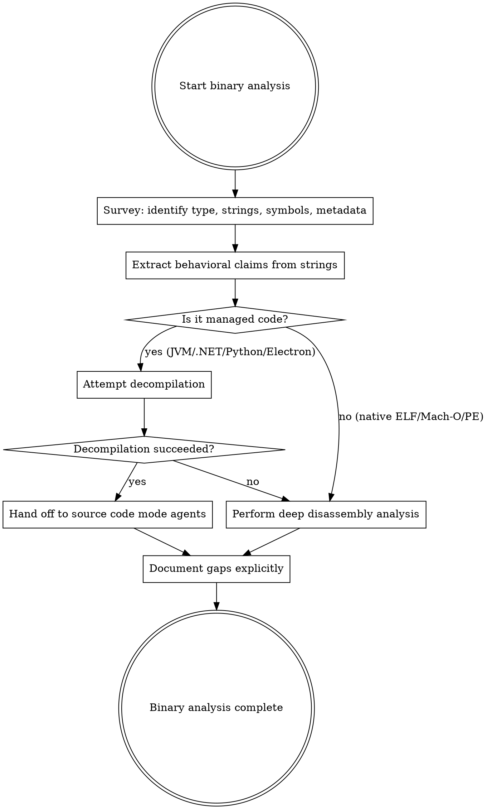

# Binary Analysis Methodology

Extract behavioral intelligence from compiled artifacts when source code is unavailable. Static analysis only — the binary is never executed.

## When This Mode Applies

Binary analysis activates when:
- The `/analyze` command detects compiled artifacts in the target
- The discovery inventory identifies compiled binaries at the target path
- Other modes discover compiled artifacts during analysis (e.g., a bundled native binary inside an npm package)

## Binary Type Taxonomy

| Artifact Type | Format | Survey Tools | Decompiler | Decompilation Quality | Default Confidence |
|--------------|--------|-------------|------------|----------------------|-------------------|
| Native binaries | ELF, Mach-O, PE | `file`, `readelf`/`otool`/`objdump`, `nm`, `strings` | Ghidra, radare2 (disassembly only) | N/A (no source recovery) | `assumed` |
| JVM bytecode | `.class`, `.jar`, `.war` | `jar tf`, `javap -public`, manifest extraction | CFR, Procyon, FernFlower | Very high | `inferred` |
| .NET assemblies | `.dll`, `.exe` (managed) | `dotnet ildasm`, type enumeration, attributes | ILSpy (`ilspycmd`) | Very high | `inferred` |
| Python bytecode | `.pyc`, `.pyo` | Magic number inspection, `strings` | uncompyle6, decompyle3, pycdc | Very high | `inferred` |
| Electron apps | `.asar` bundles | `npx asar extract`, `package.json` | N/A (lossless source recovery) | Lossless | `inferred` |
| WebAssembly | `.wasm` | `wasm-tools print`, export/import enumeration | `wasm2wat` (text format only) | Limited | `assumed` |

## Agents

| Agent | Role | Output Location |
|-------|------|----------------|
| `binary-surveyor` | Initial triage: type ID, strings, symbols, metadata, dependencies, decompilation attempts | `workspace/raw/binary/survey/` |
| `binary-deep-analyzer` | Deep analysis: disassembly, control flow, data structures, algorithms, protocols | `workspace/raw/binary/analysis/` |

The surveyor always runs first. The deep analyzer runs on modules the surveyor recommends.

## Tool Reference

### Identification

```bash
file target.bin                        # Magic-based type identification
```

### Native Binary Tools (ELF)

```bash
readelf -h target.bin                  # ELF header
readelf -S target.bin                  # Section headers
readelf --dyn-syms target.bin          # Dynamic symbol table
readelf -d target.bin                  # Dynamic section (dependencies)
readelf --debug-dump=info target.bin   # Debug info (DWARF)
nm target.bin                          # Symbol table (empty if stripped)
nm -D target.bin                       # Dynamic symbols only
ldd target.bin                         # Shared library dependencies
strings -a -n 4 target.bin            # ASCII strings
strings -a -el -n 4 target.bin        # Wide-character (UTF-16LE) strings
objdump -d --section=.text target.bin  # Disassemble text section
```

### Native Binary Tools (Mach-O)

```bash
otool -h target.bin                    # Mach-O header
otool -l target.bin                    # Load commands
otool -TV target.bin                   # Exports trie
otool -L target.bin                    # Linked libraries
```

### Native Binary Tools (PE)

```bash
objdump -x target.exe                 # All headers
objdump -p target.exe                 # Private headers (imports/exports)
```

### Disassemblers (Deep Analysis)

```bash
# Ghidra headless mode
$GHIDRA_HOME/support/analyzeHeadless \
  /tmp/ghidra-project project-name \
  -import target.bin \
  -postScript ExportDisassembly.java \
  -scriptPath /analysis/scripts/

# radare2: function disassembly
r2 -q -c 'aaa; pdf @ sym.main' target.bin

# radare2: function list
r2 -q -c 'aaa; afl' target.bin

# radare2: string cross-references
r2 -q -c 'aaa; axt @ str.error_message' target.bin
```

### JVM Tools

```bash
jar tf target.jar                      # List contents
unzip -p target.jar META-INF/MANIFEST.MF  # Extract manifest
javap -public com.example.MainClass    # Public API surface
java -jar cfr.jar target.jar --outputdir decompiled/  # Decompile
```

### .NET Tools

```bash
dotnet ildasm target.dll               # Type/method listing
ilspycmd target.dll -o decompiled/     # Decompile to C#
```

### Python Tools

```bash
# Version identification from magic number
python3 -c "
with open('target.pyc', 'rb') as f:
    magic = f.read(4)
    print(f'Magic: {magic.hex()}')
"
uncompyle6 target.pyc > decompiled.py  # Decompile
```

### Electron/ASAR Tools

```bash
npx asar list app.asar                 # List contents
npx asar extract app.asar extracted/   # Extract (lossless)
```

### WebAssembly Tools

```bash
wasm-tools print target.wasm | head -100  # Text format summary
wasm2wat target.wasm -o target.wat     # Full WAT conversion
```

## Analysis Methodology



### Step 1: Survey First

Always run the binary-surveyor before deep analysis. The survey:
- Identifies the binary type and selects the right tool chain
- Extracts everything accessible through lightweight tools (strings, symbols, metadata)
- Determines which modules warrant the cost of deep analysis
- Attempts decompilation for managed code and triggers source code mode handoff

### Step 2: Strings Are Gold

Embedded strings are the highest-value, lowest-effort source of behavioral intelligence from binaries. They provide direct evidence without interpretation:

- **Error messages** reveal validation rules, failure modes, and error handling paths
- **URLs and endpoints** reveal API surface and external dependencies
- **Help text** reveals CLI interface, flags, and usage patterns
- **SQL queries** reveal data model, table names, and query patterns
- **Configuration keys** reveal tunable parameters
- **Format strings** reveal logging patterns and output formatting
- **Regex patterns** reveal input validation rules

Extract strings early. Categorize them. Cross-reference them during deep analysis.

### Step 3: Managed Code Gets Decompiled

JVM, .NET, Python, and Electron artifacts preserve enough metadata for high-quality decompilation. When decompilation succeeds:

1. Place decompiled source in `workspace/raw/binary/decompiled/{language}/`
2. Write a handoff file at `workspace/raw/binary/source-handoff.md`
3. The orchestrator schedules source code mode agents on the decompiled source
4. All claims from decompiled source retain `source=binary-analysis` provenance (not `source-code`)
5. Decompiled source never reaches `workspace/output/` or the implementer

### Step 4: Native Binaries Get Deep Analysis

For native code (ELF, Mach-O, PE), decompilation to source is unreliable. Deep analysis uses disassembly:

1. Select target functions based on surveyor recommendations
2. Disassemble with Ghidra (headless) or radare2
3. Trace control flow and express as behavioral decision trees
4. Map data structures from memory access patterns
5. Identify algorithms from instruction patterns and constants
6. Cross-reference with strings for context

### Step 5: Document Gaps Explicitly

Binary analysis frequently produces incomplete pictures. Every analysis file must include a "Gaps in Analysis" section listing:
- What could NOT be determined
- WHY it could not be determined
- Which other intelligence source could fill the gap

## Confidence Calibration

Binary-derived claims follow the standard confidence levels from provenance-methodology, with these mode-specific guidelines:

### When to Use `confirmed`

Only when two independent evidence types agree:
- Disassembly shows AES S-box constants AND strings include "AES-256"
- Symbol name says `parse_json` AND strings include JSON-related error messages
- Two different tools (e.g., radare2 and objdump) produce consistent results

### When to Use `inferred`

Single authoritative evidence source:
- `file` command output (direct tool result)
- Literal strings extracted from the binary
- Symbol names from unstripped binaries
- Decompiled managed code (JVM, .NET, Python)
- Algorithm identification with strong constant/pattern match
- Dependency identification from linker metadata

### When to Use `assumed`

Interpretation without direct evidence:
- Control flow interpretation from stripped native disassembly
- Data structure reconstruction from memory access patterns
- Purpose/intent attribution to unnamed code blocks
- Behavioral inferences that require analyst judgment
- Algorithm identification with partial or weak pattern match
- Anything where you are reasoning rather than observing

**Default for native binaries: `assumed`.** Native binary analysis is inherently interpretive. Be honest about uncertainty.

**Default for managed code: `inferred`.** Decompiled managed code is near-source-quality, but still single-source.

## Provenance Citation Format

All binary-derived claims use `source=binary-analysis`:

```markdown
- The binary accepts three output formats: json, csv, xml
  <!-- cite: source=binary-analysis, ref=workspace/raw/binary/survey/strings.md:15, confidence=inferred, agent=binary-surveyor -->
```

For decompiled source processed by source code mode agents:

```markdown
- The UserService validates email addresses using a regex pattern
  <!-- cite: source=binary-analysis, ref=workspace/raw/binary/decompiled/java/com/example/UserService.java:45, confidence=inferred, agent=chunk-analyzer -->
```

Note: `source` remains `binary-analysis` even when a source code mode agent performs the analysis, because the ultimate origin is a binary artifact.

## Corroboration Patterns

Binary analysis is most valuable as a corroborating source for claims from other modes:

| Primary Source | Binary Corroboration | Result |
|---------------|---------------------|--------|
| Official docs say "uses AES-256" | Ghidra finds AES S-box constants | Escalates to `confirmed` |
| SDK analysis finds `/api/v2/users` | Binary strings include the same URL | Escalates to `confirmed` |
| Runtime observation sees "invalid token" error | Binary strings include matching error text | Escalates to `confirmed` |
| Docs say "supports JSON and XML" | Binary strings show json, csv, xml | Docs claims `confirmed`, new `inferred` claim about csv |

## Container Recipes for Analysis Tools

Analysis tools may be complex to install. Pre-built containers hold the tools (not the target):

| Binary Type | Base Image | Key Tools |
|-------------|-----------|-----------|
| Native (ELF/Mach-O/PE) | ubuntu:22.04 | binutils, radare2, Ghidra |
| JVM | eclipse-temurin:21 | CFR, Procyon, javap |
| Python | python:3.12 | uncompyle6, decompyle3, pycdas |
| .NET | mcr.microsoft.com/dotnet/sdk:8.0 | ILSpy CLI |
| WASM | rust:1.75 | wasm-tools, wabt |

Containers mount the target at `/target:ro` and write output to `/output:rw`. Containers run with `--network=none`. The target is never executed inside these containers.

## Output Structure

```
workspace/raw/binary/
├── survey/
│   ├── binary-survey.md            # Overall survey
│   ├── strings.md                  # Categorized strings
│   ├── symbols.md                  # Exported/imported symbols
│   ├── dependencies.md             # Linked libraries, packages
│   ├── metadata.md                 # Version, compiler, build info
│   ├── type-info.md                # Class hierarchy (managed code)
│   └── deep-analysis-targets.md    # Recommendations for deep analysis
├── analysis/
│   ├── {module-name}.md             # Per-module deep analysis
│   └── ...
├── decompiled/                     # Managed code decompilation output
│   ├── java/
│   ├── python/
│   ├── csharp/
│   └── electron/
└── source-handoff.md               # Handoff notification (if decompilation succeeded)
```

## Pipeline Position

Binary analysis is a Layer 1 input type. It runs independently and in parallel with other modes. It is typically scheduled last because:

1. It is the most labor-intensive mode
2. It produces the lowest-confidence claims
3. Other modes often provide the same intelligence at higher confidence
4. Its greatest value is filling gaps and corroborating claims from other modes
