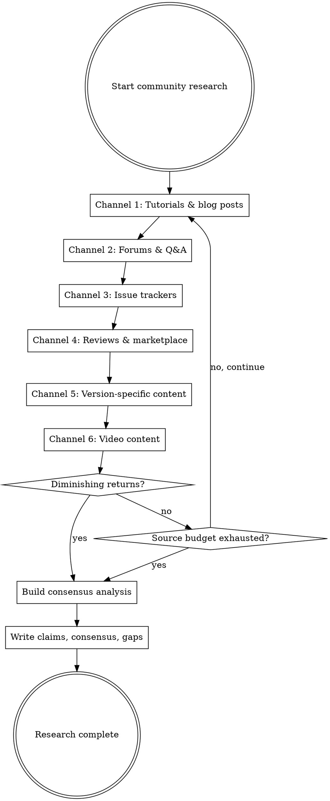

# Community Intelligence Methodology

Extract behavioral specifications from user-generated content: tutorials, blog posts, reviews, forum threads, issue reports, video transcripts, and changelogs. These are external observations of behavior by real users — zero structural contamination, pure behavioral surface.

## When to Use This Mode

Use Community Intelligence mode when:
- The target product has active users who write about it
- Official documentation has gaps (community fills in what docs miss)
- You need observed behavior to corroborate or contradict official claims
- Edge cases, defaults, and undocumented behavior need coverage
- Version-specific behavioral changes need tracking

This mode runs independently of all other intelligence sources. It requires only web access. All output is **public origin** and goes to `workspace/public/community/`.

## Why Community Content Matters

Official documentation describes **intended** behavior. Community content describes **observed** behavior. The gap between the two is where edge cases, undocumented features, surprising defaults, and breaking changes live.

A tutorial author who writes "when I ran `tool --flag`, it output X" has performed a runtime observation. A GitHub issue that says "expected Y but got Z" documents a behavioral contract violation. A blog post walkthrough that shows step-by-step output is equivalent to a test vector recorded by a human.

## 1. Search Channels

Search proceeds across six channels. Execute multiple patterns per channel before moving on.



### Channel 1: Tutorials & Blog Posts

| # | Search Pattern | Purpose |
|---|----------------|---------|
| 1 | `{product} tutorial` | Step-by-step guides |
| 2 | `{product} getting started guide blog` | Setup walkthroughs |
| 3 | `{product} walkthrough` | End-to-end usage |
| 4 | `{product} how to use` | Practical usage |
| 5 | `{product} step by step` | Sequential instructions |
| 6 | `{product} setup guide` | Configuration guides |
| 7 | `{product} tips and tricks` | Advanced behavioral observations |
| 8 | `{product} advanced usage` | Power-user behavioral observations |
| 9 | `{product} site:medium.com` | Medium posts |
| 10 | `{product} site:dev.to` | Dev.to posts |
| 11 | `{product} site:hashnode.dev` | Hashnode posts |

### Channel 2: Forums & Q&A

| # | Search Pattern | Purpose |
|---|----------------|---------|
| 1 | `{product} site:stackoverflow.com` | Community Q&A |
| 2 | `{product} site:reddit.com` | Reddit discussions |
| 3 | `{product} site:news.ycombinator.com` | HN discussions |
| 4 | `{product} site:github.com discussions` | GitHub Discussions |
| 5 | `{product} forum` | Product-specific forums |
| 6 | `{product} unexpected behavior` | Behavioral surprises |
| 7 | `{product} how does {feature} work` | Feature-specific behavioral questions |

### Channel 3: Issue Trackers

| # | Search Pattern | Purpose |
|---|----------------|---------|
| 1 | `site:github.com {product} is:issue "expected" "actual"` | Bug reports with behavioral contracts |
| 2 | `site:github.com {product} is:issue label:bug` | Known bugs (behavioral deviations) |
| 3 | `site:github.com {product} is:issue "steps to reproduce"` | Reproducible behavioral observations |
| 4 | `site:gitlab.com {product} issues` | GitLab issue tracker |

Issue tracker content is extremely high-value because bug reports document the gap between expected and actual behavior — both are behavioral specifications.

### Channel 4: Reviews & Marketplace

| # | Search Pattern | Purpose |
|---|----------------|---------|
| 1 | `{product} review` | Product reviews |
| 2 | `{product} comparison` | Comparative behavioral analysis |
| 3 | `{product} vs {competitor}` | Behavioral differences described precisely |
| 4 | `{product} marketplace review` | Marketplace reviews (VS Code, npm, etc.) |
| 5 | `{product} extension review` | Extension/plugin marketplace reviews |
| 6 | `{product} pros cons` | Feature-level behavioral assessments |

### Channel 5: Version-Specific Content

| # | Search Pattern | Purpose |
|---|----------------|---------|
| 1 | `{product} changelog` | Official version history |
| 2 | `{product} release notes` | Feature additions, breaking changes |
| 3 | `{product} migration guide` | Version-to-version behavioral differences |
| 4 | `{product} breaking changes` | Behavioral contract violations between versions |
| 5 | `{product} "what's new"` | New capabilities per version |
| 6 | `{product} upgrade from {version}` | Version-specific migration behavioral notes |

Version-specific content is critical for understanding behavioral evolution and resolving contradictions between community sources (different versions may explain different observed behaviors).

### Channel 6: Video Content

| # | Search Pattern | Purpose |
|---|----------------|---------|
| 1 | `{product} tutorial site:youtube.com` | Video tutorials |
| 2 | `{product} demo site:youtube.com` | Product demos |
| 3 | `{product} walkthrough site:youtube.com` | Video walkthroughs |

For video results, fetch the page to extract title, description, and any transcript/caption data available. Video descriptions often contain command sequences and expected outputs.

### Source Prioritization

1. Tutorials with concrete examples (commands + output) over opinion pieces
2. Recent content over old (behavioral changes over time)
3. Multiple independent authors confirming same behavior over single sources
4. Bug reports with "steps to reproduce" over vague complaints
5. Content matching target version over other versions

### Termination Criteria

Stop when ALL of the following are true:
1. At least 3 search patterns executed per channel
2. At least 10 distinct tutorial/blog sources reviewed
3. At least 10 Stack Overflow threads reviewed
4. At least 5 GitHub issues reviewed (if issue tracker exists)
5. No new behavioral claims from the last 5 sources fetched (diminishing returns)

Source budget: 75 sources per agent run. Community sources are individually smaller than documentation pages but more numerous. Record unfetched sources in `gaps.md`.

## 2. Fetching Rules

### Rate Limiting

- Insert at least 2 seconds between consecutive fetches to the same domain.
- On HTTP 429, respect `Retry-After` header. If absent, wait 30 seconds.
- Maximum 3 retries per URL. After 3 failures, record in `gaps.md`.

### Content Handling

- Convert HTML to markdown for storage.
- For forum threads, ensure the full thread is captured (not just the question).
- For multi-page tutorials, follow "next" / "part 2" links.
- Track visited URLs to avoid cycles.

### Sources to Skip

- Paywalled or authenticated content: record in `gaps.md`.
- Non-English content: record URL and language in `gaps.md`.
- Content clearly about a different product with the same name.
- Pure marketing with no behavioral content.

## 3. Extraction Methodology

### High-Value Observations (EXTRACT)

| Type | Example | Why Valuable |
|------|---------|-------------|
| Command + output pairs | "Running `tool --flag` outputs `X`" | Equivalent to a test vector |
| Error messages observed | "I got error: `Y` when I tried `Z`" | Documents error contract |
| Default behavior | "If you don't set `--option`, it defaults to `W`" | Documents defaults |
| Configuration effects | "Setting `config.key = V` changes behavior to..." | Documents config contract |
| Edge case behavior | "When the file is empty, it does..." | Documents boundary conditions |
| Behavioral changes | "In v2.3, `--flag` now does X instead of Y" | Documents version-specific behavior |
| Workarounds | "To avoid the bug, you need to..." | Documents known issues |
| Unexpected behavior | "I expected X but it did Y" | Documents actual vs. documented behavior |
| Screenshots/output | Step-by-step output shown in tutorial | Visual behavioral evidence |
| Performance characteristics | "Times out after ~30 seconds" | Documents timing behavior |

### Low-Value Content (SKIP)

| Type | Example | Why Skipped |
|------|---------|-------------|
| Opinion without evidence | "I think it's great" | No behavioral content |
| Marketing language | "Revolutionary AI tool" | No behavioral content |
| Installation only | "Run `npm install`" | Not behavioral |
| Speculation about internals | "Probably uses a B-tree" | Structural contamination risk |
| Architecture guesses | "I bet it uses library X internally" | Structural contamination risk |

### Structural Contamination Guard

**CRITICAL.** Community content sometimes speculates about internal implementation. If a source says "internally it uses library X" or "the code probably does Y", do NOT extract this. Only extract **observable behavior** — what the user saw happen, not what they think happens inside.

This guard is more important for community content than for official docs, because community authors frequently mix behavioral observations with architectural speculation.

### Handling Contradictions

When two community sources disagree about behavior:
1. Record both claims with separate provenance citations.
2. Check dates — newer observations may reflect behavioral changes between versions.
3. Flag the contradiction:
   ```markdown
   <!-- contradiction: {other URL} reports different behavior, possibly version-dependent -->
   ```
4. Report in `gaps.md`.

### Handling Version Mismatches

- Track content date and target version discussed by each source.
- When a source discusses a different version than the target, mark claims as `inferred` with a note: "observed in v{X}, target is v{Y}."
- Use changelog/migration content to determine whether behavior changed between versions.

### Deduplication

When the same behavioral observation appears across multiple sources:
- Keep one entry in the claims file.
- Add corroboration notes.
- Track source count for consensus analysis.

## 4. Confidence Rules

Community confidence thresholds are deliberately **higher** than doc-researcher because individual community observations are less authoritative. Confidence comes from **consensus across independent observers**.

| Condition | Confidence Level |
|-----------|-----------------|
| 3+ independent sources describe the same behavior | `confirmed` |
| Community observation matches official documentation | `confirmed` |
| 2 independent sources agree | `inferred` |
| Single source with concrete evidence (exact commands + exact output) | `inferred` |
| Single source, informal description, no concrete evidence | `assumed` |

A "source" must be **independent** — syndicated/republished content is not a separate source. Blog posts that clearly copy from each other count as one source.

## 5. Consensus Analysis

After extracting all claims, build a consensus analysis showing where multiple independent sources agree:

### Strong Consensus (3+ independent sources)
- Behavioral claim
- All sources cited
- Confidence: `confirmed`

### Moderate Consensus (2 sources)
- Behavioral claim
- Both sources cited
- Confidence: `inferred`

### Single-Source Observations (notable but unconfirmed)
- Claims from only one source that describe detailed, concrete behavior
- Worth preserving for potential corroboration by other modes

### Contradictions
- Cases where sources disagree
- May indicate version-specific behavior — check dates and version info

## 6. Version-Aware Behavioral Changes

If changelog, release notes, or migration content was found, extract version-specific behavioral changes:

| Change | Version | Before | After | Source |
|--------|---------|--------|-------|--------|
| {feature} | v{X} → v{Y} | {old behavior} | {new behavior} | {URL} |

This resolves contradictions and provides version-gated behavioral specifications.

## 7. Output Structure

```
workspace/public/community/
    raw/                        # Fetched content converted to markdown
        tutorials/              # Blog posts, walkthroughs, how-to guides
        reviews/                # Product reviews, marketplace reviews
        forums/                 # Stack Overflow, Reddit, HN, Discourse
        issues/                 # GitHub/GitLab issue reports
        videos/                 # Video tutorial transcript summaries
        changelogs/             # Version-specific behavioral changes
    claims/                     # Extracted behavioral claims
        claims-by-topic.md      # All claims organized by topic
        claims-by-confidence.md # Claims grouped by corroboration level
    behavioral-consensus.md     # Where multiple sources agree
    gaps.md                     # What community content doesn't cover
```

### Claims File Format

```markdown
# Behavioral Claims from Community Sources

## Metadata
- **Target:** {product name}
- **Agent:** community-analyst
- **Date:** {ISO 8601}
- **Total claims:** {count}
- **By confidence:** confirmed: {n}, inferred: {n}, assumed: {n}
- **Sources consulted:** {n} tutorials, {n} forum threads, {n} issues, {n} reviews

---

## {Topic Area}

### CLAIM-COM-001: {Short Descriptive Title}
{Claim text — concrete behavioral observation.}
<!-- cite: source=community-knowledge, ref={URL}, confidence={level}, agent=community-analyst -->

### CLAIM-COM-002: {Short Descriptive Title}
{Claim text.}
<!-- cite: source=community-knowledge, ref={URL}, confidence={level}, agent=community-analyst -->
```

Claim ID format: `CLAIM-COM-{NNN}`.

### Raw File Format

```markdown
# {Title}

## Source
- **URL:** {source URL}
- **Author:** {if identifiable}
- **Date:** {publication date if available}
- **Platform:** {blog/stackoverflow/reddit/github-issue/youtube/etc.}
- **Fetched:** {ISO 8601 timestamp}
- **Target version discussed:** {if identifiable}

## Content Summary
[Concise structured extraction. NOT verbatim reproduction.]

## Behavioral Observations
- {observation}
  <!-- cite: source=community-knowledge, ref={URL}, confidence={level}, agent=community-analyst -->
```

## 8. Provenance Discipline

### Source Type

All citations use `source=community-knowledge`.

### Citation Format

```markdown
<!-- cite: source=community-knowledge, ref={URL}, confidence={level}, agent=community-analyst -->
```

When a community observation is corroborated by official documentation:
```markdown
<!-- cite: source=community-knowledge, ref={URL}, confidence=confirmed, agent=community-analyst, corroborated_by=official-docs -->
```

### Cite As You Go

Every time you write a behavioral claim, the very next thing you write is the citation. Do not batch citations. Write the claim, write the citation, move on.

## 9. Challenges and Mitigations

| Challenge | Mitigation |
|-----------|------------|
| Outdated content | Track content date and version discussed. Flag version mismatches. |
| Speculation about internals | Only extract observable behavior. Skip "probably uses X" claims. |
| Inaccurate community claims | Require consensus (3+ sources) for `confirmed`. |
| Paywalled content | Skip. Record in gaps.md. |
| Video without transcript | Extract from title, description, comments. Note "video-description-only" in citation. |
| Rate limiting | 2-second delay. Exponential backoff on 429. Max 3 retries. |
| High source volume | 75-source limit. Focus on most concrete (commands + output) sources first. |
| Duplicate content (syndicated) | Deduplicate by claim. Keep earliest or most detailed source. |
| Non-English content | Skip. Record URL and language in gaps.md. |

## 10. Integration with Pipeline

Community findings flow to Layer 2 synthesis:
- **feature-discoverer** reads community claims to identify features not found in official docs
- **analysis-synthesizer** merges community findings with other intelligence sources
- **deep-dive-analyzer** consults community observations for edge cases and undocumented behavior

Community consensus analysis is especially valuable for:
- Corroborating claims from other modes (upgrades confidence to `confirmed`)
- Identifying behaviors that official docs don't cover
- Resolving version-specific behavioral questions
