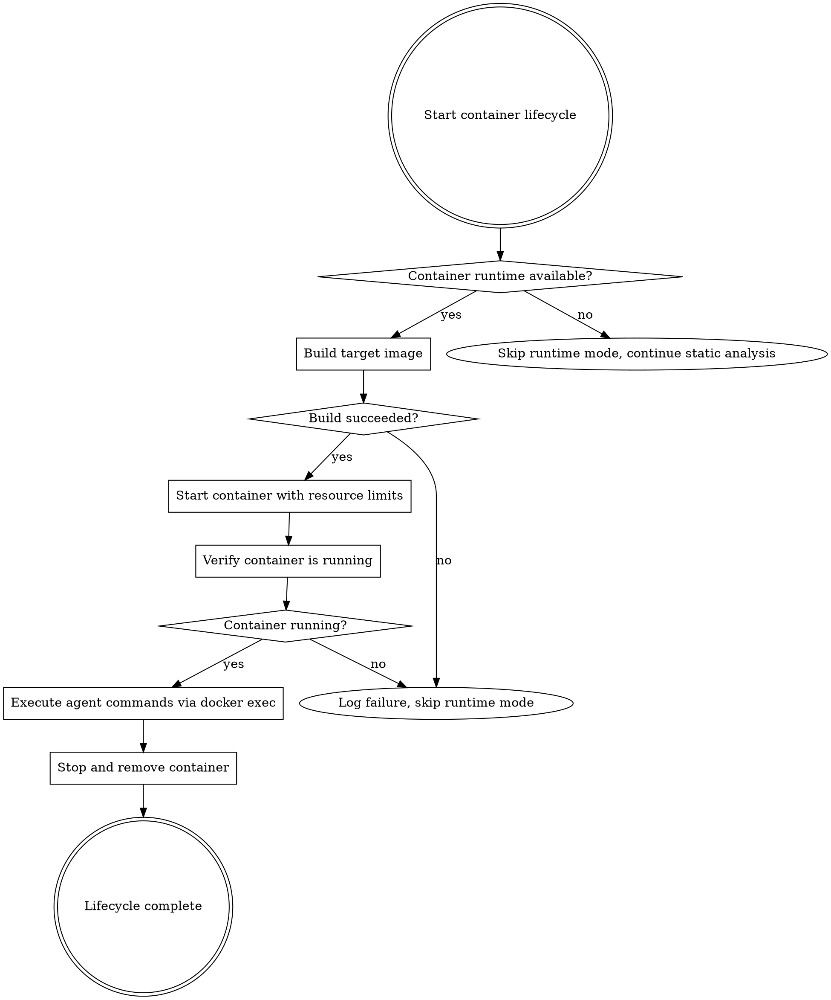

# Container Execution

All runtime analysis targets run inside containers. Never execute untrusted code on the host.

## Runtime Detection

```bash
if command -v docker &>/dev/null; then
  RUNTIME="docker"
elif command -v podman &>/dev/null; then
  RUNTIME="podman"
else
  echo "No container runtime found. Runtime observation unavailable."
  # Continue with static analysis modes only
fi
```

If neither Docker nor Podman is available, skip all agents that require containers. This is not an error — runtime observation is additive.

## Container Naming

Container name: `greenfield-${WORKSPACE}-target`

- Deterministic (same workspace = same name)
- Does not leak the target's identity
- Allows multiple concurrent analyses

## Container Lifecycle



### 1. Build the Image

The Dockerfile is at `workspace/raw/runtime/Dockerfile`. It is generated based on target type:

**Node.js CLI/Library:**
```dockerfile
FROM node:lts-slim
WORKDIR /app
COPY target/ /app/
RUN npm install --production 2>/dev/null || true
RUN npm link 2>/dev/null || true
RUN mkdir -p /output
ENTRYPOINT ["sleep", "infinity"]
```

**Python:**
```dockerfile
FROM python:3.12-slim
WORKDIR /app
COPY target/ /app/
RUN pip install --no-cache-dir -r requirements.txt 2>/dev/null || true
RUN pip install --no-cache-dir -e . 2>/dev/null || true
RUN mkdir -p /output
ENTRYPOINT ["sleep", "infinity"]
```

**Compiled Binary (Go, Rust, C):**
```dockerfile
FROM ubuntu:22.04
RUN apt-get update && apt-get install -y --no-install-recommends \
    ca-certificates file strace && rm -rf /var/lib/apt/lists/*
COPY target/binary /usr/local/bin/target
RUN chmod +x /usr/local/bin/target
RUN mkdir -p /output
ENTRYPOINT ["sleep", "infinity"]
```

**Web Application:**
```dockerfile
FROM node:lts-slim
WORKDIR /app
COPY target/ /app/
RUN npm install --production 2>/dev/null || true
RUN mkdir -p /output
EXPOSE 3000
CMD ["npm", "start"]
```

Build command:
```bash
$RUNTIME build -t greenfield-${WORKSPACE}-target \
  -f workspace/raw/runtime/Dockerfile .
```

If the build fails, log the error to `workspace/raw/runtime/build-log.txt` and mark runtime mode as unavailable. The pipeline continues with other modes.

### 2. Start the Container

**CLI/Library targets:**
```bash
$RUNTIME run -d \
  --name greenfield-${WORKSPACE}-target \
  --memory=2g --cpus=2 --pids-limit=256 \
  --network=none --read-only \
  --tmpfs /tmp:rw,noexec,nosuid,size=256m \
  -v "$(pwd)/workspace/raw/runtime:/output:rw" \
  greenfield-${WORKSPACE}-target
```

**Web application targets:**
```bash
$RUNTIME run -d \
  --name greenfield-${WORKSPACE}-target \
  --memory=2g --cpus=2 --pids-limit=256 \
  --network=none \
  -p 127.0.0.1:3000:3000 \
  -v "$(pwd)/workspace/raw/runtime:/output:rw" \
  greenfield-${WORKSPACE}-target
```

### 3. Verify Running

```bash
$RUNTIME inspect --format='{{.State.Running}}' greenfield-${WORKSPACE}-target
# Expected: true
```

### 4. Cleanup

```bash
$RUNTIME stop --time=10 greenfield-${WORKSPACE}-target 2>/dev/null || true
$RUNTIME rm greenfield-${WORKSPACE}-target 2>/dev/null || true
```

## Command Execution

All target interaction goes through `docker exec` (or `podman exec`).

### Basic Command

```bash
timeout 30 $RUNTIME exec greenfield-${WORKSPACE}-target \
  sh -c 'command args 2>&1' \
  > workspace/raw/runtime/cli/output.txt
```

### With Timeout Handling

```bash
timeout 30 $RUNTIME exec greenfield-${WORKSPACE}-target \
  sh -c 'command args 2>&1' > output.txt 2>&1

EXIT_CODE=$?
if [ $EXIT_CODE -eq 124 ]; then
  echo "TIMEOUT: Command killed after 30 seconds." >> output.txt
fi
```

### With Environment Variables

```bash
$RUNTIME exec -e "DEBUG=true" -e "CONFIG_PATH=/app/config.json" \
  greenfield-${WORKSPACE}-target sh -c 'target-command 2>&1'
```

### With Piped Input

```bash
echo "user input here" | \
  timeout 30 $RUNTIME exec -i greenfield-${WORKSPACE}-target \
  sh -c 'target-command' > output.txt 2>&1
```

## Pre-Execution Checklist

Before executing commands, verify:

1. Container is running: `$RUNTIME inspect --format='{{.State.Running}}' greenfield-${WORKSPACE}-target`
2. Output directory is mounted: `$RUNTIME exec greenfield-${WORKSPACE}-target test -d /output`

## Exploration Patterns

### CLI Exploration

```bash
# Help and version discovery
timeout 30 $RUNTIME exec $CONTAINER sh -c 'target --help 2>&1' > cli/help.txt
timeout 30 $RUNTIME exec $CONTAINER sh -c 'target --version 2>&1' > cli/version.txt

# Subcommand enumeration: parse help output, try each subcommand
# Error exploration: invalid flags, missing args, bad input
# Config discovery: env vars, config files, default paths
```

### Web Endpoint Discovery

```bash
# Probe root and common API paths
curl -s -D- http://127.0.0.1:3000/ > web/root-response.txt

for endpoint in /api /health /swagger.json /openapi.json; do
  STATUS=$(curl -s -o /dev/null -w '%{http_code}' "http://127.0.0.1:3000${endpoint}")
  echo "${endpoint} -> ${STATUS}" >> web/endpoint-scan.txt
done
```

## File Extraction

```bash
# Copy a file from the container
$RUNTIME cp greenfield-${WORKSPACE}-target:/path/to/file \
  workspace/raw/runtime/extracted/

# List files inside the container
$RUNTIME exec greenfield-${WORKSPACE}-target find /app -type f -name '*.log' 2>/dev/null
```

## Error Handling

**Build failure:** Log to `build-log.txt`, skip runtime mode, continue with static analysis.

**Command timeout (exit 124):** Capture partial output, note timeout, move to next command.

**Container crash/OOM:**
```bash
if [ "$($RUNTIME inspect --format='{{.State.Running}}' $CONTAINER 2>/dev/null)" != "true" ]; then
  $RUNTIME logs $CONTAINER > crash-log.txt 2>&1
  $RUNTIME start $CONTAINER  # Attempt restart
fi
```

Container errors are behavioral observations — document them as data, not just failures.

## Resource Limits

| Resource | Default | Notes |
|----------|---------|-------|
| Memory | 2 GB | `--memory=2g` |
| CPU | 2 cores | `--cpus=2` |
| Command timeout | 30 seconds | `timeout 30` on `docker exec` |
| PID limit | 256 | `--pids-limit=256` |
| Network | None | `--network=none` (default) |
| GPU | Never | Not granted |
| Privileged | Never | Not granted |

## Security Restrictions (Non-Negotiable)

- **Never** use `--privileged`
- **Never** mount host paths outside `workspace/raw/runtime/`
- **Never** bind ports to `0.0.0.0` (always `127.0.0.1`)
- **Never** grant GPU access
- **Never** disable seccomp/AppArmor
- All captured output goes to `workspace/raw/runtime/`
- Avoid including raw credential values in captured output (use judgment, not regex)
