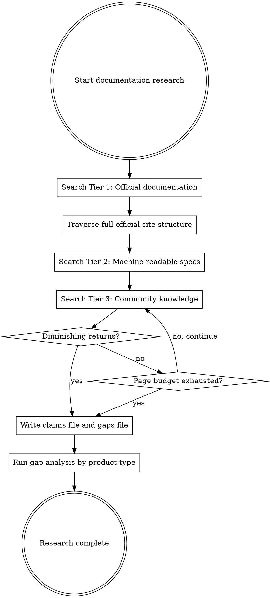

# Documentation Research Methodology

This skill defines the complete methodology for extracting behavioral specifications from public documentation. Follow it step by step. Every section is normative.

## 1. Search Sequence

Search proceeds from most authoritative to least authoritative. Execute every pattern in each tier before moving to the next tier.



### Tier 1: Official Documentation (source type: `official-docs`)

Execute these search patterns in order. Replace `{product}` with the target product name and `{domain}` with the official domain if known.

| # | Search Pattern | Purpose |
|---|----------------|---------|
| 1 | `{product} documentation` | Main documentation site |
| 2 | `{product} API reference` | API surface |
| 3 | `{product} getting started` | Installation, first run, quick setup |
| 4 | `{product} configuration reference` | Config files, keys, defaults |
| 5 | `{product} CLI reference` | Commands, flags, arguments |
| 6 | `{product} changelog` | Version history, behavioral changes |
| 7 | `{product} release notes` | Feature additions, breaking changes |
| 8 | `{product} migration guide` | Version-to-version behavioral differences |
| 9 | `{product} FAQ` | Common behavioral questions and answers |
| 10 | `{product} troubleshooting` | Error conditions and resolutions |
| 11 | `{product} security` | Auth, encryption, permissions |
| 12 | `site:{domain} {product}` | Catch pages not found by keyword search |

After finding the official documentation site, traverse its full structure:
- Fetch the table of contents, sitemap, or sidebar navigation.
- Queue every linked page that has not already been fetched.
- Follow "next page" and pagination links.

### Tier 2: Machine-Readable Specifications (source type: `official-docs`)

Execute the patterns relevant to the target product type. Not all patterns apply to all products.

| # | Search Pattern | Applies When |
|---|----------------|--------------|
| 1 | `{product} openapi` or `{product} swagger` | Product has a REST API |
| 2 | `{product} graphql schema` | Product has a GraphQL API |
| 3 | `{product} protobuf` or `{product} grpc` | Product uses protocol buffers |
| 4 | `{product} json schema` | Product defines data formats |
| 5 | `{product} man page` | Product is a CLI tool on Unix |
| 6 | `{product} --help` | Product is a CLI tool |
| 7 | `{product} wsdl` | Product has a SOAP API |

Machine-readable specs are higher value than prose because they are precise and unambiguous. When a machine-readable spec exists, it takes precedence over prose documentation for the same topic.

### Tier 3: Community Knowledge (source type: `community-knowledge`)

| # | Search Pattern | Purpose |
|---|----------------|---------|
| 1 | `{product} site:stackoverflow.com` | Community Q&A about behavior |
| 2 | `{product} site:github.com discussions` | Maintainer and community discussions |
| 3 | `{product} blog` (filter for maintainer blogs) | Design rationale, behavioral explanations |
| 4 | `{product} tutorial` (filter for expert content) | Practical behavioral descriptions |

Community sources are valuable for:
- Behaviors that official docs fail to document
- Edge cases discovered by users
- Practical workarounds that reveal behavioral constraints
- Corroborating claims from official docs (upgrades confidence to `confirmed`)

Community sources are NOT authoritative for:
- Exact parameter values or limits (may be outdated)
- Version-specific behavior (community content may describe a different version)
- Internal implementation details (community speculation is not evidence)

### Prioritization

When the same behavioral information appears in multiple sources, prefer:

1. Official API reference over tutorials
2. Latest version documentation over older versions
3. Machine-readable specifications over prose
4. Maintainer content over community content
5. Specific documentation (configuration reference) over general documentation (overview)

## 2. Fetching Rules

### Rate Limiting

- Insert at least 2 seconds between consecutive fetches to the same domain.
- On HTTP 429, respect the `Retry-After` header. If no header is present, wait 30 seconds.
- Maximum 3 retries per URL. After 3 failures, record the URL in `gaps.md` and move on.

### Content Handling

- Convert fetched HTML to markdown for storage.
- Merge multiple pages about the same topic into a single raw file (e.g., a multi-page API reference becomes one `api-reference.md`).
- Track visited URLs to avoid cycles in linked documentation.
- If a page yields empty or skeleton-only content (likely JavaScript-rendered), record it in `gaps.md` with the note "dynamic rendering -- content not extractable via WebFetch."

### Pages to Skip

- Pages requiring authentication: record URL and auth type in `gaps.md`.
- Pages in non-English languages: record URL and language in `gaps.md`.
- Pages clearly outside the target product scope (e.g., unrelated products on the same domain).
- Marketing and sales pages with no behavioral content.

### Page Budget

Default limit: 50 pages per agent run. Prioritize Tier 1 official reference pages. If the budget is exhausted before all pages are fetched, record remaining URLs in `gaps.md` for a follow-up run.

## 3. Extraction Methodology

### 3.1 What Constitutes a Behavioral Claim

A behavioral claim is a statement that asserts something observable about the target's behavior. You are extracting these from prose and converting them into structured, citable claims.

**Extract these claim types:**

| Claim Type | What to Look For | Example |
|------------|-----------------|---------|
| Action-response | "When you do X, Y happens" | Running `init` creates a config file at `~/.tool/config.json` |
| Data format | JSON schemas, field names, types, structures | Response body contains `{"id": string, "status": enum}` |
| Constraint/limit | Maximums, minimums, quotas, restrictions | File uploads limited to 100MB |
| Default value | What happens when the user does not configure something | Default timeout is 30 seconds |
| Error condition | What triggers an error and what the error looks like | Non-existent resource returns HTTP 404 with `{"error": "not_found"}` |
| State transition | How the system moves between states | Session moves from `active` to `expired` after 24 hours of inactivity |
| Execution sequence | Ordering guarantees, step-by-step processes | Authentication check runs before authorization check |
| Configuration effect | What a config option changes about behavior | Setting `DEBUG=true` enables verbose logging to stderr |
| Algorithm/processing | How the system transforms data | Passwords are hashed using bcrypt with cost factor 12 |
| Timing value | Timeouts, intervals, durations, TTLs | Rate limit resets every 60 seconds |

**Skip these non-claims:**

| Skip | Why | Example |
|------|-----|---------|
| Marketing copy | Not behavioral | "Best-in-class performance" |
| Vague descriptions | Not testable | "Robust security features" |
| Future plans | Not current behavior | "We plan to add WebSocket support" |
| Design motivation | Informational, not normative | "We chose this approach because..." |
| History | Informational | "In previous versions, this worked differently" |
| Redundant restatements | Already extracted | Same claim restated in tutorial after being extracted from API reference |

### 3.2 Normative vs. Informational Content

Documentation contains both normative content (what the product DOES) and informational content (context, history, motivation). Extract only normative content.

**Normative indicators -- EXTRACT:**
- Imperative statements: "The API returns...", "The command creates..."
- Requirement keywords: "must", "always", "never", "requires"
- Concrete values: numbers, file paths, field names, status codes
- Input/output descriptions: "Given X, the output is Y"
- Code examples with expected output

**Informational indicators -- SKIP:**
- Motivation: "We designed this because..."
- History: "In version 1.x, this worked differently..."
- Comparisons: "Unlike other tools, we..."
- Opinions: "This is the recommended approach"
- Aspirations: "We aim to provide..."

### 3.3 Handling Contradictions

When two documentation pages state different things about the same behavior:

1. **Record both claims.** Each gets its own provenance citation.
2. **Flag the contradiction** with an inline annotation:
   ```markdown
   - Default timeout is 30 seconds
     <!-- cite: source=official-docs, ref=https://docs.example.com/config#timeout, confidence=inferred, agent=doc-researcher -->
     <!-- contradiction: https://docs.example.com/quickstart claims 60 seconds -->
   ```
3. **Prefer the more specific source.** Configuration reference beats quickstart guide. API reference beats tutorial. Changelog beats overview.
4. **Report in gaps.md.** Contradictions are documentation gaps -- the docs are internally inconsistent.

### 3.4 Handling Version-Specific Content

1. Identify the documentation version from version selectors, URL path segments (`/docs/v2/`), or version badges.
2. When the documentation version differs from the target version, mark affected claims as `inferred` and add a note: "documented for v{X}, target is v{Y}."
3. When no version is stated, assume latest version. Note this assumption.
4. Check changelogs between documentation version and target version for behavioral changes that would invalidate claims.

### 3.5 Deduplication

When the same behavioral claim appears on multiple pages:
- Keep one entry in the claims file.
- Cite the most authoritative source (API reference over tutorial).
- If both sources are equally authoritative and agree, cite either and add `corroborated_by` to escalate confidence.

## 4. Output Structure

### 4.1 Raw Files (`workspace/public/docs/raw/`)

One file per topic area. Multiple pages about the same topic merge into one raw file.

```markdown
# {Topic Name}

## Source
- **URL:** {primary source URL}
- **Additional URLs:** {other pages merged into this file}
- **Fetched:** {ISO 8601 timestamp}
- **Doc version:** {version if identifiable, otherwise "assumed latest"}

## Content Summary

[Concise structured extraction of key information from this topic area.
NOT verbatim reproduction. Organized by subtopic.]

## Key Behavioral Claims

- {claim text}
  <!-- cite: source=official-docs, ref={URL}#{section}, confidence={level}, agent=doc-researcher -->

- {claim text}
  <!-- cite: source=official-docs, ref={URL}#{section}, confidence={level}, agent=doc-researcher -->
```

### 4.2 Claims File (`workspace/public/docs/claims/claims-by-topic.md`)

The primary output. All behavioral claims organized by topic with full provenance.

```markdown
# Behavioral Claims from Public Documentation

## Metadata
- **Target:** {product name}
- **Agent:** doc-researcher
- **Date:** {ISO 8601}
- **Total claims:** {count}
- **By confidence:** confirmed: {n}, inferred: {n}, assumed: {n}
- **Sources consulted:** {n} documentation pages, {n} community resources

---

## {Topic Area 1}

### CLAIM-DOC-001: {Short Descriptive Title}
{One or two sentences stating the behavioral claim precisely.}
<!-- cite: source={source-type}, ref={URL}, confidence={level}, agent=doc-researcher -->

### CLAIM-DOC-002: {Short Descriptive Title}
{Claim text.}
<!-- cite: source={source-type}, ref={URL}, confidence={level}, agent=doc-researcher -->

---

## {Topic Area 2}

### CLAIM-DOC-003: {Short Descriptive Title}
{Claim text.}
<!-- cite: source={source-type}, ref={URL}, confidence={level}, agent=doc-researcher -->
```

**Claim ID format:** `CLAIM-DOC-{NNN}` where NNN is a zero-padded three-digit sequence. IDs are assigned in the order claims are written and are never reused.

### 4.3 Gaps File (`workspace/public/docs/gaps.md`)

```markdown
# Documentation Gaps

## Metadata
- **Target:** {product name}
- **Agent:** doc-researcher
- **Date:** {ISO 8601}
- **Topics documented:** {n}
- **Topics expected but missing:** {n}

---

## Missing Documentation

### GAP-001: {Topic}
**Expected:** {what documentation should exist for this topic}
**Found:** {what was actually found, or "No documentation found"}
**Impact:** {what analysis mode or manual effort could fill this gap}

---

## Authenticated Documentation (Skipped)

| URL | Auth Type | Notes |
|-----|-----------|-------|

## Non-English Documentation (Skipped)

| URL | Language | Notes |
|-----|----------|-------|

## Unfetched Pages (Budget Exhausted)

| URL | Reason | Priority |
|-----|--------|----------|

## Documentation Contradictions

| Topic | Page A | Page B | Contradiction |
|-------|--------|--------|---------------|
```

## 5. Termination Criteria

Stop the research process when ALL of the following are true:

1. **Official site exhausted.** The official documentation site has been fully traversed -- all pages in the table of contents or sitemap have been fetched, or the page budget has been reached.
2. **All Tier 1 patterns executed.** Every search pattern in Tier 1 has been run.
3. **Tier 2 attempted.** At least 3 relevant Tier 2 patterns have been tried.
4. **Community reviewed.** At least the top 5 Stack Overflow results have been reviewed.
5. **Diminishing returns.** No new behavioral claims have been extracted from the last 3 pages fetched.

If the page budget (50 pages) is reached before these criteria are met, stop fetching but still write the claims and gaps files from what was gathered. Record the unmet criteria in `gaps.md`.

## 6. Gap Analysis

After all extraction is complete, assess documentation completeness by comparing what you found against what a complete documentation suite should include for the target product type.

### Expected Topics by Product Type

**CLI tool:**
- Installation and setup
- All commands and subcommands
- All flags and arguments (including global flags)
- Configuration file format and location
- Environment variables
- Authentication and credentials
- Error messages and exit codes
- Input/output formats
- Shell completion

**Web API / REST service:**
- Authentication and authorization
- All endpoints (method, path, parameters, request/response body)
- Rate limiting
- Pagination
- Error response format and error codes
- Versioning strategy
- Webhooks (if applicable)
- SDKs and client libraries

**Library / SDK:**
- Installation
- Public API surface (classes, functions, types)
- Configuration and initialization
- Error handling patterns
- Lifecycle and resource management
- Thread safety / concurrency model
- Compatibility matrix (language versions, platforms)

**Desktop / mobile application:**
- Installation and system requirements
- Features and UI flows
- Keyboard shortcuts
- File formats
- Configuration and preferences
- Integration points (plugins, extensions, APIs)

For each expected topic that is missing or insufficiently documented, create a GAP entry in `gaps.md`. Note which other intelligence source (SDK analysis, runtime observation, source code analysis) could fill the gap.

## 7. Provenance Discipline

This section restates the rules from the provenance-methodology skill as they apply specifically to documentation research. Follow both this section and the full provenance-methodology skill.

### Cite As You Go

Every time you write a behavioral claim, the very next thing you write is the citation. Do not batch citations. Do not defer them. Write the claim, write the citation, then move on.

### Citation Format

```markdown
<!-- cite: source={source-type}, ref={URL}, confidence={level}, agent=doc-researcher -->
```

### Source Type Selection

- Use `official-docs` for: official documentation pages, README files, man pages, API references, changelogs, published standards, RFCs
- Use `community-knowledge` for: Stack Overflow answers, GitHub Discussions, third-party blog posts, tutorials by non-maintainers, conference talks

### Confidence Assignment

- `confirmed`: Two or more independent sources agree on the same behavioral claim. Example: official docs state a timeout is 30 seconds AND a Stack Overflow answer with maintainer confirmation says the same.
- `inferred`: One authoritative source states the claim and nothing contradicts it. This is the most common confidence level for doc-researcher output.
- `assumed`: No direct source states this, but it follows from convention or reasoning. Rare for this agent. If you find yourself writing many `assumed` claims, you may be speculating rather than extracting.

### Standards and RFCs

When official documentation references a standard or RFC:
- Note the standard name and relevant section numbers in the claim.
- Use source type `official-docs` (the documentation itself is the source; the standard is additional context).
- If you fetch the standard/RFC directly, cite it separately.
