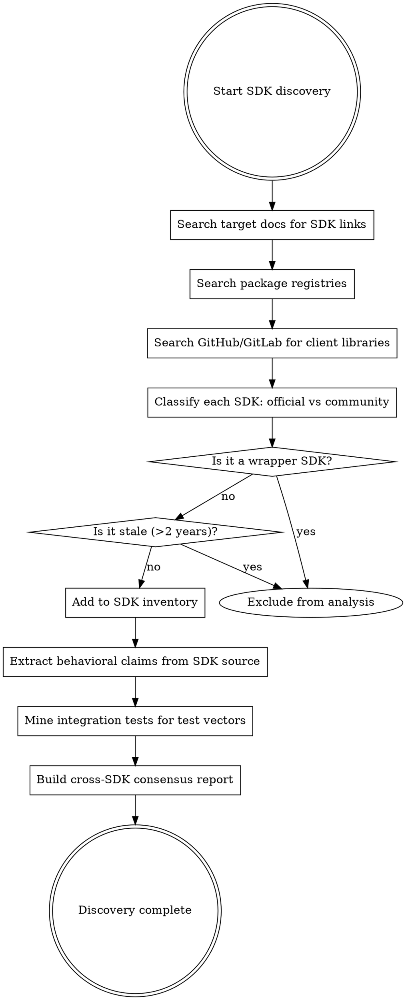

# Ecosystem Analysis

Extract behavioral specifications from third-party SDKs, client libraries, and ecosystem tooling. Every SDK that consumes the target's APIs encodes behavioral assumptions in executable logic -- the strongest form of specification.

## When to Use This Mode

Use SDK/Ecosystem mode when the target product has:
- Public APIs consumed by third-party client libraries
- Official SDKs published on package registries
- Community-maintained client libraries on GitHub/GitLab
- Open-source integrations or plugins that interact with the target

This mode runs independently of all other intelligence sources. It requires no source code access, no runtime execution, and no container. It needs only network access to package registries and code hosting platforms.

Targets without a public SDK or third-party client ecosystem get no useful signal from this mode — skip it.

## Source Origin

SDK analysis draws only from published artifacts — client libraries on package registries, open-source community integrations, and the examples in official documentation. Nothing in this mode reads the target's source code; all inputs are material the target's vendor has already published for third-party developers to consume.

All SDK-derived intelligence is **public origin** and goes to `workspace/public/ecosystem/`.

## Agents

| Agent | Purpose | Output |
|-------|---------|--------|
| `sdk-analyzer` | Discover and analyze SDK source code for behavioral assumptions | `workspace/public/ecosystem/sdks/` |
| `integration-test-miner` | Extract test vectors from SDK test suites and fixtures | `workspace/public/ecosystem/tests/` |

Run `sdk-analyzer` first (it produces the SDK inventory), then `integration-test-miner` (it uses the inventory to find test suites).

## SDK Discovery Strategy



### Discovery Sources (Priority Order)

1. **Target's documentation** -- "Client Libraries", "SDKs", "Getting Started" pages
2. **Package registries** -- search for the target name on:

| Registry | Language | Search Pattern |
|----------|----------|---------------|
| npm | JavaScript/TypeScript | `https://www.npmjs.com/search?q={target}` |
| PyPI | Python | `https://pypi.org/search/?q={target}` |
| crates.io | Rust | `https://crates.io/search?q={target}` |
| Maven Central | Java/Kotlin | `https://search.maven.org/search?q={target}` |
| NuGet | C#/.NET | `https://www.nuget.org/packages?q={target}` |
| RubyGems | Ruby | `https://rubygems.org/search?query={target}` |
| pkg.go.dev | Go | `https://pkg.go.dev/search?q={target}` |
| Hex.pm | Elixir | `https://hex.pm/packages?search={target}` |
| Packagist | PHP | `https://packagist.org/?query={target}` |

3. **GitHub/GitLab** -- search topics, code search for import statements
4. **Web search** -- '{target} SDK', '{target} client library'

### SDK Classification

For each discovered SDK, record: name, language, type (official/community), version, repository URL, package registry URL, last updated date, downloads/stars, maintainer, target API version, license.

### Prioritization

1. **Official SDKs first** -- maintained by the target's organization, most accurate
2. **Most-downloaded community SDKs** -- download count correlates with community vetting
3. **Recently updated over stale** -- packages >2 years old may target deprecated APIs
4. **Multiple languages** -- analyzing the same API from 3+ languages provides cross-language corroboration

### Exclusion Criteria

- **Wrapper SDKs** that depend on another SDK (check dependencies). Not independent sources.
- **Stale packages** last updated >2 years ago. May reflect deprecated API versions.
- **Minimal wrappers** with few stars/downloads and negligible behavioral content.

## Behavioral Extraction Methodology

### What SDKs Reveal

| Category | What to Look For | How to Find It |
|----------|-----------------|----------------|
| API Surface | Endpoint URLs, HTTP methods, URL patterns | HTTP method calls, URL string literals, route constants |
| Request Schemas | Field names, types, required/optional, constraints | Object construction near HTTP calls, TypeScript interfaces, validation logic |
| Response Schemas | Parsed fields, types, structure | Response type definitions, JSON deserialization, field access patterns |
| Authentication | Token types, header names, credential flows | `Authorization` header, auth middleware, constructor parameters |
| Error Handling | Error codes, types, response format | Custom exception classes, error parsing, status code handling |
| Retry/Backoff | Retryable codes, backoff algorithm, retry headers | Retry loops, `Retry-After` parsing, backoff calculation |
| Versioning | API version in URL or headers | Version strings in paths, version headers |
| Pagination | Cursor/offset patterns, page size | Iterator classes, `after`/`cursor`/`limit` parameters |
| Streaming | SSE/WebSocket, event types, termination | SSE parsing, WebSocket handling, `[DONE]` signals |
| Timeouts | Default values, timeout configuration | Client construction defaults, timeout override mechanisms |

### Extraction Rules

- **One claim per extraction.** Do not combine multiple behavioral observations into a single claim.
- **Cite the specific file and line.** `ref=https://github.com/org/repo/blob/v1.0.0/src/client.ts#L42`
- **Distinguish required from optional.** If a field is only sent conditionally, it is optional.
- **Record defaults.** If the SDK uses a default value for a parameter, that default is behavioral intelligence.
- **Note constraints.** Validation logic reveals constraints (min/max, allowed values, format requirements).

### Confidence Rules

- **Single SDK claim = `inferred`.** One SDK author's assumption is not confirmed.
- **2+ SDKs agree = `confirmed`.** Independent implementations reaching the same conclusion is strong evidence.
- **SDKs disagree = both remain `inferred`.** Record both claims with a disagreement note.
- **Wrapper SDKs do not count for consensus.** They are not independent sources.

## Integration Test Mining

### Test Classification

| Type | Value | Characteristics |
|------|-------|----------------|
| Integration tests | HIGH | Call the real target API or use recorded responses |
| Fixture-based tests | HIGHEST | Contain recorded HTTP interactions (literal target responses) |
| Unit tests (mocked) | LOW | Mock the target's responses; reveal SDK assumptions only |

### Where to Find Tests

- Test directories: `test/`, `tests/`, `__tests__/`, `spec/`, `specs/`, `test_*/`, `*_test/`, `integration/`
- Test frameworks: check `package.json` (Jest, Mocha, Vitest), `setup.py`/`pyproject.toml` (pytest), `Cargo.toml` (cargo test), `pom.xml` (JUnit)
- Fixture formats: VCR cassettes (`.yml` in `cassettes/`), Polly recordings, nock fixtures (`.json`), httpretty recordings

### What to Extract from Each Test

1. **The behavioral claim** -- what does this test prove about the target?
2. **Concrete input** -- HTTP method, path, headers, body
3. **Expected output** -- status code, headers, body structure, specific values
4. **Provenance** -- test file path and line number

### Test Vector Format

```markdown
### TV-SDK-{NNN}: {descriptive name}

**Source:** {sdk-name}, {file}:{line}
<!-- cite: source=sdk-analysis, ref={url}, confidence=inferred, agent=integration-test-miner -->

**Input:**
[JSON: method, path, headers, body]

**Expected Output:**
[JSON: status, headers, body]

**Behavioral claim:** {what this test proves}
```

## Output Structure

```
workspace/public/ecosystem/
+-- sdk-inventory.md              # All SDKs discovered
+-- sdks/
|   +-- {sdk-name}/
|       +-- analysis.md           # Full behavioral extraction
+-- tests/
|   +-- test-inventory.md         # All test suites found
|   +-- extracted-vectors.md      # Test cases as behavioral claims
|   +-- fixtures/
|       +-- {sdk-name}/           # Analyzed fixture content
+-- consensus.md                  # Multi-SDK agreement/disagreement
```

## Provenance

All citations use `source=sdk-analysis`. Ref format for GitHub-hosted SDKs:

```
ref=https://github.com/{org}/{repo}/blob/{version}/{file}#{line}
```

For package registry sources:

```
ref=https://www.npmjs.com/package/{name}/v/{version}
```

Initial confidence is `inferred` (single SDK). Escalates to `confirmed` through:
- Multi-SDK consensus (2+ independent SDKs agree)
- Cross-mode corroboration (docs, runtime observation, or source code analysis confirms the SDK claim)

## Challenges and Mitigations

| Challenge | Mitigation |
|-----------|-----------|
| Outdated SDKs | Record version and date; prefer latest versions; cross-reference with other sources |
| SDK bugs | Analyze multiple SDKs; bugs in one are unlikely in independent implementations |
| Private/internal SDKs | Skip entirely; analyze only publicly available code |
| Large SDK codebases | Focus on API client layer; ignore utilities, build scripts, docs generators |
| Auto-generated SDKs | Still valuable (generated from an OpenAPI spec); look for hand-written patches |
| Wrapper SDKs | Identify by checking dependencies; exclude from consensus |

## Integration with Pipeline

SDK findings flow to Layer 2 synthesis:
- **feature-discoverer** reads SDK inventory to understand API scope
- **architecture-analyst** reads SDK analyses for API architecture and resource hierarchy
- **api-extractor** reads SDK analyses for complete API surface and schemas
- **analysis-synthesizer** merges SDK findings with other intelligence sources

SDK test vectors flow to Layer 4:
- **test-vector-generator** incorporates SDK-mined vectors into the project's test vector suite
