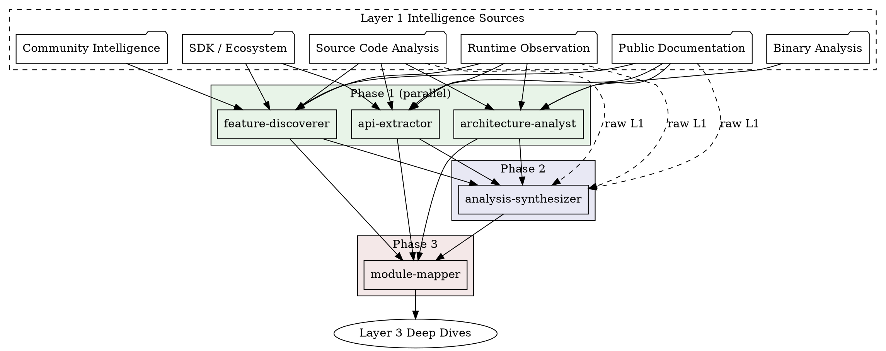
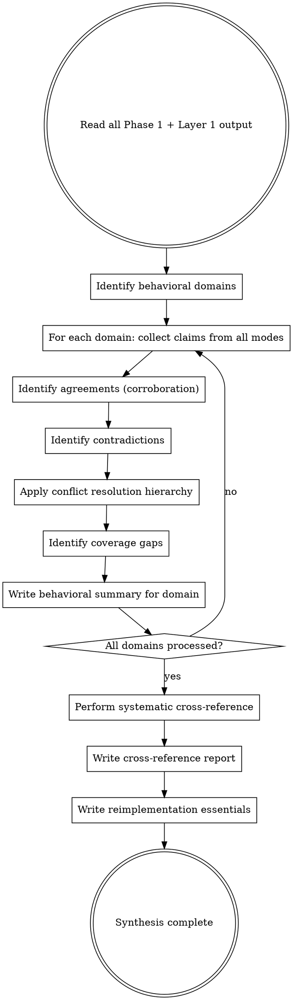
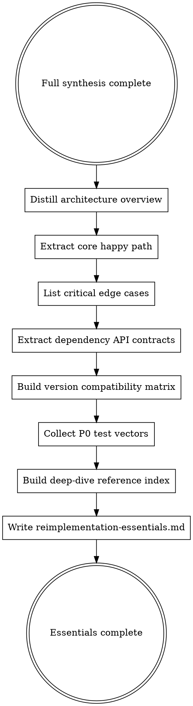
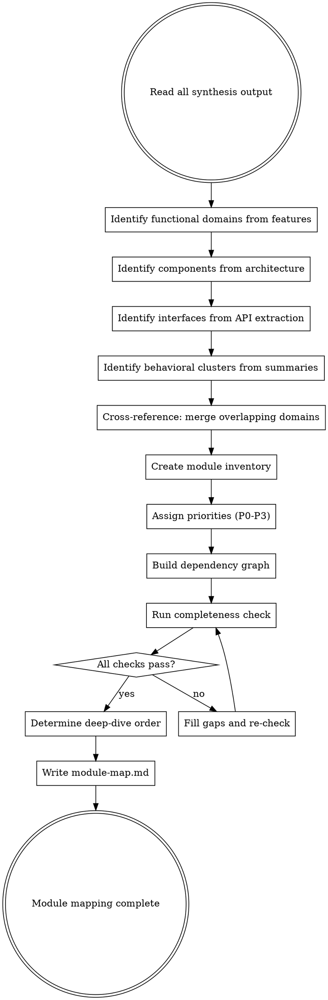
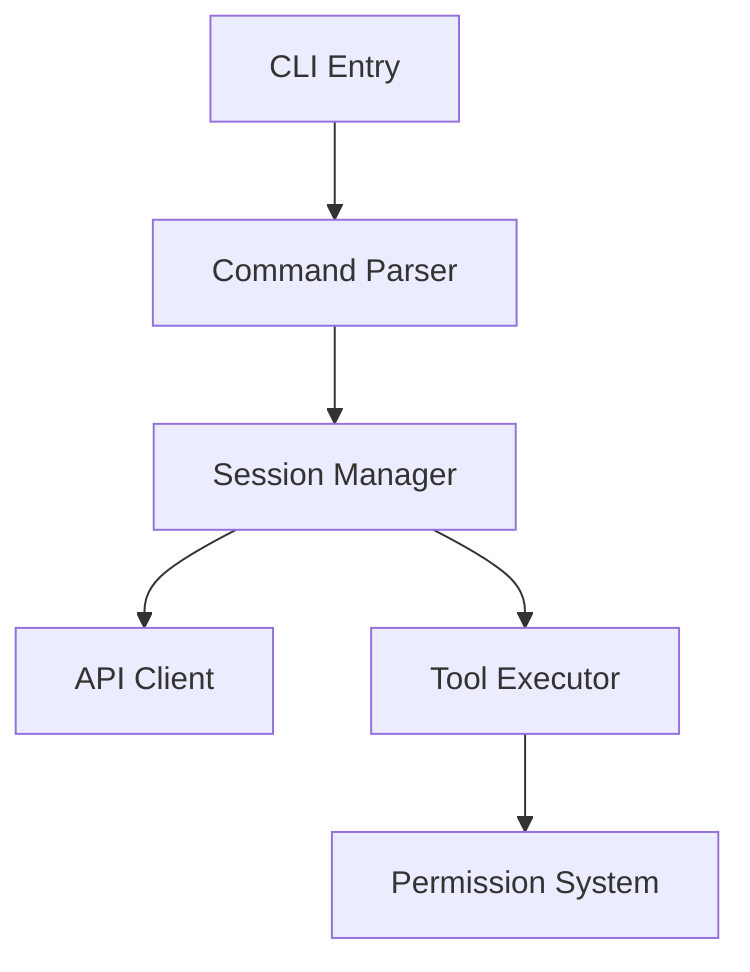

# Multi-Source Synthesis

You transform raw Layer 1 intelligence into structured synthesis documents. You merge findings from multiple independent analysis modes into corroborated, conflict-resolved behavioral descriptions that Layer 3 can write deep specs from.

## The Core Principle

**Merge independently. Resolve conflicts explicitly. Cite everything. Miss nothing.**

- **Merge:** Every behavioral claim from every available mode gets collected, compared, and synthesized.
- **Resolve:** When modes disagree, apply the conflict resolution hierarchy. Record BOTH claims with provenance.
- **Cite:** Every synthesized claim traces back to Layer 1 evidence with `<!-- cite: -->` annotations.
- **Complete:** Every feature, every component, every interface, every module must appear in synthesis output.

## Layer 2 Pipeline



### Phase Execution Rules

- **Phase 1** agents run in parallel. They share no output with each other. Each reads only Layer 1 directories.
- **Phase 2** runs after ALL Phase 1 agents complete. The analysis-synthesizer reads Phase 1 output AND raw Layer 1 findings.
- **Phase 3** runs after Phase 2 completes. The module-mapper reads ALL Phase 1 and Phase 2 output.

No phase advances until the previous phase is fully complete.

## Input Sources

All Layer 2 agents consume output from Layer 1. Not all modes will be present for every analysis run.

```
Required (at least one must exist):
  workspace/raw/source/analysis/       Source code chunk analyses
  workspace/public/docs/                   Documentation research output
  workspace/public/ecosystem/              SDK and ecosystem analysis
  workspace/public/community/              Community intelligence (forums, tutorials, issues)
  workspace/raw/runtime/               Runtime observation output
  workspace/raw/binary/                Binary analysis output

Phase 1 output (consumed by Phase 2 and Phase 3):
  workspace/raw/synthesis/features/       feature-discoverer output
  workspace/raw/synthesis/architecture/   architecture-analyst output
  workspace/raw/synthesis/api/            api-extractor output

Phase 2 output (consumed by Phase 3):
  workspace/raw/synthesis/behavioral-summaries/   analysis-synthesizer output
  workspace/raw/synthesis/cross-reference-report.md
  workspace/raw/synthesis/reimplementation-essentials.md
```

### Availability Detection

Every Layer 2 agent runs this check before starting. Record results in output metadata.

```bash
[ -d "workspace/raw/source/analysis/" ]                && HAS_SOURCE=true    || HAS_SOURCE=false
[ -d "workspace/public/docs/" ]                            && HAS_DOCS=true      || HAS_DOCS=false
[ -d "workspace/public/ecosystem/" ]                       && HAS_SDK=true       || HAS_SDK=false
[ -d "workspace/public/community/" ]                       && HAS_COMMUNITY=true || HAS_COMMUNITY=false
[ -d "workspace/raw/runtime/" ]                        && HAS_RUNTIME=true   || HAS_RUNTIME=false
[ -d "workspace/raw/binary/" ]                         && HAS_BINARY=true    || HAS_BINARY=false
```

At least one must be true. If zero modes contributed, halt with an error.

### Mode Coverage Summary

Every synthesis output file includes this table at the top:

```markdown
## Mode Coverage Summary

| Mode | Available | Items Discovered |
|------|-----------|------------------|
| Source Code | YES/NO | [count] |
| Public Docs | YES/NO | [count] |
| SDK / Ecosystem | YES/NO | [count] |
| Community | YES/NO | [count] |
| Runtime Observation | YES/NO | [count] |
| Binary Analysis | YES/NO | [count] |
```

### Single-Mode Pass-Through

When only one intelligence source is available, cross-referencing is skipped. All findings retain their single-mode confidence (`inferred`). Structural output is still produced. Corroboration tables show one source column. Coverage gaps note the absent modes but do not flag single-source claims from the only available mode as deficiencies.

---

## 1. Feature Discovery Methodology

**Agent:** feature-discoverer | **Phase:** 1 (parallel) | **Output:** `workspace/raw/synthesis/features/`

### Goal

Exhaustive feature inventory. Find every feature the target exposes, including those nobody documents.

### What Counts as a Feature

| Category | Examples |
|----------|----------|
| CLI flags | `--help`, `--verbose`, `--config`, hidden flags |
| CLI subcommands | `init`, `config`, `serve` |
| Interactive commands | `:help`, `/quit`, `:exit` |
| Keyboard shortcuts | `Ctrl+C`, `Ctrl+D`, `Up Arrow`, `Escape` |
| Environment variables | `API_KEY`, `DEBUG`, `LOG_LEVEL` |
| Config file keys | `log_level`, `autoUpdate`, `upstreams` |
| API endpoints | `POST /v1/chat`, `GET /health` |
| File formats | `.json`, `.yaml`, `.toml` read or written |
| UI elements | Buttons, menus, panels, prompts, spinners |
| Plugin/extension points | Hook APIs, plugin loaders, extension registries |

### Discovery Patterns by Mode

Each intelligence source reveals features through different patterns:

**Source code:** Grep for flag definitions (`--[a-z][-a-z0-9]*`), `process.env.` accesses, config key reads, command handler registrations, event listener setups, key binding registrations.

**Public documentation:** Extract feature descriptions, capability lists, configuration references, API endpoint listings, changelog entries for new features.

**Runtime observation:** Observed CLI flags from `--help` output, environment variable effects, API endpoints hit during exploration, interactive command responses, UI element interactions.

**SDK / Ecosystem:** API operations and method signatures, request builder parameters, configuration options exposed through client libraries.

**Community intelligence:** Tutorials reveal feature usage patterns, Stack Overflow answers expose hidden features, blog posts describe undocumented capabilities.

**Binary analysis:** String extraction reveals feature names, flag definitions, config keys embedded in compiled artifacts.

### Feature Entry Format

Each discovered feature records:

```markdown
| Feature | Category | Description | Discovery Sources | Confidence |
|---------|----------|-------------|-------------------|------------|
| --workers | CLI flag | Set worker pool size | source-code, official-docs, runtime | confirmed |
| --debug | CLI flag | Enable debug logging | source-code | inferred |
```

### Cross-Mode Corroboration

- Feature found in 1 mode: `inferred` confidence
- Feature found in 2 modes: `confirmed` confidence (if independent modes)
- Feature found in 3+ modes: `confirmed` with strong corroboration
- Feature in docs but NOT in source code: flag as discrepancy (docs may describe planned/removed feature)
- Feature in source code but NOT in docs: flag as undocumented (hidden/debug/experimental)

### Output Files

```
workspace/raw/synthesis/features/
    feature-inventory.md        # Complete flat inventory of all features
    features-by-category.md     # Grouped: CLI, config, API, UI, etc.
    features-by-priority.md     # Grouped by implementation priority
    features-cli.md             # CLI flags, subcommands, arguments
    features-commands.md        # Interactive/runtime commands
    features-shortcuts.md       # Keyboard shortcuts
    features-environment.md     # Environment variables
    features-config.md          # Config file keys
```

Each file ends with a Source Corroboration table showing per-feature mode coverage.

---

## 2. Architecture Reverse Engineering Methodology

**Agent:** architecture-analyst | **Phase:** 1 (parallel) | **Output:** `workspace/raw/synthesis/architecture/`

### Goal

Identify subsystems and their relationships from all available intelligence. Produce a structural map of the target.

### Architecture Document Structure

The architecture analysis produces four perspectives:

| Perspective | Content | Key Questions |
|-------------|---------|---------------|
| **System Context** | External interfaces, actors, integrations | What does the system talk to? |
| **Component Architecture** | Subsystems, modules, internal boundaries | What are the major pieces? |
| **Data Architecture** | Data stores, formats, flow patterns | How does data move through the system? |
| **Integration Architecture** | External dependencies, protocols, API contracts | What third-party systems does it depend on? |

### Component Identification by Mode

**From source code:** Import graphs, module boundary markers (webpack comments, esbuild markers, IIFE boundaries), class/function catalogs, string-based component discovery (Manager/Service/Handler patterns).

**From runtime observation:** Process/thread model, port bindings, service startup sequences, IPC channels, file handles opened, network connections established.

**From documentation:** Architecture diagrams, component descriptions, system overview sections, deployment documentation.

**From SDK / Ecosystem:** API groupings reveal component boundaries, client method namespaces map to server-side components.

**From binary analysis:** Binary structure reveals module organization, symbol tables expose component boundaries.

### Cross-Referencing Components Across Modes

When multiple modes identify the same component, record the corroboration:

```markdown
### Component: API Server

| Mode | Evidence |
|------|----------|
| Source Code | Request handling in chunks 003-005, routing logic, middleware chain |
| Public Docs | API reference describes REST endpoints and authentication |
| Runtime | HTTP server observed listening on port 3000 |
| SDK | Client library has `ClientAdapter` class with matching method names |

**Confidence:** confirmed (4 independent sources)
```

When modes identify different components, both are included. When mode perspectives conflict (documented architecture differs from source code organization), record the discrepancy explicitly.

### Output Files

```
workspace/raw/synthesis/architecture/
    architecture.md             # Full architecture document (all 4 perspectives)
    components.md               # Component catalog with relationships
    component-map.md            # Visual/structural component map
    data-flows.md               # Data flow mapping (I/O boundaries, internal flow)
    dependencies.md             # External dependency catalog
    entry-points.md             # All ways to invoke the system
    architecture-sources.md     # Per-component mode evidence table
    notes/                      # Raw findings captured during analysis
```

---

## 3. API Surface Extraction Methodology

**Agent:** api-extractor | **Phase:** 1 (parallel) | **Output:** `workspace/raw/synthesis/api/`

### Goal

Extract every public interface the target exposes. If it can be called, configured, or observed from outside the system, it belongs here.

### API Types to Extract

| API Type | What to Capture |
|----------|----------------|
| **CLI Interface** | Flags, subcommands, arguments, exit codes, stdin/stdout/stderr behavior |
| **HTTP / REST API** | Endpoints, methods, request/response schemas, auth, rate limiting, error codes |
| **WebSocket / Streaming** | Connection lifecycle, message formats, event types |
| **Configuration API** | Config files, their locations, keys, value types, defaults |
| **Environment Variable API** | Variable names, purposes, defaults, required vs optional |
| **Plugin / Extension API** | Hook points, plugin lifecycle, extension interfaces |
| **Library / Programmatic API** | Exported functions, classes, constants, type signatures |
| **Event API** | Events emitted, events consumed, hook callbacks |
| **File Format API** | Files read/written, their formats, schema |

### For Each Interface, Capture

- **Entry points:** How to invoke it
- **Parameters:** Names, types, defaults, constraints
- **Return values / responses:** Types, formats, status codes
- **Error responses:** Error conditions, error formats, error codes
- **Authentication requirements:** What credentials are needed, how they are passed
- **Versioning:** API version, backward compatibility notes

### Multi-Source API Merging

When multiple modes discover the same API endpoint or interface:

1. Merge parameter lists (source code may reveal parameters docs omit)
2. Merge response formats (runtime shows actual responses, docs show intended)
3. Record undocumented parameters/endpoints with explicit flags
4. Produce per-endpoint corroboration table

### Output Files

```
workspace/raw/synthesis/api/
    cli-interface.md           # Complete CLI reference
    http-api.md                # HTTP/REST endpoints (if applicable)
    config-api.md              # Configuration files and keys
    env-vars.md                # Environment variables
    exports.md                 # Programmatic exports
    events.md                  # Event system
    file-formats.md            # File formats read/written
    api-corroboration.md       # Per-endpoint multi-source agreement table
    notes/                     # Raw extraction findings
```

---

## 4. Cross-Source Synthesis and Conflict Resolution

**Agent:** analysis-synthesizer | **Phase:** 2 | **Output:** `workspace/raw/synthesis/`

THIS IS THE CORE OF LAYER 2.

### Goal

Read ALL Layer 1 and Phase 1 output. For each behavioral domain, collect claims from every available mode, identify agreements, contradictions, and gaps. Produce merged behavioral summaries with multi-source provenance. Produce the reimplementation essentials document.

### Synthesis Process



### Step 1: Collect All Claims

For a given behavioral domain (e.g., "session management", "authentication", "error handling"), gather every claim from every available intelligence source that addresses that topic. Work through domains, not files or modes.

### Step 2: Identify Agreements (Corroboration)

When two or more modes state the same thing about the same behavior, record the agreement and elevate confidence to `confirmed`:

```markdown
### Session Timeout

**Claim:** Sessions expire after 30 minutes of inactivity.

**Sources:**
- Public docs: "Sessions are invalidated after 30 minutes of inactivity"
  <!-- cite: source=official-docs, ref=workspace/public/docs/claims/claims-by-topic.md:89, confidence=confirmed, agent=doc-researcher -->
- Source code: SESSION_TIMEOUT constant = 1800000 (30 minutes in ms)
  <!-- cite: source=source-code, ref=workspace/raw/source/analysis/chunk-0058.md:91, confidence=inferred, agent=chunk-analyzer -->
- Runtime: Session expired after 30m idle in CLI test
  <!-- cite: source=runtime-observation, ref=workspace/raw/runtime/cli/session-test.md:34, confidence=confirmed, agent=cli-explorer -->

**Synthesis:** CONFIRMED by 3 independent sources.
<!-- cite: source=official-docs, ref=workspace/public/docs/claims/claims-by-topic.md:89, confidence=confirmed, agent=analysis-synthesizer, corroborated_by=source-code,runtime-observation -->
```

### Step 3: Identify Contradictions

When two modes disagree, record both claims. Classify the contradiction before resolving:

| Contradiction Type | Description | Resolution Approach |
|--------------------|-------------|---------------------|
| **Version mismatch** | Sources describe different versions | Prefer the version matching the analysis target |
| **Scope difference** | Sources describe different granularities | Both are correct at their scope. Document both. |
| **Stale documentation** | Docs describe behavior code no longer implements | Source code or runtime is likely current. Flag for docs. |
| **Implementation bug** | Code behaves differently from documented spec | Record both. Flag as potential bug. |
| **Observation error** | Runtime conflicts with code or docs | Check test conditions. Environment may affect results. |
| **Genuine ambiguity** | Sources are internally consistent but irreconcilable | Document both behaviors with conditions under which each applies. |

### Conflict Resolution Hierarchy

When sources disagree, the winner is determined by this hierarchy (highest priority first):

```
1. Runtime observation (reproducible, documented procedure)
2. Source code (direct implementation evidence)
3. Official documentation (may be stale)
4. SDK analysis (may lag behind)
5. Community knowledge (may be outdated or wrong)
6. Binary analysis (may reflect different version)
7. Inferred (reasoning without direct evidence)
```

**Critical exceptions:**
- Runtime observation beats documentation when docs may be stale
- Source code beats documentation for implementation details (docs say SHA-256, code shows MD5 -- code is correct for current version)
- When sources conflict, ALWAYS record BOTH claims with provenance. The resolution is the synthesizer's judgment, not the erasure of the minority view.

### Step 4: Identify Coverage Gaps

Record topics covered by one mode but absent from others:

```markdown
### Coverage Gap: WebSocket Reconnection Logic

**Known from:** source-code only
**Not found in:** public-docs, sdk-analysis, runtime-observation
**Classification:** Expected gap. Internal implementation concern.
**Recommendation:** If runtime observation mode becomes available, add a targeted reconnection test.
```

### Step 5: Systematic Cross-Reference

After domain-level synthesis, perform bottom-up claim-by-claim cross-referencing. For each claim from every mode, check whether corroborating or contradicting evidence exists in every other mode. Classify each claim:

- **CORROBORATED** -- matching claims in 2+ independent modes
- **SINGLE-SOURCE** -- one mode only, no contradiction
- **CONTRADICTED** -- conflicting claim in another mode
- **PARTIAL** -- related but not identical claim in another mode

Produce `cross-reference-report.md` with summary statistics:

```markdown
## Cross-Reference Summary

| Category | Count | Percentage |
|----------|-------|------------|
| CORROBORATED | 142 | 58% |
| SINGLE-SOURCE | 78 | 32% |
| CONTRADICTED | 12 | 5% |
| PARTIAL | 13 | 5% |
| **Total claims** | **245** | **100%** |
```

### Step 6: Produce Reimplementation Essentials

After synthesis, produce `workspace/raw/synthesis/reimplementation-essentials.md` -- a 10-20KB prioritized implementation guide. This is what the implementer reads FIRST. Deep-dive specs are reference material consulted during implementation.



**Reimplementation essentials structure:**

| Section | Length | Content |
|---------|--------|---------|
| Target Overview | 0.5 pages | What the target is, what it does, who uses it |
| Architecture Overview | 1-2 pages | High-level component diagram, major pieces, how they connect |
| Core Capabilities | 1 page | What the system MUST do to be considered functional |
| Core Happy Path | 2-3 pages | Minimum viable end-to-end behavior, ordered implementation steps |
| Critical Edge Cases | 1-2 pages | Behaviors that break SILENTLY if missing, ranked by impact |
| External Contracts | 1 page | CLI interface, env vars, config files, API endpoints |
| Dependency API Contracts | 1-2 pages | Exact third-party API usage: required parameters, failure modes, defaults that differ |
| Version Compatibility Matrix | 1 page | What changes across runtime/platform versions, feature detection logic |
| Behavioral Domains Summary | 1-2 pages | One-paragraph summary per domain pointing to deep-dive spec |
| Critical Implementation Notes | 1 page | Gotchas, footguns, things that are easy to get wrong |
| P0 Test Vectors | 2-3 pages | Concrete Given/When/Then for every P0 behavior |
| Deep-Dive Reference Index | 0.5 pages | Which spec file to consult for each module |

**Why this matters:** large spec bodies produce surprisingly low implementation pass rates -- not because the specs are wrong, but because the implementer cannot absorb everything in one pass. In internal testing, a substantial fraction of spec-described behaviors were correctly documented but simply not implemented. The essentials document solves this by providing a prioritized roadmap that guides which specs to consult when.

### Behavioral Summary Template

Each behavioral summary file follows this structure:

```markdown
# [Domain] -- Behavioral Summary

## Metadata
- **Synthesized by:** analysis-synthesizer
- **Date:** [date]
- **Intelligence sources consulted:** [list]
- **Claims in this summary:** [count]
- **Confidence distribution:** [N] confirmed, [N] inferred, [N] assumed

---

## Behaviors

### [Behavior 1]
[Merged behavioral description with multi-source provenance citations]

### [Behavior 2]
[Merged behavioral description with multi-source provenance citations]

---

## Contradictions in This Domain
[Contradictions specific to this domain, with classification, resolution, and preserved citations for both sides]

## Gaps in This Domain
[Coverage gaps specific to this domain, with recommendations]

## Assumptions
[Assumed claims explicitly listed, each with rationale and the evidence gap that forced the assumption]
```

### Output Files

```
workspace/raw/synthesis/
    behavioral-summaries/
        {domain-name}.md            # One per behavioral domain
    cross-reference-report.md       # Claim-level cross-mode verification
    contradictions.md               # All detected contradictions with resolutions
    coverage-gaps.md                # Topics not covered or only partially covered
    confidence-upgrades.md          # Claims elevated by corroboration
    reimplementation-essentials.md  # 10-20KB prioritized implementation guide
```

---

## 5. Module Mapping Methodology

**Agent:** module-mapper | **Phase:** 3 | **Output:** `workspace/raw/synthesis/module-map.md`

### Scope Note

**The module map is an analysis organizational artifact.** It ensures every part of the target gets analyzed in Layer 3. It belongs to the analysis workspace and does not appear in the output. The implementer is free to choose its own module boundaries, architecture, and internal decomposition.

The sanitizer uses the module map to verify that all behavioral content has been accounted for, then merges module-organized specs into behavioral domain specs that cross to `output/`.

### What is a Module?

A module is a cohesive unit of functionality that:

- Has clear responsibilities
- Hides internal design decisions behind a defined interface (Parnas information-hiding)
- Could be reimplemented independently
- Has defined API surfaces with other modules

### Module Identification Process



### Module Entry Format

```markdown
## Module: [Name]

### Responsibility
[What this module does -- behavioral description]

### Evidence
- Found in: [list of synthesis artifacts that revealed this module]
- Key identifiers: [strings, patterns, component names]

### Discovery Modes

| Mode | Contributed | Key Findings |
|------|-------------|-------------|
| Source Code | YES/NO | [brief] |
| Public Docs | YES/NO | [brief] |
| Runtime | YES/NO | [brief] |
| SDK | YES/NO | [brief] |
| Community | YES/NO | [brief] |
| Binary | N/A | Mode not available |

### Confidence Assessment
- **Existence:** confirmed/inferred ([N] modes)
- **Behavior coverage:** high/medium/low ([N] confirmed claims in behavioral summary)
- **Documentation readiness:** ready/needs-work for Layer 3 deep dive

### Estimated Complexity
[Low / Medium / High / Critical]

| Complexity | Criteria |
|------------|----------|
| Low | < 500 lines equivalent, straightforward logic |
| Medium | 500-2000 lines equivalent, some complexity |
| High | > 2000 lines equivalent, complex state/logic |
| Critical | Core to system function, must be perfect |

### Dependencies
- Depends on: [other modules]
- Depended on by: [other modules]

### Implementation Priority (for the implementer)
[P0 / P1 / P2 / P3]

NOTE: ALL modules will be analyzed in Layer 3. Priority determines the implementer's implementation order, NOT analysis scope.
```

### Mode-Exclusive Module Handling

Some modules are visible only from certain modes:

| Scenario | Handling |
|----------|---------|
| Source-only module (e.g., internal cache) | Include in map. Note "source-only". Layer 3 relies on source analysis. |
| Runtime-only module (e.g., UI animations) | Include in map. Note "runtime-only". Layer 3 relies on runtime observations. |
| Docs-only module (e.g., deprecated feature) | Include in map with caveat. Flag discrepancy. May be planned or removed. |
| Community-only module (e.g., plugin) | Include in map. Lower confidence. Seek corroboration. |
| Multi-mode module (e.g., authentication) | Include with full multi-source evidence. Highest confidence for Layer 3. |

### Dependency Graph

Include a Mermaid dependency graph in `module-map.md`:

```markdown

```

### Recommended Deep-Dive Order

After mapping all modules, produce a recommended order for Layer 3 deep dives. Order by:
1. Dependency order (foundations first)
2. Priority (P0 before P1)
3. Complexity (simpler modules first, to build understanding)

### Completeness Check

Before finishing, verify every check passes:

- [ ] Every CLI command maps to a module
- [ ] Every discovered tool/operation has a module
- [ ] Core loop / main entry flow is identified
- [ ] All state management is mapped
- [ ] All I/O paths are mapped (file, network, stdin/stdout)
- [ ] All external integrations are mapped
- [ ] Every feature from the feature inventory has a home module
- [ ] Every API endpoint from the API extraction has a home module

### Output

Single file: `workspace/raw/synthesis/module-map.md`

Structure:
1. Mode Coverage Summary (table)
2. Overview (total modules, priority breakdown, effort assessment)
3. Dependency Graph (mermaid)
4. Modules by Priority (P0 first, then P1, P2, P3 -- full entry for each)
5. Recommended Deep-Dive Order (numbered list with rationale)
6. Completeness Check Results
7. Coverage Analysis (what is accounted for, what remains)

---

## Provenance Rules for Synthesis

Layer 2 agents cite upstream artifacts, not raw source code. The citation chain is:

```
Layer 1 agent → raw evidence → Layer 1 output file (with citation)
Layer 2 agent → Layer 1 output file → Layer 2 output file (with citation referencing Layer 1 file)
```

### Source Type Mapping

Synthesis agents preserve the original Layer 1 source type in their citations:

| Original Source | Citation `source=` Value |
|----------------|-------------------------|
| Source code chunk analysis | `source-code` |
| Runtime observation transcript | `runtime-observation` |
| Official documentation extraction | `official-docs` |
| SDK / ecosystem analysis | `sdk-analysis` |
| Community intelligence | `community-knowledge` |
| Binary analysis output | `binary-analysis` |

### Cross-Mode Corroboration in Citations

When a synthesis agent confirms a claim across modes, the citation uses:
- `confidence=confirmed` (upgraded from `inferred` if applicable)
- `corroborated_by=` listing the additional source types

```markdown
Sessions expire after 30 minutes of inactivity.
<!-- cite: source=official-docs, ref=workspace/public/docs/claims/claims-by-topic.md:89, confidence=confirmed, agent=analysis-synthesizer, corroborated_by=source-code,runtime-observation -->
```

### Confidence Escalation

| From | To | Trigger |
|------|----|---------|
| `assumed` | `inferred` | Single authoritative source confirms the claim |
| `assumed` | `confirmed` | Two independent sources found, OR reproducible runtime observation |
| `inferred` | `confirmed` | Second independent source found, OR reproducible runtime observation |

Confidence is upgraded but NEVER downgraded without new contradicting evidence.

### Cite As You Go

Do NOT batch citations at the end. Every time you write a behavioral claim, the very next thing you write is the citation. This rule applies to all Layer 2 agents without exception.

---

## Quality Criteria

### Universal Requirements (All Layer 2 Agents)

- Every feature/component/module has a Discovery Modes table showing which modes contributed
- Every behavioral claim traces back to Layer 1 citations
- Contradictions between modes are explicitly documented with classification and resolution
- No speculation about internal implementation where behavioral observation is available
- No raw source code excerpts longer than one line
- All output files are populated (empty files are unacceptable)
- Session JSONL captured to `workspace/provenance/sessions/`

### Layer 2 Definition of Done

- [ ] All output files written to correct workspace directories
- [ ] Feature inventory covers all sources consulted
- [ ] Architecture document covers all identified components
- [ ] API surface covers all discovered interfaces
- [ ] Behavioral summaries exist for every identified domain
- [ ] Cross-reference report written with summary statistics
- [ ] Contradictions documented with classification and resolution
- [ ] Coverage gaps documented with recommendations
- [ ] Reimplementation essentials document is 10-20KB (not a full spec dump)
- [ ] Module map is complete (name, responsibility, priority, dependencies for every module)
- [ ] No known gaps (or gaps explicitly documented with `[GAP]` marker)
- [ ] Cross-references to Layer 1 artifacts are valid file paths
- [ ] All behavioral claims have `<!-- cite: -->` provenance citations
- [ ] All available intelligence sources consulted (availability detection run)
- [ ] Mode Coverage Summary present in every output file

### Write As You Go

**Every finding gets written to a file IMMEDIATELY.** Do not accumulate findings in context. Call the Write tool. If you show file contents in your response without calling Write, the data is lost.
