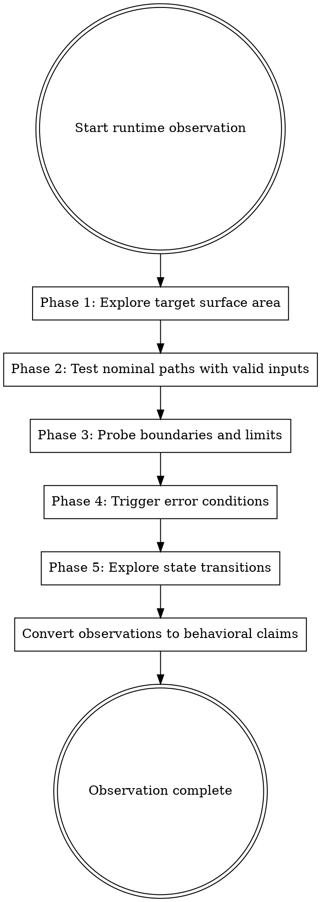
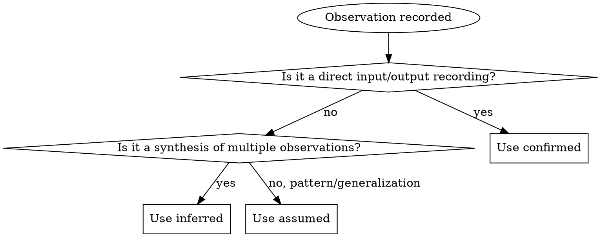

# Runtime Observation Methodology

Runtime observation produces ground truth. When you execute a command and record the output, that observation is an empirical fact -- not an interpretation, not an inference, not a guess. This skill defines how every runtime observation agent operates.

## The Principle

**Run it. Record it. Cite it.**

You never guess what a target does. You run it and document what happens. Every observation is a witnessed fact: this input produced this output in this environment at this time.

## When Runtime Observation Applies

Runtime observation applies to any target that can be executed inside a container:

| Target Type | Observation Method | Primary Agent |
|-------------|-------------------|---------------|
| CLI tools | Execute commands, capture stdout/stderr/exit codes | `cli-explorer` |
| Web applications | HTTP requests, browser automation, form interaction | `web-ui-explorer` |
| APIs and services | HTTP/gRPC/WebSocket requests, response analysis | `behavior-observer` |
| Libraries and SDKs | Probe scripts that import and exercise the library | `behavior-observer` |
| GUI applications | Browser automation for web-based GUIs | `web-ui-explorer` |

Targets that cannot be executed (static documentation, binary files without a runtime) are handled by other intelligence sources. Runtime observation is additive -- it enhances and corroborates intelligence from all other modes.

## Source Origin

All runtime observation output is **RAW**. Running the target and recording its behavior produces artifacts that require sanitization before reaching the implementer. Even though the observations describe external behavior (not implementation internals), recording the target's responses creates a derivation chain.

Targets that cannot be executed in a sandbox (or where executing them has side effects the user declines to accept) should skip this mode.

- Output location: `workspace/raw/runtime/`
- Never write runtime observations to `workspace/output/` or `workspace/public/`.
- The origin label does not reduce the value of the observations. It is a provenance marker that controls downstream processing.

## Container Requirement

All runtime observation happens inside containers. No exceptions. The target is never executed on the host machine. This is a hard safety requirement. The container is already running before any runtime observation agent begins work -- the orchestrator sets it up per the container-execution skill.

Agents MUST NOT attempt to build, start, stop, or remove containers. They interact with an already-running container.

## Five-Phase Observation Methodology

Every runtime observation agent follows these five phases in order. You are not required to complete every phase for every target -- proceed as far as the target type and available time allow. But you MUST follow the phase order.



### Phase 1: Exploration

**Goal:** Discover what the target can do.

**Activities:**
- Run help commands (`--help`, `-h`, `help`, `man target`)
- Read menus, navigation bars, landing pages
- List available API endpoints (OpenAPI, GraphQL introspection, sitemap)
- Discover configuration options (environment variables, config files, CLI flags)
- Identify authentication requirements (does the target prompt for credentials?)
- Check version information (`--version`, `-V`, `/api/version`)

**Output:** A map of the target's surface area. What commands exist. What endpoints respond. What configuration is available. This is the foundation for all subsequent phases.

**Provenance:** Exploration observations are `confidence=confirmed` (the target responded with this output). Inferences about what a discovered feature does are `confidence=inferred` until tested.

### Phase 2: Nominal Path Testing

**Goal:** Exercise the target's happy paths -- standard workflows with valid inputs that produce expected outputs.

**Activities:**
- Execute each command with the simplest valid arguments
- Submit forms with valid data
- Make API requests with well-formed payloads
- Follow the "getting started" workflow end-to-end
- Perform CRUD operations where applicable (create, read, update, delete)
- Test each output format option (JSON, text, CSV, etc.)

**Recording discipline:** For each nominal test, record:
- The exact input (command, request, form data)
- The exact output (stdout, response body, UI state)
- The exit code or HTTP status
- Any side effects (files created, state changed)

**Provenance:** Nominal path observations are `confidence=confirmed`. Each recorded input/output pair is a reproducible fact.

### Phase 3: Boundary Testing

**Goal:** Probe the edges of the target's input domain to discover validation rules, limits, and type handling.

**Activities:**
- **Empty inputs:** What happens with zero-length strings, empty files, no arguments?
- **Maximum sizes:** What is the largest input accepted? When does truncation occur?
- **Special characters:** Unicode, null bytes, newlines in arguments, shell metacharacters
- **Type boundaries:** Negative numbers, zero, MAX_INT, floating point precision
- **Format variations:** Dates in different formats, URLs with unusual schemes, paths with spaces
- **Missing required fields:** Omit each required field one at a time

**Recording discipline:** For each boundary test, record whether the target:
- Rejected the input with a clear error message
- Accepted the input and processed it
- Crashed or hung
- Produced unexpected output

**Provenance:** Boundary observations are `confidence=confirmed`. The target's validation behavior (or lack thereof) at each boundary is an empirical fact.

### Phase 4: Error Probing

**Goal:** Deliberately trigger error conditions to document the target's error handling, error messages, and failure modes.

**Activities:**
- **Authentication failures:** Wrong credentials, expired tokens, missing auth headers
- **Permission failures:** Read-only paths, operations requiring elevation
- **Resource failures:** Non-existent files, unreachable hosts, full disks (simulated)
- **Timeout behaviors:** Commands that take longer than the timeout
- **Concurrent access:** Multiple simultaneous requests (where applicable)
- **Invalid state transitions:** Operations in the wrong order, double-close, resume after finish
- **Malformed input:** Invalid JSON, truncated payloads, wrong content types

**Recording discipline:** For each error probe, record:
- The exact trigger (what caused the error)
- The error message (exact text)
- The error code (exit code, HTTP status, error type)
- Recovery behavior (does the target recover or remain in a broken state?)

**Provenance:** Error probing observations are `confidence=confirmed`. Error messages and codes are empirical facts. Interpretations of what the error means (e.g., "this exit code indicates a permission problem") are `confidence=inferred`.

### Phase 5: State Exploration

**Goal:** Understand how the target maintains and transitions between states.

**Activities:**
- **Session lifecycle:** Create, use, suspend, resume, expire, destroy sessions
- **Configuration persistence:** Change a setting, restart the target, verify the setting persists
- **Data persistence:** Create data, restart the container, verify data survives
- **Cache behavior:** First request vs. second request timing differences
- **Initialization sequence:** What happens on first run vs. subsequent runs?
- **Cleanup behavior:** What does the target do on graceful shutdown vs. kill?

**Recording discipline:** State exploration requires before/after snapshots:

```bash
# Before: capture state
$RUNTIME exec $CONTAINER sh -c 'find /app /tmp -type f -newer /tmp/start-marker 2>/dev/null' \
  > workspace/raw/runtime/observations/state-before.txt

# Action: perform the state change
$RUNTIME exec $CONTAINER sh -c 'target create --name test 2>&1'

# After: capture new state
$RUNTIME exec $CONTAINER sh -c 'find /app /tmp -type f -newer /tmp/start-marker 2>/dev/null' \
  > workspace/raw/runtime/observations/state-after.txt

# Diff: what changed
diff workspace/raw/runtime/observations/state-before.txt \
     workspace/raw/runtime/observations/state-after.txt \
  > workspace/raw/runtime/observations/state-diff.txt
```

**Provenance:** Directly observed state transitions are `confidence=confirmed`. Inferences about internal state management (e.g., "the target probably uses a file-based session store because session files appear in /tmp") are `confidence=inferred`.

## Environment Variation

Behavior may differ across locales, terminal sizes, OS versions, or configuration states. Agents should vary the environment where practical:

- **Locale:** Test with `LC_ALL=C` and at least one non-English locale (e.g., `LC_ALL=ja_JP.UTF-8`)
- **Terminal:** Test with `TERM=dumb` (no color/formatting) and `COLUMNS=40` (narrow terminal)
- **Config state:** Test with default config, empty config, and (if known) non-default config values
- **Environment variables:** Test with and without common variables like `NO_COLOR`, `DEBUG`, `CI=true`

When behavior differs between environments, record both observations and flag the divergence. The goal is not exhaustive environment coverage -- it is catching the obvious cases where behavior is environment-dependent.

## Observation Record Format

Every runtime observation is recorded using this standardized format:

```markdown
## Observation: OBS-{NNN}

**Action:** {Exact command executed or request made}
**Timestamp:** {ISO 8601 timestamp}
**Agent:** {Your agent name}
**Environment:** {Container name, relevant config state}
**Phase:** {exploration | nominal | boundary | error | state}

**Input:**
```
{Exact input -- command line, HTTP request, form data}
```

**Output:**
```
{Exact output -- stdout, HTTP response body, UI text}
```

**Exit Code / Status:** {Exit code for CLI, HTTP status for web, or N/A}
**Stderr:** {Stderr output if separate from stdout, or "merged with stdout"}
**Side Effects:** {Files created, state changed, network connections made, or "none observed"}
**Duration:** {Wall-clock time for the operation, if measured}

**Interpretation:** {What this observation tells us about the target's behavior}
**Intent:** {intended | unknown}

**Citation:** <!-- cite: source=runtime-observation, ref=OBS-{NNN}, confidence={confirmed|inferred}, agent={agent-name} -->
```

### Observation ID Rules

- Three-digit zero-padded sequential number: `OBS-001`, `OBS-002`, etc.
- IDs are scoped per agent run. Each agent produces its own independent sequence.
- IDs are immutable. If invalidated, annotate with `**Status: INVALIDATED** -- {reason}` but do not reuse.
- Global uniqueness is achieved by combining agent name + observation ID.

## Container Interaction Patterns

All commands go through `$RUNTIME exec $CONTAINER` with timeout wrapping. Use the container-execution skill for the full pattern reference.

### Standard CLI Command Execution

```bash
run_observation() {
  local obs_id="$1"
  local command="$2"
  local output_file="$3"

  local start_time=$(date +%s%3N)

  timeout "$TIMEOUT" $RUNTIME exec "$CONTAINER" sh -c "$command" \
    > "${output_file}.stdout" 2> "${output_file}.stderr"
  local exit_code=$?

  local end_time=$(date +%s%3N)
  local duration=$((end_time - start_time))

  if [ $exit_code -eq 124 ]; then
    echo "TIMEOUT after ${TIMEOUT}s" >> "${output_file}.stderr"
  fi

  echo "{\"id\":\"${obs_id}\",\"exit_code\":${exit_code},\"duration_ms\":${duration}}" \
    >> "${output_file}.meta"
}
```

### HTTP Request Capture (Web/API Targets)

```bash
curl -s -D- \
  -w "\n---TIMING---\ntime_total: %{time_total}\ntime_connect: %{time_connect}\ntime_starttransfer: %{time_starttransfer}\nhttp_code: %{http_code}\n" \
  "http://127.0.0.1:3000${ENDPOINT}" \
  > "workspace/raw/runtime/web/request-${ENDPOINT_SLUG}.txt" 2>&1
```

### File System Observation

```bash
# Create timestamp marker before operation
$RUNTIME exec $CONTAINER touch /tmp/observation-marker

# Perform the operation
$RUNTIME exec $CONTAINER sh -c 'target create --name test 2>&1'

# Find files modified after the marker
$RUNTIME exec $CONTAINER find /app /tmp -type f -newer /tmp/observation-marker 2>/dev/null \
  > workspace/raw/runtime/observations/filesystem-changes.txt

# Examine created files
$RUNTIME exec $CONTAINER cat /app/data/test.json 2>/dev/null \
  > workspace/raw/runtime/observations/created-file-contents.txt
```

### Environment Variable Injection

```bash
for var in "DEBUG=1" "DEBUG=0" "LOG_LEVEL=verbose" "LOG_LEVEL=quiet" \
           "NO_COLOR=1" "FORCE_COLOR=1" "NODE_ENV=production" "NODE_ENV=development"; do
  varname="${var%%=*}"
  timeout 30 $RUNTIME exec -e "$var" $CONTAINER sh -c 'target --version 2>&1' \
    > "workspace/raw/runtime/cli/env-${varname}.txt" 2>&1
done
```

### Network Observation for Web/API Targets

```bash
# List network connections the target is making (inside the container)
$RUNTIME exec $CONTAINER sh -c 'ss -tuln 2>/dev/null || netstat -tuln 2>/dev/null' \
  > workspace/raw/runtime/network/listening-ports.txt
```

## Observation-to-Claim Conversion

Observations become behavioral claims through interpretation.



**Absence of observation is not evidence.** "The target does not support X" requires trying X and recording the failure. "I did not test X" is not evidence that X does not exist.

### Claim Writing Discipline

When writing claims derived from observations:

```markdown
The `list` command supports JSON output via the `--output json` flag.
<!-- cite: source=runtime-observation, ref=OBS-017, confidence=confirmed, agent=cli-explorer -->

The JSON output contains objects with `name`, `status`, and `created` fields.
<!-- cite: source=runtime-observation, ref=OBS-017, confidence=confirmed, agent=cli-explorer -->

The `status` field appears to be an enum with values "active" and "inactive".
<!-- cite: source=runtime-observation, ref=OBS-017, confidence=inferred, agent=cli-explorer -->
```

Note: The first two claims are confirmed (directly observed). The third is inferred (only two values were observed; there might be others).

## Output Directory Structure

All runtime observation output lives under `workspace/raw/runtime/`. Each agent writes to its designated subdirectory:

```
workspace/raw/runtime/
  observations/          # behavior-observer output
  cli/                   # cli-explorer output
  web/                   # web-ui-explorer output
  ux-flows/              # ux-documenter output
  network/               # Shared network observation captures
```

## Discovering Undocumented Behaviors

Runtime observation can discover behaviors that no other mode can find:

- **Undocumented flags** that appear in help text but not in official documentation
- **Hidden API endpoints** that respond to requests but are not in the OpenAPI schema
- **Implicit defaults** that are never stated anywhere but are observable at runtime
- **Error messages** that reveal internal behavior when the target is pushed beyond its documented limits
- **Timing behaviors** (rate limits, timeouts, retry intervals) that are not documented
- **Side effects** (files created, environment changes) that are not mentioned in docs or code comments

These discoveries are flagged as `confidence=confirmed` (they were observed) but with a note that no other source corroborates them. This makes them high-priority items for the synthesis layer to investigate across other modes.

## Contradiction Discovery

When runtime observations contradict claims from other modes, the contradiction is valuable data. Record contradictions in the observation file and flag them for the `spec-verifier` agent at Gate 1. Each contradiction documents:

- The conflicting claim and its source
- The observation that contradicts it
- The priority for resolution

## Error Handling

- **Command timeout (exit 124):** Capture partial output, note the timeout, move on. Timeouts are behavioral data.
- **Container crash/OOM:** Check container status, capture crash logs. Crashes are behavioral data.
- **No output:** Record the absence of output as an observation. Empty responses are data.
- **Unexpected output:** Record it exactly as received. Do not filter or correct.

Every failure mode produces data. Never discard a failed observation -- document it.

## What Runtime Observation Is NOT

- It is NOT source code analysis. You never read implementation code.
- It is NOT documentation review. You never cite docs as primary evidence.
- It is NOT inference from conventions. You cite what you observed.
- It is NOT exhaustive coverage. You explore as far as time allows and document what you found and what you did not test.

## Integration with the Pipeline

Runtime observations serve the pipeline in three key ways:

1. **Corroboration.** A behavioral claim from documentation that is also confirmed by runtime observation earns the highest confidence level. Runtime observation is the strongest corroborating evidence.

2. **Discovery.** Runtime observation finds behaviors that no other mode can: undocumented flags, hidden endpoints, implicit defaults, timing behaviors, side effects.

3. **Test vectors.** Every observation that records an exact input/output pair is a candidate test vector. The `test-vector-generator` agent in Layer 4 consumes observation records and converts confirmed observations into formal test cases for the implementer.
