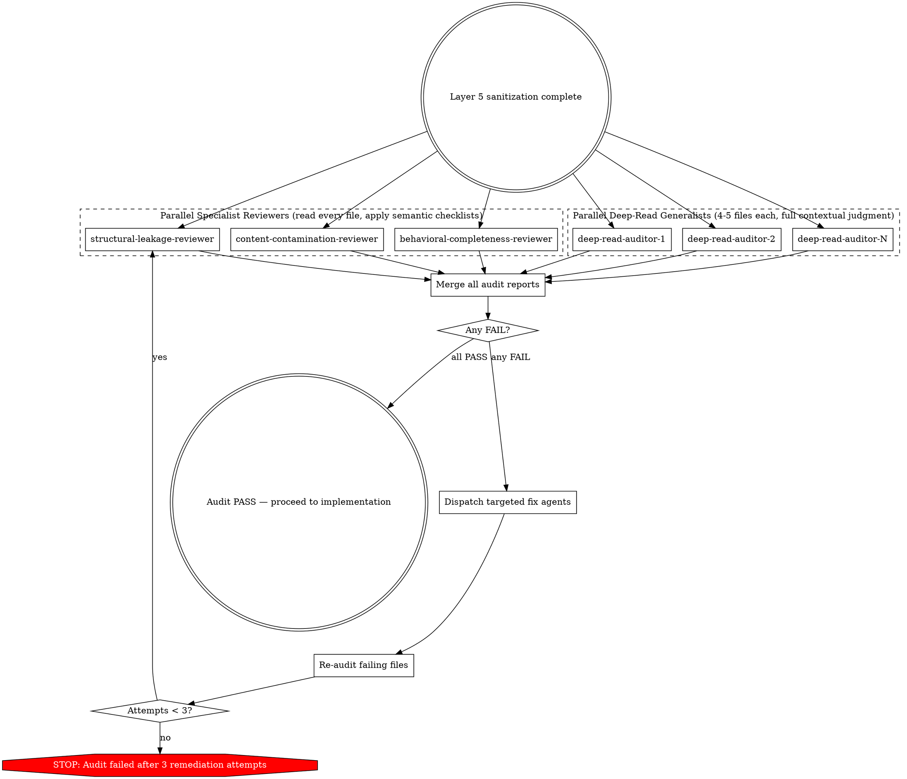

# Second-Pass Review (Layer 6)

Sanitization is necessary but insufficient. The author of a sanitized spec can't reliably catch their own leaks — the same assumptions that let implementation details slip in during the rewrite also let them slip past a self-review. A fresh read, with no access to the raw analysis, catches drift the author missed.

## Why This Exists

Sanitization alone misses contamination in predictable categories:
- **Structural leakage:** Module names in Part headers, cross-module dependency tables, module counts carried into the output
- **Content contamination:** Minified identifiers, line number references, IPC channel names, state-store selectors, internal filenames
- **Behavioral completeness:** Usually passes, because completeness is the easiest dimension to check

Root causes:
1. Sanitization agents copy-paste instead of rewriting
2. Gate 2 flags "zero leakage" but never defines what to look for
3. Grep patterns can't catch descriptive English identifiers
4. Without a second-pass review, authors can't catch their own blind spots

## Audit Pipeline



## Scope Rules

- **READ ONLY from `workspace/output/`** — auditors check what reached the output without cross-referencing the raw analysis
- Detailed reports with per-finding evidence are written to `workspace/raw/audit/` alongside other analysis artifacts
- Top-level summaries with PASS/FAIL verdicts are written to `workspace/output/audit/` so downstream consumers see review outcomes
- Summaries describe *outcomes*, not *source-derived examples*: a category PASS or FAIL with counts, plus overall PASS/FAIL. Per-finding details live in the raw-side reports for remediation; they don't belong in the implementer-facing output.

---

## Why This Is LLM-Based, Not Grep-Based

Pattern matching is fundamentally the wrong tool for contamination detection. It produces both false positives and false negatives at rates that make it unreliable as a primary mechanism.

**False positives are pervasive.** Patterns that detect minified identifiers also match regex character classes, priority levels (P0, P1), and standard technology names. Patterns for code structure language match natural English ("cannot function without"). Patterns for module counts match legitimate behavioral quantities ("supports 3 output formats"). An auditor drowning in false positives either wastes time on noise or starts ignoring real findings.

**Contextual contamination is invisible to patterns.** No regex can detect:
- A legitimate-looking constant name that is actually an internal implementation detail
- Behavioral prose that describes code structure rather than observable behavior
- Tables that mix clean behavioral content with contaminated source references
- Feature flags and telemetry events that look like ordinary string constants

**Semantic judgment catches everything patterns miss.** The core test is simple: "Would an implementor encounter this exact string without seeing the source code?" An LLM can apply this test to every identifier, name, and reference in a spec, using contextual understanding that patterns lack. This catches minified symbols, internal function names, vendor-specific flags, and structural leakage — all with a single semantic criterion rather than a brittle pattern library.

## LLM-Based Audit Protocol

All auditors — specialist reviewers and deep-read generalists — are LLM agents that read files end-to-end and apply semantic judgment. There is no grep triage phase.

### Specialist Reviewers

Three parallel agents (structural-leakage-reviewer, content-contamination-reviewer, behavioral-completeness-reviewer) each read **every file** in `workspace/output/specs/` and apply their category-specific checklists. See the role sections below for their checklists.

Each specialist reviewer:
1. Reads every file in `workspace/output/specs/` end-to-end
2. For each finding, applies the semantic test: **"Would an implementor encounter this exact string without seeing the source code?"**
3. Classifies findings by their category checklist (SL-1 through SL-8, CC-1 through CC-12, or BC-1 through BC-9)
4. Produces a structured verdict per file (PASS/FAIL with evidence)

### Deep-Read Generalists

In parallel with the specialists, dispatch deep-read auditor agents (one per 4-5 domain files) with this prompt template:

```
Role: deep-read auditor
Skill: second-pass-review

Read each of these files END TO END:
- workspace/output/specs/domains/<file1>.md
- workspace/output/specs/domains/<file2>.md
- ...

## The Test

For every identifier, name, or reference in the spec, ask:
**"Would an implementor encounter this exact string without seeing the source code?"**

If YES (it's in official docs, CLI help, config schemas, API specs, protocol standards) → CLEAN.
If NO (it came from reading the source code, observing internal state, or reverse engineering) → CONTAMINATION.

This test catches everything: minified gibberish, internal function names, internal feature flags, internal telemetry events, source file paths, and line numbers. No pattern list needed — just judgment.

## Common traps

- **Descriptive camelCase**: `shouldRetryOnTimeout` looks like English but it's an internal variable name. A different developer would call it something else. CONTAMINATION.
- **Feature flags with vendor prefixes**: vendor-prefixed flags (e.g., `<vendor>_experiment_*`, `ff_<scope>_*`) — these are internal, not user-facing. CONTAMINATION.
- **Telemetry event names**: `request_rate_limited`, `worker_shutdown_initiated` — internal analytics. CONTAMINATION.
- **Config property names that look behavioral**: `strictSchemaValidation` — is this the actual config key users write, or an internal state property? Check the config schema spec to verify.

## What is NOT contamination

- Environment variables users set: `DATABASE_URL`, `CACHE_DISABLE_TTL`
- CLI flags: `--format`, `--workers`, `--follow`
- Config file keys users type: `upstreams`, `log_level`, `read_timeout`
- API/protocol field names: `Retry-After`, `Content-Type`, `Authorization`
- Public library/tool names: `jq`, `ffmpeg`, `pandoc`
- Standard tech names: `OAuth`, `PKCE`, `TLS`, `JWT`
- IDE names: `PyCharm`, `GoLand`, `VSCode`

For each file, report:
1. PASS or FAIL
2. If FAIL: exact line numbers and the contaminating text
3. Brief explanation of why it's contamination (applying the test above)

Write findings to workspace/raw/audit/deep-read-<batch>.md
```

### Targeted Fix

For each file that failed any audit (specialist or generalist), dispatch a fix agent:

```
Role: contamination fixer
Skill: spec-sanitization (contamination taxonomy + rewrite patterns)

Read workspace/output/specs/domains/<file>.md

The audit found these specific issues:
[paste exact findings with line numbers]

Fix ONLY the identified issues. Do NOT rewrite clean content.
For each fix, apply the appropriate rewrite pattern:
- Minified IDs → remove or describe the behavior
- Line numbers → remove the "line NNN" reference, keep the behavioral content
- Module names → replace with behavioral domain description
- Feature flags → "a feature gate controlling [behavior]"
- Part N: headers → behavioral domain name

Write the corrected file back to the same path.
```

### Re-verify

After all fixes, re-run audit (specialists + deep-read) on previously-failing files. Repeat up to 3 times.

### Agent Sizing

- **Specialist reviewers**: 3 agents, each reads all files for their category
- **Deep-read generalists**: 4-5 domain files each (keeps context manageable)
- **Fix agents**: 1 file each (focused, targeted fixes)
- **Parallelism**: All specialist and deep-read agents run in parallel; all fix agents run in parallel

---

## Role: structural-leakage-reviewer

Checks whether the organizational structure of `workspace/output/` leaks the original's internal module decomposition.

**Why this matters:** output specs describe behavior, not the original's architecture. An implementer anchored to the original's module structure will reproduce its design — even when a different decomposition would be better for the new implementation. Module counts, inter-module tables, and domain-to-module mappings all encode architectural decisions that should be the implementer's to make fresh.

### Semantic Checklist (8 categories)

Read every file in `workspace/output/specs/` end-to-end. For each file, check all 8 categories. Apply the core test: **"Would an implementor encounter this exact string without seeing the source code?"**

#### SL-1: Module Names in Headers

Scan all `#`, `##`, `###` headers. Flag any header that contains a source module name, internal component name, or internal package name rather than a behavioral domain description.

A header like "Session Management" is behavioral (PASS). A header like "Fx3 Module" or "Part 3: CacheManager" is structural leakage (FAIL).

#### SL-2: Part N: Headers

The `Part N:` numbering pattern reveals the original module decomposition count and ordering. Any `Part N:` header is FAIL. Clean specs use behavioral domain names, not numbered parts.

#### SL-3: Module Counts

Any reference to a specific count of modules, components, or source files reveals the internal decomposition. FAIL unless the count refers to a user-facing concept (e.g., "supports 3 output formats").

#### SL-4: Cross-Module / Inter-Module / Module Boundary Sections

Section headings or content that reference module-to-module relationships (e.g., "cross-module", "inter-module", "module boundary", "module interface", "module dependency"). All are FAIL. Clean specs describe behavioral integration, not module interfaces.

#### SL-5: Module IDs (MOD-NNN)

Internal module identifiers from the analysis module map. Any `MOD-NNN` reference is FAIL.

#### SL-6: Interface Consumption Tables

Tables showing which module consumes which module's interface. Look for language like "consumes", "consumed by", "provides to", "depends on module", "module provides".

"Depends on the API key being set" is behavioral (PASS). "Depends on AuthModule" is structural (FAIL).

#### SL-7: Domain-to-Module Mappings

Any text that maps a behavioral domain back to its source module(s). Look for language like "from module", "source module", "originally in", "derived from module", "mapped from". All are FAIL.

#### SL-8: Raw Paths

Any reference to `workspace/raw/` or files within it. All are FAIL.

### Structural Audit Output

Write detailed report to `workspace/raw/audit/structural-leakage.md`:
- Per-category: PASS/FAIL, match count, file:line evidence for each match
- Summary: total categories checked, total findings, overall PASS/FAIL

Write summary to `workspace/output/audit/structural-summary.md`:
- Per-category: PASS/FAIL only
- Overall: PASS/FAIL
- Report counts only (e.g., "N findings in M files"); the per-finding examples live in the detailed raw-side report.

---

## Role: content-contamination-reviewer

Checks whether implementation-specific content from the original source survives in `workspace/output/`.

### Semantic Checklist (12 categories)

Read every file in `workspace/output/specs/` end-to-end. For each file, check all 12 categories. Apply the core test: **"Would an implementor encounter this exact string without seeing the source code?"**

#### CC-1: Minified Identifiers

Short alphanumeric tokens that are artifacts of minification or bundling (e.g., `Ab2`, `sp`, `r0`, `Fx3`, `Qz`). Look for 2-3 character tokens that have no English meaning and appear in code-like or identifier-like contexts.

Two-letter abbreviations like "UI", "IO", "ID" are OK. Behavioral acronyms like "API", "CLI", "SDK" are OK. If the token has no English meaning, it's contamination.

#### CC-2: Line Number References

References to specific source code line numbers (e.g., "line 42", "L157", ":234:"). FAIL unless referencing a user-facing output (e.g., "error reported at line 5 of the config file").

#### CC-3: Source File Paths

Internal source file paths, import paths, or bundle chunk references. Look for paths containing `src/`, `lib/`, `dist/`, package manager directories, source file extensions in path context, or bundle chunk references (e.g., `chunk-042`).

FAIL for all internal paths. Clean specs reference user-facing paths only (e.g., `~/.config/app/settings.json`).

#### CC-4: Internal Function/Class Names

Named functions, classes, or methods from the source code. Look for camelCase identifiers that look like function/method names (e.g., `parseArgs()`, `serializeResponse()`), and PascalCase identifiers that look like class names (e.g., `JobRunner`, `QueueHandler`).

Well-known compound words like "JavaScript", "TypeScript", "WebSocket" are legitimate (PASS). Internal names that a different developer would name differently are contamination (FAIL).

#### CC-5: Code Structure Language

Phrases that describe internal code organization rather than observable behavior. Look for text that names specific functions, classes, or methods and describes calling relationships between them.

"Calls the API endpoint" is behavioral (PASS). "Calls `parseArgs()` which returns..." is code structure (FAIL).

#### CC-6: IPC Channel Names

Internal inter-process communication channel identifiers. Look for IPC-prefixed names, channel string literals, or message-passing identifiers that are internal to the implementation.

**Rewrite guidance:** Replace with "internal messaging mechanism" or describe the behavioral outcome instead.

#### CC-7: Store Property Names / State Selectors

Internal state management property names — selectors, store accessors, or state library-specific patterns. Look for references to specific state management libraries or their API patterns.

**Rewrite guidance:** Replace with behavioral descriptions of the managed state (e.g., "session state data", "user preferences store").

#### CC-8: Feature Flag Names and Telemetry Event Names

Internal feature flag identifiers and telemetry/analytics event names. These are NOT user-facing — they are internal implementation identifiers that happen to be strings rather than minified symbols. Look for:
- Feature flag patterns (e.g., `FF_*`, `FEATURE_*`, vendor-prefixed flags)
- Vendor-specific identifiers (e.g., vendor-prefixed flags (e.g., `<vendor>_experiment_*`, `ff_<scope>_*`), `experiment_*`)
- Telemetry event names (internal analytics strings, not user-visible)

The test is: **does a user type this?** If the user never sees or configures this string, it is an internal identifier and MUST be generalized.

**Rewrite guidance:** Replace flag names with "a feature gate controlling [behavioral description]". Replace telemetry event names with "a telemetry event recording [what is measured]".

#### CC-9: CSS/Styling Class Names

Internal styling class names or module identifiers (CSS classes, BEM naming, styled-component references, styling module paths). FAIL for all. Clean specs describe visual behavior, not styling implementation.

#### CC-10: Database Schema Details

Internal database table names, column names, migration identifiers, or storage API references. Look for SQL statements, database file extensions, migration identifiers, or client-side storage API calls.

**Rewrite guidance:** Replace with behavioral data persistence descriptions (e.g., "persists session data locally").

**External system exception:** Matches in `workspace/output/specs/contracts/` files (database contracts, API contracts, CLI contracts, format contracts) are NOT contamination. External system contracts document interfaces the reimplementation must conform to — the schema/API/CLI details are behavioral constraints, not implementation choices.

#### CC-11: Internal Filenames

Internal application filenames that are not user-facing. Look for filenames with source code extensions that name internal implementation files rather than user-facing configuration or output files.

User-facing filenames (e.g., `config.json`, `settings.yaml`) are PASS. Internal source files (e.g., `auth-handler.py`, `session-manager.go`) are FAIL.

#### CC-12: State Management Selectors

Specific selector or accessor patterns from state management libraries (e.g., `selectUserState`, `useSessionStore`, `getAuthState`). FAIL unless describing a user-facing API.

### Content Audit Output

Write detailed report to `workspace/raw/audit/content-contamination.md`:
- Per-category: PASS/FAIL, match count, file:line evidence for each match
- Summary: total categories checked, total findings, overall PASS/FAIL

Write summary to `workspace/output/audit/content-summary.md`:
- Per-category: PASS/FAIL only
- Overall: PASS/FAIL
- Report counts only (e.g., "N findings in M files"); the per-finding examples live in the detailed raw-side report.

---

## Role: behavioral-completeness-reviewer

Checks that sanitization preserved all behavioral information. This is the "did we throw the baby out with the bathwater?" check.

### Semantic Checklist (9 categories)

Read every file in `workspace/output/specs/` end-to-end. For each file, assess behavioral completeness across all 9 categories. The question here is not "is this contaminated?" but "is critical behavioral information missing?"

#### BC-1: SPEC ID Coverage

Count unique SPEC IDs across all output specs. Compare against the SPEC ID index (if one exists in `output/`). Flag any SPEC IDs that appear in the raw sanitization report but not in output. FAIL if count is significantly lower than expected.

#### BC-2: State Machines

Every stateful behavioral domain should have state machine documentation (states, transitions, triggers). Look for state machine descriptions, state diagrams, transition tables. FAIL if zero across all specs (unless all domains are genuinely stateless).

#### BC-3: Error Conditions

Specs must document error conditions with equal depth to normal operations. Look for error condition descriptions, failure modes, error responses. FAIL if no error handling documentation exists.

#### BC-4: Edge Cases

Every spec should document boundary conditions. Look for edge case descriptions, boundary conditions, corner cases, special cases. FAIL if none are documented.

#### BC-5: Decision Trees

Behavioral branching logic must be documented. Look for decision trees, conditional logic descriptions, branching behavior. FAIL if no branching logic is documented.

#### BC-6: AC-to-SPEC Linkage

Acceptance criteria should reference SPEC IDs they verify. Check `workspace/output/validation/` for acceptance criteria with SPEC ID references. FAIL if zero acceptance criteria exist.

#### BC-7: Test Vector Coverage

Test vectors should exist in `workspace/output/test-vectors/` and contain concrete input/output pairs. FAIL if zero test vector files or zero concrete pairs.

#### BC-8: Constant Preservation

Named constants, magic numbers, timeout values, and limits should survive sanitization. Look for numeric values with units (ms, seconds, bytes, KB, MB), and named constants (MAX, MIN, DEFAULT, LIMIT, TIMEOUT, THRESHOLD). Low count may indicate constants were stripped during sanitization.

#### BC-9: Requirement Level Coverage

Every behavioral claim should have MUST/SHOULD/MAY annotation (RFC 2119 language). FAIL if zero requirement-level keywords exist.

### Completeness Audit Output

Write detailed report to `workspace/raw/audit/behavioral-completeness.md`:
- Per-category: PASS/FAIL, count, assessment
- Summary: total categories checked, total findings, overall PASS/FAIL

Write summary to `workspace/output/audit/completeness-summary.md`:
- Per-category: PASS/FAIL with counts only
- Overall: PASS/FAIL

---

## Remediation Protocol

When any audit role or deep-read agent reports FAIL:

1. **Batch by file**: Group findings by affected file
2. **Dispatch fix agents**: One agent per file (or batch of small files), using the fix agent prompt template from the LLM-Based Audit Protocol
3. **Re-verify**: Re-run specialist and deep-read audits on previously-failing files
4. **Maximum 3 remediation rounds** — if audit still fails after 3 rounds, STOP the pipeline

### Fix Agent Prompt Template

For each affected file, dispatch `greenfield:analyzer`:

```
Role: contamination fixer
Skill: spec-sanitization

Read workspace/output/specs/domains/<file>.md

The audit found these specific issues:
- Line [N]: [exact finding and category]
- Line [M]: [exact finding and category]

Fix ONLY the identified issues. For each:
1. Read the surrounding context (5 lines before/after)
2. Determine if this is real contamination or false positive
3. If real: apply the matching rewrite pattern from the skill
4. If false positive: leave unchanged

Write the corrected file back to the same path.
```

## Output Directory Structure

```
workspace/
├── raw/
│   └── audit/                    # Detailed reports WITH evidence (stays in raw)
│       ├── structural-leakage.md
│       ├── content-contamination.md
│       └── behavioral-completeness.md
└── output/
    └── audit/                    # Summaries (outcomes only)
        ├── structural-summary.md
        ├── content-summary.md
        └── completeness-summary.md
```

## Definition of Done

- [ ] All 8 structural checks executed against `workspace/output/`
- [ ] All 12 content checks executed against `workspace/output/`
- [ ] All 9 behavioral-completeness checks executed against `workspace/output/`
- [ ] Deep contextual audit agents dispatched (one per 4-5 domain files)
- [ ] All deep-read findings triaged (real vs false positive)
- [ ] Detailed reports written to `workspace/raw/audit/`
- [ ] Clean summaries written to `workspace/output/audit/` (outcomes only)
- [ ] Overall PASS/FAIL determination made
- [ ] If FAIL: remediation attempted (up to 3 rounds, using fix agent prompt template)
- [ ] If PASS: `review-complete` git tag applied
