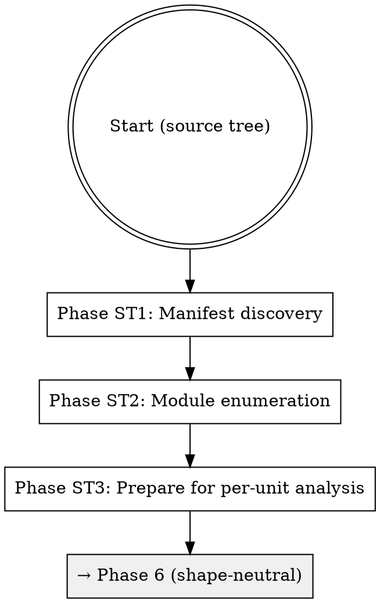
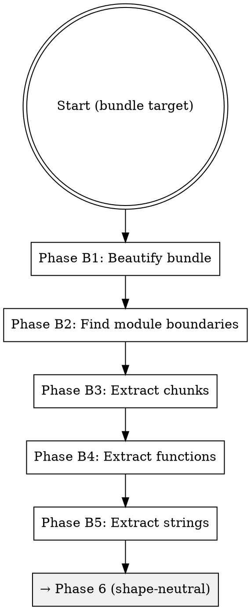

# Source Analysis Methodology

Extract behavioral intelligence from source code. Decompose the codebase into analyzable units, then systematically analyze each unit for behavioral claims with full provenance.

## When to Use This Mode

Source analysis activates when:
- The discovery inventory identifies source code files at the target path
- Any source code needs behavioral analysis (any language, bundled or not)
- Decompiled output exists at `workspace/raw/source/decompiled/`

## General Approach

Source analysis takes three shapes depending on what the target looks like:

- **Source tree** — a repository with a package manifest and conventional directory layout (Python, Rust, Go, Swift, Java, Node/TS, C++, etc.). Follow the **Source Tree Pipeline** below.
- **Bundle** — a single-file minified or packed artifact (JavaScript bundle, Electron asar, webpack/esbuild output). Follow the **Bundle Pipeline** below.
- **Decompiled binary** — a compiled artifact where source isn't directly available. Decompile first via the **Decompilation Path**, then analyze the decompiled output using whichever of the above shapes fits.

Regardless of shape, the pipeline follows the same logical steps:

1. **Assess the source.** What language? How is it organized? How large is it?
2. **Decompose into analyzable units.** Use the language's natural boundaries (modules, packages, files) when they exist. Split bundled artifacts into chunks when they don't.
3. **Analyze each unit exhaustively.** Read every line. Identify every function, method, class. Understand what each does behaviorally.
4. **Extract behavioral specifications.** Write what the code DOES (observable behavior), not how it's structured (implementation details). Every claim gets a provenance citation.

Phases 6-8 (per-unit analysis, per-function deep analysis, targeted extraction) are shape-agnostic and apply to all three paths.

## Decompilation Path

When source code isn't directly available, decompile binaries into structured source before analysis.

### Language-Specific Decompilation Tools

| Language/Platform | Tools | Notes |
|-------------------|-------|-------|
| JVM (Java, Kotlin) | cfr, procyon, fernflower | cfr is standalone JAR; fernflower is IntelliJ's built-in decompiler |
| .NET (C#, F#) | ilspy, dotPeek CLI | ilspy has a command-line mode suitable for automation |
| Python (.pyc, .pyo) | uncompyle6, decompyle3 | decompyle3 targets Python 3.7+; uncompyle6 covers older versions |
| JavaScript (bundled/obfuscated) | js-beautify | Also covered by the Bundle Pipeline below |
| Native (x86, ARM, etc.) | ghidra headless, radare2 | Produces pseudocode, not true source; useful for behavioral extraction but lower fidelity |

### Process

1. **Identify binary type.** Determine the platform and format (JAR, DLL, .pyc, ELF, Mach-O, etc.).
2. **Check tool availability.** Verify the appropriate decompiler is installed and accessible. If tools are unavailable, warn and fall back to binary analysis (strings, symbols, imports/exports).
3. **Decompile to workspace.** Output decompiled source to `workspace/raw/source/decompiled/`. Preserve directory structure from the binary where possible (e.g., Java package paths).
4. **Treat decompiled output as structured source.** Once decompiled, analyze using the same General Approach above — each decompiled file is an analyzable unit.

```bash
mkdir -p workspace/raw/source/decompiled

# Example: JVM with cfr
java -jar cfr.jar target.jar --outputdir workspace/raw/source/decompiled/

# Example: Python with uncompyle6
uncompyle6 -o workspace/raw/source/decompiled/ target.pyc

# Example: .NET with ilspy
ilspycmd target.dll -o workspace/raw/source/decompiled/

# Example: Native with Ghidra headless
analyzeHeadless /tmp/ghidra_project proj -import target.bin -postScript ExportDecompiled.java workspace/raw/source/decompiled/
```

### Quality Notes

Decompiled code differs from original source in predictable ways:

- **Variable and parameter names are lost.** Decompilers generate synthetic names (e.g., `var1`, `a0`). Focus on behavioral patterns, not identifier semantics.
- **Comments are lost.** All inline documentation is gone. Rely on string constants, API calls, and control flow for behavioral understanding.
- **Control flow may be less readable.** Optimized bytecode can decompile into awkward `goto`-style structures or deeply nested conditionals.

These limitations are acceptable for behavioral extraction. The goal is to understand what the code does, not to recover the original source.

## Source Tree Pipeline

Source tree analysis is the common path for Python, Rust, Go, Swift, Java, C++, and similar languages that ship as a repository rather than a single compiled artifact. The target is a directory with a package manifest and a conventional source layout.

The Source Tree Pipeline defines Phases ST1-ST3 (survey, enumeration, and unit preparation). After ST3, control flows into the shape-neutral Phases 6-8 shared with the Bundle Pipeline.



### Phase ST1: Manifest Discovery

Identify the package manifest and read it. The manifest names the package, declares dependencies, and lists the source roots.

| Language | Manifest | Source roots |
|----------|----------|--------------|
| Python | `pyproject.toml`, `setup.py`, `setup.cfg` | `src/`, `<package>/`, or top-level modules |
| Rust | `Cargo.toml` (+ workspace `Cargo.toml`) | `src/`, each crate's `src/` |
| Go | `go.mod` | Module root and every directory with `.go` files |
| Swift | `Package.swift`, `*.xcodeproj/project.pbxproj` | `Sources/<target>/` per target |
| Java/Kotlin | `pom.xml`, `build.gradle`, `build.gradle.kts` | `src/main/java/`, `src/main/kotlin/` |
| C#/F# | `*.csproj`, `*.fsproj` | project-relative source directories |
| C/C++ | `CMakeLists.txt`, `Makefile`, `meson.build` | varies; often `src/` and `include/` |
| Node (non-bundled) | `package.json` | `src/`, `lib/`, `index.js` |

Write the survey to `workspace/raw/source/analysis/survey.md`:

```markdown
# Source Tree Survey

**Language:** <primary>
**Manifest:** <path>
**Package name:** <from manifest>
**Source roots:** <list>
**Dependency count:** <count>
**Line count by language:** <table>
```

### Phase ST2: Module Enumeration

Walk the source roots and produce a module list. A "module" in this pipeline is whatever the language's natural unit of organization is — a Python package, a Rust module/crate, a Go package, a Swift target, a Java package. Don't invent your own boundaries; use the language's.

```bash
# Python: every directory with __init__.py plus every top-level .py file
find <source-root> -name '__init__.py' -exec dirname {} \;
find <source-root> -maxdepth 1 -name '*.py' -not -name '__init__.py'

# Rust: every directory with a mod.rs or every file in src/
find <crate>/src -name '*.rs'

# Go: every directory with at least one .go file
find <source-root> -name '*.go' -exec dirname {} \; | sort -u

# Swift: every directory under Sources/
find Sources -mindepth 2 -maxdepth 2 -type d

# Java/Kotlin: every directory with .java or .kt files
find src/main -name '*.java' -o -name '*.kt' -exec dirname {} \; | sort -u
```

Write the module inventory to `workspace/raw/source/manifests/module-manifest.json`:

```json
{
  "modules": [
    {"path": "src/parser", "files": 7, "lines": 1240, "language": "rust"},
    {"path": "src/http", "files": 4, "lines": 680, "language": "rust"}
  ]
}
```

### Phase ST3: Prepare for Per-Unit Analysis

Once Phases ST1-ST2 have produced the survey and module manifest, each module is ready to be treated as the analyzable unit for the shape-neutral Phase 6. The analysis unit differs by target shape: in a bundle, the unit is a chunk from the bundle-splitter; in a source tree, it's a module as the language defines it. Both produce the same per-unit output format.

Phases 6-8 (Per-Unit Analysis, Per-Function Deep Analysis, Targeted Extraction), described later in this skill, apply from here on.

---

## Bundle Pipeline

The Bundle Pipeline defines Phases B1-B5 (bundle-specific decomposition). After B5, control flows into the shape-neutral Phases 6-8 shared with the Source Tree Pipeline.



Phases B1-B5 are bundle decomposition infrastructure (bundle-splitter). Phases 6-7 produce behavioral analysis (chunk-analyzer, function-analyzer) and are shape-neutral. Phase 8 is optional targeted extraction (targeted-extractor).

For non-bundled targets, run the Source Tree Pipeline's Phases ST1-ST3 instead of this section's B1-B5, then flow into the same shape-neutral Phases 6-8.

## Phase B1: Bundle Preparation

### 1.1 Beautify if Needed

Check if the bundle is minified by comparing line count to byte count. A file with few lines but many bytes is minified.

```bash
LINE_COUNT=$(wc -l < "$BUNDLE")
BYTE_COUNT=$(wc -c < "$BUNDLE")
if [ "$LINE_COUNT" -lt 100 ] && [ "$BYTE_COUNT" -gt 100000 ]; then
  echo "Minified - needs beautification"
  mkdir -p workspace/raw/source
  BEAUTIFIED="workspace/raw/source/target.js"
  if [ ! -f "$BEAUTIFIED" ]; then
    npx js-beautify --type js -f "$BUNDLE" -o "$BEAUTIFIED"
  fi
  TARGET="$BEAUTIFIED"
else
  TARGET="$BUNDLE"
fi
```

Always check for an existing beautified version before re-beautifying. Multiple agents may operate on the same bundle.

### 1.2 Initial Survey

```bash
# Size and line count
ls -lh "$TARGET"
wc -l "$TARGET"

# Detect bundler type
head -100 "$TARGET" > workspace/raw/source/analysis/bundle-header.txt
grep -m1 "webpack\|esbuild\|rollup\|parcel" "$TARGET" || echo "Unknown bundler"
```

Write the survey to `workspace/raw/source/analysis/survey.md`.

## Phase B2: Find Module Boundaries

### 2.1 Bundler-Specific Markers

#### Webpack

```bash
# Module ID markers
grep -n "^/\*\*\*\*\*\*/ \"" "$TARGET" > manifests/webpack-modules.txt

# Export declarations
grep -n "__webpack_require__\.d\|__webpack_exports__" "$TARGET" | head -100 > manifests/webpack-exports.txt
```

#### esbuild

```bash
# esbuild source comments
grep -n "^// " "$TARGET" | grep -v "^// $" > manifests/esbuild-markers.txt
```

#### Generic IIFE Boundaries

```bash
# Function expression boundaries
grep -n "^(function\|^!function\|^var [a-z]* = function" "$TARGET" > manifests/iife-boundaries.txt
```

### 2.2 Heuristic Boundaries

When no bundler-specific markers are found, fall back to heuristics:

```bash
# Long comment separators
grep -n "^/\*\*\*\*\*\*\*\*" "$TARGET" > manifests/separator-comments.txt

# Export clusters
grep -n "^exports\.\|^module\.exports" "$TARGET" > manifests/export-points.txt

# Large gaps (blank lines often separate modules)
awk 'NF==0 {if(++blank>=3) print NR": --- blank section ---"} NF>0 {blank=0}' "$TARGET" | head -100
```

## Phase B3: Extract Chunks

### 3.1 Split by Module Markers

```bash
mkdir -p workspace/raw/source/chunks

# Webpack-style split
csplit -f workspace/raw/source/chunks/chunk- -n 4 "$TARGET" '/^\/\*\*\*\*\*\*\//' '{*}' 2>/dev/null

# Fall back to line-count splitting if no clear markers
if [ $(ls workspace/raw/source/chunks/ | wc -l) -lt 5 ]; then
  rm workspace/raw/source/chunks/*
  split -l 2000 "$TARGET" workspace/raw/source/chunks/chunk-
fi

# Rename to .js
for f in workspace/raw/source/chunks/chunk-*; do
  [ "${f%.js}" = "$f" ] && mv "$f" "${f}.js"
done
```

### 3.2 Generate Chunk Manifest

```bash
echo '{"chunks": [' > workspace/raw/source/manifests/chunk-manifest.json

for chunk in workspace/raw/source/chunks/*.js; do
  name=$(basename "$chunk")
  lines=$(wc -l < "$chunk")
  size=$(wc -c < "$chunk")

  # Extract first meaningful identifier
  first_func=$(grep -oP "function [a-zA-Z_][a-zA-Z0-9_]*" "$chunk" | head -1)
  first_class=$(grep -oP "class [a-zA-Z_][a-zA-Z0-9_]*" "$chunk" | head -1)

  echo "  {\"file\": \"$name\", \"lines\": $lines, \"bytes\": $size, \"first_func\": \"$first_func\", \"first_class\": \"$first_class\"},"
done >> workspace/raw/source/manifests/chunk-manifest.json

echo ']}' >> workspace/raw/source/manifests/chunk-manifest.json
```

## Phase B4: Extract Functions

### 4.1 Find Function Definitions

```bash
mkdir -p workspace/raw/source/functions

# Named functions
grep -n "function [a-zA-Z_][a-zA-Z0-9_]*\s*(" "$TARGET" > workspace/raw/source/manifests/function-locations.txt

# Arrow function assignments
grep -n "const [a-zA-Z_][a-zA-Z0-9_]* = (" "$TARGET" >> workspace/raw/source/manifests/function-locations.txt
grep -n "const [a-zA-Z_][a-zA-Z0-9_]* = async" "$TARGET" >> workspace/raw/source/manifests/function-locations.txt
```

### 4.2 Extract Individual Functions

Extract each significant function (more than 10 lines) to its own file:

```bash
cat > /tmp/extract_funcs.js << 'EOF'
const fs = require('fs');
const code = fs.readFileSync(process.argv[2], 'utf8');

const funcPattern = /function\s+([a-zA-Z_][a-zA-Z0-9_]*)\s*\([^)]*\)\s*\{/g;
let match;
let funcId = 0;
const outDir = process.argv[3] || 'workspace/raw/source/functions';

while ((match = funcPattern.exec(code)) !== null) {
  const name = match[1];
  const start = match.index;
  let depth = 1;
  let i = code.indexOf('{', start) + 1;
  while (depth > 0 && i < code.length) {
    if (code[i] === '{') depth++;
    if (code[i] === '}') depth--;
    i++;
  }
  const funcCode = code.slice(start, i);
  if (funcCode.split('\n').length > 10) {
    fs.writeFileSync(
      `${outDir}/func-${String(funcId++).padStart(4, '0')}-${name}.js`,
      funcCode
    );
  }
}
EOF
node /tmp/extract_funcs.js "$TARGET" workspace/raw/source/functions
```

### 4.3 Generate Function Manifest

```bash
echo '{"functions": [' > workspace/raw/source/manifests/function-manifest.json

for func in workspace/raw/source/functions/*.js; do
  name=$(basename "$func" .js)
  lines=$(wc -l < "$func")
  params=$(grep -oP "function[^(]*\([^)]*\)" "$func" | head -1)
  echo "  {\"file\": \"$name\", \"lines\": $lines, \"signature\": \"$params\"},"
done >> workspace/raw/source/manifests/function-manifest.json

echo ']}' >> workspace/raw/source/manifests/function-manifest.json
```

## Phase B5: String Extraction

### 5.1 Catalog All Strings

```bash
mkdir -p workspace/raw/source/manifests

# Extract all strings with line numbers (minimum 5 chars)
grep -noP '"[^"]{5,}"' "$TARGET" > workspace/raw/source/manifests/strings-raw.txt

# Categorize
grep -P '"https?://' workspace/raw/source/manifests/strings-raw.txt > workspace/raw/source/manifests/strings-urls.txt
grep -P '"[A-Z][A-Z_]{3,}"' workspace/raw/source/manifests/strings-raw.txt > workspace/raw/source/manifests/strings-constants.txt
grep -P '"--[a-z]' workspace/raw/source/manifests/strings-raw.txt > workspace/raw/source/manifests/strings-cli-flags.txt
grep -P '"Error|Failed|Warning' workspace/raw/source/manifests/strings-raw.txt > workspace/raw/source/manifests/strings-errors.txt
```

### 5.2 Map Strings to Chunks

```bash
echo '{"string_locations": [' > workspace/raw/source/manifests/string-manifest.json

for chunk in workspace/raw/source/chunks/*.js; do
  name=$(basename "$chunk")
  echo "  {\"chunk\": \"$name\", \"strings\": [" >> workspace/raw/source/manifests/string-manifest.json
  grep -oP '"[^"]{10,}"' "$chunk" | head -20 | while read str; do
    echo "    $str," >> workspace/raw/source/manifests/string-manifest.json
  done
  echo "  ]}," >> workspace/raw/source/manifests/string-manifest.json
done

echo ']}' >> workspace/raw/source/manifests/string-manifest.json
```

## Phase 6: Per-Unit Analysis (all source shapes)

The chunk-analyzer agent runs once per analyzable unit. What counts as a "unit" depends on target shape:
- **Bundle target:** a chunk file from Phase 3, e.g. `workspace/raw/source/chunks/chunk-0042.js`
- **Source tree:** a source file or small module from Phase 3, e.g. `src/parser/lexer.py` or `src/http/handler.go`
- **Decompiled binary:** a decompiled source file from the Decompilation Path

`$UNIT` in the examples below is the path to the unit being analyzed. Grep patterns use conventions common in several languages; adjust to the target language's idioms.

### Exhaustive Reading Requirement (CRITICAL)

**You MUST read every single line of the unit. No exceptions.**

- Do NOT skim. Do NOT skip sections that "look like boilerplate."
- The grep patterns below are for INDEXING, not for UNDERSTANDING.
- After running greps, you MUST read the full unit file.
- Every routine (function, method, class) must be identified and catalogued.
- Every line must be accounted for.

**Verification checklist before writing analysis:**
- [ ] I read the ENTIRE unit, not just samples
- [ ] I identified EVERY function/method/class in the unit
- [ ] I understand what EVERY section of code does

### 6.1 Initial Survey (Then Read in Full)

```bash
wc -l "$UNIT"            # Know the size
head -50 "$UNIT"         # Get oriented
tail -20 "$UNIT"         # See the end
cat "$UNIT"              # READ THE ENTIRE FILE
```

### 6.2 Identify Behaviors

```bash
# Domain indicators (informative strings are clues in any language)
grep -oE '"[a-zA-Z]{5,}"' "$UNIT" | sort | uniq -c | sort -rn | head -20

# Error messages
grep -oE '"[^"]*[Ee]rror[^"]*"' "$UNIT" | sort -u

# Common action verbs in method/function invocations
grep -oE '\.(read|write|send|receive|parse|validate|handle|process|create|delete|update)\(' "$UNIT" | sort | uniq -c
```

### 6.3 Catalog Capabilities

Use language-appropriate declaration patterns. Read the matches; don't rely on the grep counts alone.

```bash
# JavaScript / TypeScript
grep -oE "function [a-zA-Z_][a-zA-Z0-9_]*" "$UNIT"
grep -oE "(const|let|var) [a-zA-Z_][a-zA-Z0-9_]* = (async )?(function|\()" "$UNIT"
grep -oE "class [A-Z][a-zA-Z0-9_]*" "$UNIT"
grep -oE "exports\.[a-zA-Z_]+|export (const|function|class|default)" "$UNIT"

# Python
grep -oE "^(async )?def [a-zA-Z_][a-zA-Z0-9_]*" "$UNIT"
grep -oE "^class [A-Z][a-zA-Z0-9_]*" "$UNIT"

# Go
grep -oE "^func (\([^)]+\) )?[A-Za-z_][A-Za-z0-9_]*" "$UNIT"
grep -oE "^type [A-Z][a-zA-Z0-9_]* " "$UNIT"

# Rust
grep -oE "^(pub )?fn [a-z_][a-z0-9_]*" "$UNIT"
grep -oE "^(pub )?(struct|enum|trait) [A-Z][a-zA-Z0-9_]*" "$UNIT"

# Swift
grep -oE "^(public |private |internal )?func [a-z_][a-zA-Z0-9_]*" "$UNIT"
grep -oE "^(public |private |internal )?(class|struct|enum|protocol|actor) [A-Z][a-zA-Z0-9_]*" "$UNIT"

# Java / Kotlin
grep -oE "^(public |private )?(class|interface|enum) [A-Z][a-zA-Z0-9_]*" "$UNIT"
```

### 6.4 Find Dependencies

```bash
# JavaScript / TypeScript
grep -oE "require\(['\"][^'\"]+['\"]\)|from ['\"][^'\"]+['\"]" "$UNIT"

# Python
grep -oE "^(from [a-zA-Z_][a-zA-Z0-9_.]* )?import [a-zA-Z_][a-zA-Z0-9_., ]*" "$UNIT"

# Rust
grep -oE "^use [a-zA-Z_][a-zA-Z0-9_:]+" "$UNIT"

# Swift
grep -oE "^import [A-Z][A-Za-z0-9_]*" "$UNIT"

# Java / Kotlin
grep -oE "^import [a-z][a-zA-Z0-9_.]+" "$UNIT"

# Go: import blocks span multiple lines; read them from the file header
head -50 "$UNIT" | awk '/^import [(\"]/,/^\)$/'
```

### 6.5 Data Flow

Look for I/O, state mutations, and event/signal interaction. The specific idioms vary by language and framework:

```bash
# I/O operations — common verbs across many languages
grep -nE "\.(read|write|get|set|load|save|fetch|send)\b" "$UNIT" | head -20

# Event / signal / pub-sub shapes (varies by language and framework):
#   Node EventEmitter:         .on('name', ...), .emit('name', ...)
#   Python pyee / blinker:      .connect(...), .send(...)
#   Rust tokio / crossbeam:    .notify(...), .subscribe(...)
#   Swift NotificationCenter:  .post(name:...), .addObserver(...)
#   Generic pub/sub:            .publish(...), .subscribe(...), .dispatch(...)
grep -nE "\.(on|emit|connect|notify|subscribe|publish|post|dispatch)\(" "$UNIT" | head -20
```

### 6.6 Output Template

Write the analysis to a path that mirrors the unit's origin:
- Bundle target → `workspace/raw/source/analysis/<chunk-name>.md`
- Source tree → `workspace/raw/source/analysis/<module-or-file-path>.md`

```markdown
# Unit Analysis: <unit name>

## Behavioral Summary
[1-2 sentences: What does this unit DO from a user/system perspective?]

## Key Behaviors Identified

### [Behavior 1 Name]
- **What it does**: [behavioral description]
- **Inputs**: [what it accepts]
- **Outputs**: [what it produces]
- **Evidence**: [function names, strings that indicate this]

### [Behavior 2 Name]
- **What it does**: [behavioral description]
- **Inputs**: [what it accepts]
- **Outputs**: [what it produces]
- **Evidence**: [function names, strings that indicate this]

## Data Handled
- Reads: [what data it reads]
- Writes: [what data it writes]
- Transforms: [what transformations it performs]

## Error Conditions
- [Error 1]: "[exact error message]" - when [condition]
- [Error 2]: "[exact error message]" - when [condition]

## Dependencies
- External: [third-party packages or libraries]
- Internal: [other units it references]

## Domain Indicators
Key strings that reveal purpose:
[informative strings]

## Module Guess
This unit likely belongs to the **[module name]** module because:
- [reason 1]
- [reason 2]

## Needs Deep Dive?
- [ ] Yes - complex behavior requiring full spec
- [ ] No - utility code, can be summarized

## Key Claims

| Claim | Source Location | Confidence |
|-------|----------------|------------|
| [behavioral claim] | <unit>:{line} | inferred |
```

## Phase 7: Per-Function Deep Analysis (all source shapes)

The function-analyzer agent runs once per significant function or method. Each invocation analyzes a single routine exhaustively. `$FUNC` is the path to a file containing the routine:
- **Bundle target:** an extracted-function file from Phase B4, e.g. `workspace/raw/source/functions/func-0007-parseConfig.js`.
- **Source tree:** either the containing source file (if small) or a single-routine extraction. For long source files, slice out the routine into a tmp file before analysis so that greps scope to the routine and not to the whole module.
- **Decompiled binary:** same options as source tree — decompiled code lives on disk as files, so treat it accordingly.

### Exhaustive Reading Requirement (CRITICAL)

**You MUST read every single line of the function. No exceptions.**

- Do NOT skim. Read every statement.
- The grep patterns help you INDEX what you find -- they are NOT a substitute for reading.
- Every line of code must be understood.
- Every conditional branch must be traced.
- Every side effect must be identified.

**Verification checklist before writing analysis:**
- [ ] I read the ENTIRE function, line by line
- [ ] I understand what EVERY statement does
- [ ] I traced EVERY conditional branch
- [ ] I identified EVERY side effect

### 7.1 Identify Signature and Parameters

Read the routine's first lines; the signature is in the declaration. Common shapes:
- JavaScript/TypeScript: `function name(params)`, `const name = (params) =>`, `async name(params) {`
- Python: `def name(params):`, `async def name(params):`
- Go: `func name(params) returns`, `func (receiver) name(params) returns`
- Rust: `fn name(params) -> Return`, `pub fn name<T>(params) -> Return`
- Swift: `func name(params) -> Return`, `public func name(params) async throws -> Return`
- Java/Kotlin: `public Return name(params)`, `fun name(params): Return`

### 7.2 Trace Data Flow

```bash
# Parameter identifiers (lowercase tokens are often variables/params)
grep -oE '\b[a-z][a-zA-Z0-9_]*\b' "$FUNC" | sort | uniq -c | sort -rn | head -20

# Return points
grep -nE "^\s*return\b" "$FUNC"

# Call sites (invocations — reads across most languages)
grep -oE "[a-zA-Z_][a-zA-Z0-9_]*\s*\(" "$FUNC" | sort | uniq -c | sort -rn | head -20
```

### 7.3 Identify Side Effects

Idioms are language-specific; adapt:

```bash
# File I/O — common names across languages
grep -nE "\b(read|write|open|close|unlink|remove|mkdir|makedirs|rename)_?[A-Za-z]*\(" "$FUNC"

# Network I/O
grep -nE "\b(fetch|request|Get|Post|Send|httpGet|urlopen|reqwest|URLSession)\b" "$FUNC"

# State mutations
grep -nE "\.(set|push|append|insert|splice|extend|add|update)\(|^\s*[a-zA-Z_][a-zA-Z0-9_.]*\s*=[^=]" "$FUNC"

# Logging
grep -nE "\b(console\.|log\.|logger\.|println!|eprintln!|log\.Printf|logrus\.|zap\.)" "$FUNC"
```

### 7.4 Error Handling

Idioms differ by language — error values in Go and Rust; exceptions in Python, Java, JavaScript, Swift:

```bash
# Exception-based (JS/Python/Java/Swift)
grep -nE "\b(throw|raise)\b" "$FUNC"
grep -cE "\b(try|catch|except|finally)\b" "$FUNC"

# Error-value-based (Go, Rust)
grep -nE "\breturn .*err\b|\\?$|\\?;" "$FUNC"
grep -nE "\bif err != nil\b|\\bResult<|\\bOption<" "$FUNC"

# Guard clauses / precondition checks
grep -nE "\bif\s+(err|e|not|!|.*is None|.*== nil)\b" "$FUNC"
```

### 7.5 Control Flow

```bash
# Conditionals
grep -c "if (" "$FUNC"
grep -c "else" "$FUNC"

# Loops
grep -c "for (\|while (\|\.forEach\|\.map\|\.filter" "$FUNC"

# Early returns
grep -n "return" "$FUNC" | head -10
```

### 7.6 Output Template

Write to `workspace/raw/source/functions/<module-or-unit>/<function-name>.md`:

```markdown
# Function: [name]

## Signature
[function signature with parameters]

## Purpose
[1-2 sentences: What does this function do?]

## Parameters
| Name | Inferred Type | Purpose |
|------|---------------|---------|
| param1 | string | [what it's used for] |

## Return Value
- Type: [inferred]
- Description: [what it returns]

## Behavior

### Normal Path
1. [First thing it does]
2. [Second thing it does]
3. [Returns X]

### Error Paths
- If [condition]: throws [error] / returns [value]
- If [condition]: [behavior]

## Side Effects
- [ ] Modifies parameters
- [ ] Writes to files
- [ ] Makes network calls
- [ ] Mutates external state
- [ ] Logs output

Details:
- [specific side effect 1]
- [specific side effect 2]

## Dependencies
Calls these functions:
- `funcName()` - [purpose]
- `otherFunc()` - [purpose]

## Key Strings
[strings that reveal purpose]

## Complexity
- Lines: [X]
- Conditionals: [X]
- Loops: [X]
- Nested depth: [estimate]

## Behavioral Specification

**Given:** [preconditions]
**When:** function is called with [inputs]
**Then:** [outputs and side effects]

## Key Claims

| Claim | Source Location | Confidence |
|-------|----------------|------------|
| [behavioral claim] | <function-file>:{line} | inferred |
```

## Phase 8: Targeted Module Extraction

When you need focused analysis of a specific component of the target (e.g., "HTTP parser", "error handling", "configuration loader"), rather than analyzing everything in depth. In a bundle, the component is a module identified in Phase B2. In a source tree, it's a named package or directory. In a decompiled binary, it's whichever decompiled files correspond to the focus area. This phase is driven by the targeted-extractor agent.

### 8.1 Scope Assessment

Get a rough sense of how much code relates to the focus area:

```bash
# Count matches for focus-related terms
grep -c "$FOCUS_TERMS" "$TARGET"

# Find which line ranges contain clusters of matches
grep -n "$FOCUS_TERMS" "$TARGET" | awk -F: '{print int($1/100)*100}' | sort -n | uniq -c | sort -rn | head -20
```

This reveals which 100-line regions are most relevant.

### 8.2 String Constant Discovery

Strings are NEVER minified and reveal the most about behavior:

```bash
grep -oE '"[^"]{3,80}"' "$TARGET" | grep -i "$FOCUS_PATTERN" | sort -u
```

Write immediately to `$OUTPUT_DIR/strings.md`.

### 8.3 Identifier Discovery

Named identifiers (functions, classes, properties) often survive minification:

```bash
# Named functions
grep -oE "function [a-zA-Z_]\w*" "$TARGET" | grep -i "$FOCUS_PATTERN" | sort -u

# Property assignments (method definitions)
grep -oE "\.[a-zA-Z_]\w*\s*=" "$TARGET" | grep -i "$FOCUS_PATTERN" | sort -u

# Class definitions
grep -oE "class [a-zA-Z_]\w*" "$TARGET" | grep -i "$FOCUS_PATTERN" | sort -u
```

Write immediately to `$OUTPUT_DIR/identifiers.md`.

### 8.4 Code Section Extraction

For each cluster of focus-area matches, extract surrounding code with enough context to understand the logic (50-100 lines around matches):

```bash
grep -n "$FOCUS_TERM" "$TARGET" | head -30 | while read match; do
  LINE=$(echo "$match" | cut -d: -f1)
  START=$((LINE - 50))
  END=$((LINE + 50))
  [ "$START" -lt 1 ] && START=1
  sed -n "${START},${END}p" "$TARGET"
  echo "--- END EXTRACT (lines $START-$END) ---"
done
```

For each extracted section, read and understand it, then write a summary to `$OUTPUT_DIR/sections/section-NNN.md` with:
- Line range in beautified file
- What this section does (behavioral description)
- Key identifiers and strings found
- Connections to other sections
- Open questions

### 8.5 URL and API Endpoint Extraction

```bash
grep -oE '"https?://[^"]*"' "$TARGET" | sort -u
grep -oE '"wss?://[^"]*"' "$TARGET" | sort -u
grep -oE '"/[a-z][a-z0-9/._-]*"' "$TARGET" | grep -v '\.(js|css|html|png|svg)' | sort -u
```

Write immediately to `$OUTPUT_DIR/endpoints.md`.

### 8.6 Data Structure Extraction

```bash
# Object literals with focus-area properties
grep -oE '\{[^{}]{10,200}\}' "$TARGET" | grep -i "$FOCUS_PATTERN" | head -30

# Property chains revealing structure
grep -oE '\.\w+\.\w+\.\w+' "$TARGET" | grep -i "$FOCUS_PATTERN" | sort | uniq -c | sort -rn | head -30
```

Write immediately to `$OUTPUT_DIR/data-structures.md`.

### 8.7 Error Messages and States Extraction

```bash
# Error strings
grep -oE '"[^"]*[Ee]rror[^"]*"' "$TARGET" | grep -i "$FOCUS_PATTERN" | sort -u
grep -oE '"[^"]*[Ff]ail[^"]*"' "$TARGET" | grep -i "$FOCUS_PATTERN" | sort -u

# Status/state strings
grep -oE '"[^"]*[Ss]tatus[^"]*"' "$TARGET" | grep -i "$FOCUS_PATTERN" | sort -u
```

Write immediately to `$OUTPUT_DIR/errors-and-states.md`.

### 8.8 Contextual Analysis

After extraction, read the extracted sections and produce a synthesis covering:

- **Connection map** -- which sections reference each other; trace call flows and data flows between sections
- **State machine** -- if the module manages state, document the states and transitions observed
- **Protocol/message catalog** -- if the module involves communication, catalog all message types, their fields, and when they are sent/received
- **Configuration points** -- what settings, constants, or configuration values affect this module's behavior

Write synthesis to `$OUTPUT_DIR/analysis.md`.

### 8.9 Findings Report

Write comprehensive findings to `$OUTPUT_DIR/findings.md`:

```markdown
# Targeted Extractor Findings: [Focus Area]

## Target
- Source: [path or module identifier]
- Focus: [area]

## Summary
[2-3 paragraph overview of what was found]

## Key Components
### [Component 1]
- Purpose: [what it does]
- Location: [file:line range or module/package path]
- Key identifiers: [list]
- Key strings: [list]

## Data Model
[Key data structures and their fields]

## Protocol / API
[If applicable: endpoints, message types, wire format]

## State Management
[If applicable: states, transitions, persistence]

## Configuration
[Settings that affect behavior]

## Error Conditions
[What can go wrong and how it's handled]

## Open Questions
[Things that need further investigation]

## Cross-References
[How this component relates to others in the target]
```

## Provenance Rules

### Source Type

All claims from source code analysis use `source=source-code`:

```markdown
- Sessions expire after 30 minutes of inactivity
  <!-- cite: source=source-code, ref=workspace/raw/source/analysis/chunk-0011.md:34, confidence=inferred, agent=chunk-analyzer -->
```

### Layer 1 Agents -- Single Source

Targeted-extractor, chunk-analyzer, and function-analyzer are Layer 1 agents. They examine a single source (the source code). Confidence is typically `inferred` because there is only one source to draw from.

### Confidence Levels

- **confirmed** -- exact literal or API call visible in source, OR corroborated by a second independent source (e.g., runtime observation agrees with source reading)
- **inferred** -- derived from code logic; single authoritative source provides direct evidence
- **assumed** -- based on naming convention, comment text, or structural reasoning; not verified against observable behavior

### Cite As You Go

Every behavioral claim gets an inline citation immediately after the claim. Do NOT batch citations at the end of analysis. The moment you write a behavioral assertion, the very next thing you write is the `<!-- cite: -->` comment.

### Key Claims Table

End each analysis file with a Key Claims table:

```markdown
## Key Claims

| Claim | Source Location | Confidence |
|-------|----------------|------------|
| Handles session timeout at 30 min | <unit>:145 | inferred |
| Uses AES-256-GCM for encryption | <unit>:302 | confirmed |
| Salt length is a fixed 16 bytes | <function-file>:{line} | inferred |
```

This table is how downstream verification agents trace claims back to source.

## Output Structure

Output layout varies by target shape.

### Bundle target

```
workspace/raw/source/
    target.js                    # Original (beautified) bundle
    chunks/                      # Split modules
        chunk-0001.js
        chunk-0002.js
        ...
    functions/                   # Extracted individual functions (>10 lines each)
        func-0001-processMessage.js
        func-0002-handleRequest.js
        ...
    manifests/                   # Inventories
        chunk-manifest.json
        function-manifest.json
        string-manifest.json
        strings-raw.txt
        strings-urls.txt
        strings-constants.txt
        strings-cli-flags.txt
        strings-errors.txt
        function-locations.txt
    analysis/                    # Per-chunk behavioral analysis
        survey.md
        chunk-0001.md
        chunk-0002.md
        ...
        functions/               # Per-function behavioral analysis
            func-0001.md
            func-0002.md
            ...
    exploration/                 # Targeted explorations by focus area
        {focus-area}/
            strings.md
            identifiers.md
            sections/
                section-001.md
                section-002.md
                ...
            endpoints.md
            data-structures.md
            errors-and-states.md
            analysis.md
            findings.md
```

### Source tree target

```
workspace/raw/source/
    manifests/
        module-manifest.json     # List of modules, files, lines, language
    analysis/                    # Per-module behavioral analysis
        survey.md
        <module-path-1>.md       # e.g. src-parser-lexer.md
        <module-path-2>.md
        ...
    functions/                   # Per-function analyses, grouped by module
        <module-path>/
            <function-name>.md
            ...
    exploration/                 # Targeted explorations by focus area
        {focus-area}/
            findings.md
```

The module-path convention flattens the source tree into filenames (e.g., `src/parser/lexer.py` → `src-parser-lexer.md`) so the analysis directory stays flat and greppable.

### Decompiled binary target

Decompiled binaries are handled by first writing decompiled source to `workspace/raw/source/decompiled/` (preserving the decompiler's output layout), then running the shape-appropriate pipeline above: if the decompiled output is a single large file, treat it as a bundle; if the decompiler produced a tree of files, treat it as a source tree.

## Rules

1. **WRITE AS YOU GO** -- every finding goes to a file immediately. Do not accumulate findings in your head. Use the Write tool the moment you have something to record.
2. **Focus on BEHAVIOR not IMPLEMENTATION** -- write "handles authentication" not "calls authLib.verify()". Describe what the code DOES, not how it is structured.
3. **No raw source code excerpts longer than one line** -- behavioral output must not contain multi-line code snippets. Single-line references are acceptable as evidence.
4. **Flag behavioral complexity** -- note what needs deep-dive analysis. Mark chunks and functions that exhibit complex state management, protocol handling, or multi-step workflows.
5. **Reuse beautified code** -- before beautifying, check if a beautified version already exists at `workspace/raw/source/target.js`. Multiple agents share this file.
6. **Exhaustive reading is mandatory** -- grep patterns are for indexing, not understanding. After running greps, you MUST read the full source. Every function, method, class, and code path must be identified.
7. **Cite as you go** -- every behavioral claim gets an inline `<!-- cite: -->` comment immediately after the claim. Never defer citation to a later step.
8. **One chunk/function per invocation** -- chunk-analyzer processes one chunk. function-analyzer processes one function. Stay focused.
9. **Be targeted in exploration** -- the targeted-extractor stays focused on the requested component. Do not analyze the entire target when only one component is needed.
10. **Note line numbers** -- in the beautified file, so sections can be found again by downstream agents and verification.
