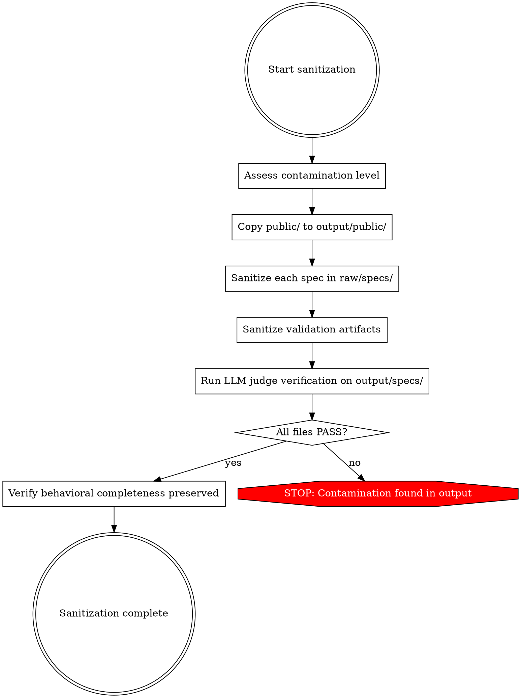

# Spec Sanitization

The sanitization pass turns raw analysis into specs an implementer can build from.

## Why This Exists

Analysts read source code, binaries, and runtime behavior. Even with good intentions, they leak implementation details:
- Function names from source (minified or not)
- Variable and class names from source
- Code structure ("function X calls Y which calls Z")
- Line numbers and file locations
- Raw file paths (`workspace/raw/source/analysis/chunk-42.md:67`)

**These have no place in the output specs.** Your job: READ each spec, UNDERSTAND the behavior, REWRITE without source references, TRANSFORM provenance citations.

## The Rewrite Rule

**You must not copy text from raw specs into output specs.** Not sentences, not paragraphs, not sections. Read the raw specs to understand the behavior, then write a fresh output spec from your understanding.

Why? Raw specs have source code identifiers woven into every sentence — minified names (`k0`, `Wq`, `z1`), internal function signatures (`Pn(a, b, c)`), and numeric implementation constants. Find-and-replace cannot catch them all; many internal identifiers read like plain English (`shouldRetryOnTimeout`, `evict_stale_connections`). A paraphrase that preserves the original's structure is still leaking the original's design. The only reliable approach is to never copy the text at all.

**Process per file:**
1. Read the raw spec end-to-end
2. Close it (do not refer back to it while writing)
3. Write the output spec from your understanding of the behavior
4. Use only: behavioral descriptions, user-facing identifiers (env vars, CLI flags, config keys, protocol fields), and numeric constants (timeouts, limits, sizes)
5. For any concept you could not translate into behavioral language — because you don't understand what it does — add: `[UNCERTAINTY: U-{DOMAIN}-{NNN}] {what the raw spec said, in behavioral terms as best you can} — behavioral purpose could not be determined from available analysis.`

Never preserve implementation jargon in slightly-reworded form. "`validator.Exists()` is called" rewritten as "the exists check runs" is still jargon — neither you nor the implementer knows what it means. Either translate it to behavior ("verifies the value exists in the constrained list") or flag it as uncertain.

If you find yourself copying a sentence and then editing out identifiers — STOP. You are doing it wrong. Rewrite the sentence from scratch.

**Caveat on the "close the file" step:** this is a behavioral instruction, not an enforced mechanism. Closing a file does not evict its content from the agent's context window; the raw text remains readable until the session ends. The Layer 6 second-pass review, which runs in a fresh session with access only to `workspace/output/`, is the practical check on verbatim leakage. Treat this process as discipline, not guarantee.

## The Core Principle

For every identifier in a spec, ask: **"Would an implementor encounter this exact string?"**

- `DATABASE_URL` → YES: it's in official docs, users type it. **KEEP.**
- `--format` → YES: it's in CLI help output. **KEEP.**
- `plugins` → YES: it's a config file key users write. **KEEP.**
- `Retry-After` → YES: it's an HTTP header defined by RFC 9110. **KEEP.**
- `routeRequest` → NO: this is an internal function name the developer chose. A different developer would name it differently. **GENERALIZE** to "the request routing operation."
- `ff_batch_commit_v2` → NO: this is an internal feature flag. No user ever types this. **GENERALIZE** to "the batch commit feature gate."
- `q9` → NO: this is a minified identifier with zero semantic content. **REMOVE.**

**No set of regex patterns will catch every internal identifier** because many look like legitimate English (e.g., `shouldRetryOnTimeout`, `evict_stale_connections`). You must read every line and apply the principle above.

## Implementation Detail vs. External Contract

Every identifier in a raw spec is either an **implementation detail** that must be abstracted or an **external contract** that must be preserved. This distinction is language-agnostic — it applies whether the source is TypeScript, Python, Rust, Go, Java, C++, or anything else.

### Implementation Details (MUST be abstracted)

These are choices the original developers made that a reimplementor would reasonably make differently. Abstract them to behavioral descriptions or remove them entirely.

**Internal names** — function, method, class, module, and variable names chosen by the original developers:
- Python: `_drain_write_queue()`, `RecordParser`, `should_retry_on_timeout`
- Go: `routeRequest()`, `evictStaleConnections`, `indexBuilder`
- Rust: `fn decode_packet()`, `struct ProtocolFrame`
- Java: `parseRecord()`, `validateRecord()`, `AbstractMessageProcessor`
- Any language: camelCase, snake_case, PascalCase internal identifiers

**Internal architecture** — how the codebase is organized into files, modules, packages, or namespaces:
- "defined in the auth handler module"
- "the session manager class calls the config loader"
- "located in `pkg/internal/transport/`"

**Framework-specific patterns** — references to libraries, state management, UI frameworks, or runtime internals:
- State stores: `useStore`, `getState()`, `@observable`, `store.get()`
- UI frameworks: `className=`, `styled.`, `@Component`, `#[derive(Template)]`
- ORM details: `Model.objects.filter()`, `has_many :sessions`, `@Entity`
- DI containers: `@Inject`, `container.resolve()`, `wire.Build()`

**Build and deployment artifacts** — paths, chunk IDs, minified identifiers, line numbers:
- Source paths: `src/`, `lib/`, `pkg/`, `internal/`, `dist/`, `target/`, `build/`
- Source filenames: `auth-handler.ts`, `record_parser.py`, `transport.go`, `Main.java`
- Minified/obfuscated identifiers: `Ab2`, `q9`, `a$b`, `__webpack_require__`
- Line numbers: "at line 234", ":45:", "L187"
- Module IDs: `MOD-023`, `chunk-NNNN`

**Internal feature gates** — feature flag names, experiment keys, and vendor-specific telemetry identifiers:
- `ff_batch_commit_v2`, `FF_NEW_INDEX_FORMAT`, `ff_dark_mode`
- `exp_async_cache_v2`, `exp_beta_user`
- Internal telemetry event names: `cli_parse_completed`, `worker_started`

**Code structure language** — descriptions that mirror source code control flow rather than observable behavior:
- "function X calls Y which calls Z"
- "the method iterates over the list and invokes the callback"
- "the constructor initializes three private fields"

### External Contracts (MUST be preserved)

These are constraints imposed by the outside world that a reimplementor cannot redesign. Preserve them exactly.

**User-facing identifiers** — anything a user types, reads in docs, or sees in output:
- Environment variables: `DATABASE_URL`, `DEBUG`, `RUST_LOG`
- CLI flags: `--format`, `--workers`, `-h`, `--verbose`
- Config file keys: `upstreams`, `log_level`, `timeout_seconds`
- User-visible error messages: "Error: Invalid API key"
- Deep link protocols: `vscode://`, `myapp://`

**Wire protocol fields** — names that appear in network traffic, file formats, or IPC contracts:
- API fields: `request_id`, `batch_size`, `stream`
- HTTP headers and status codes: `Authorization`, `200`, `401`
- Serialization keys in documented formats

**External system schemas** — databases, APIs, CLIs, and file formats the application does not own:
- Database: table names, column names, constraints, cardinalities
- Third-party APIs: endpoint paths, request/response field names, auth flows, rate limits
- CLI tools the app shells out to: command names, flag names, output formats, exit codes
- Imposed file formats: field names, encoding rules, version headers

**Published constants and standard names** — values defined by specifications or public documentation:
- Protocol versions, standard error codes, well-known ports
- Names from RFCs, language specs, or platform documentation

### The Test

For any identifier, ask: **"Could the reimplementor reasonably redesign this?"**

- **YES → implementation detail.** Abstract it to behavioral language or remove it.
- **NO → external contract.** Preserve it exactly.

### Gray Area Heuristics

When the test isn't clear-cut, apply these secondary questions:

1. **Would a user encounter it?** If the string appears in CLI help, config files, error messages, or API responses visible to users → external contract.
2. **Would two independent developers choose the same name?** If both would write `--verbose` → external contract. If one might write `parseArgs` and another `parse_arguments` → implementation detail.
3. **Is it imposed by a dependency the app doesn't control?** Database column names in a shared schema, field names in a third-party API → external contract.
4. **Does the spec make sense without it?** If removing the identifier and describing the behavior instead loses no information → implementation detail. If the exact string is needed for interoperability → external contract.

### The Descriptive-Name Trap (CRITICAL)

Internal identifiers like `routeRequest`, `should_retry_on_timeout`, `FlushConnectionPool`, `strict_schema_validation` look legitimate because they're descriptive English words in some casing convention. But they are implementation details — an implementor would choose different names for the same concepts. This applies equally to camelCase, snake_case, PascalCase, and kebab-case identifiers.

**The test**: Does this exact string appear in official documentation, a config file schema, a CLI `--help` output, or an API response? If not, it's an internal identifier and MUST be generalized, even if it's descriptive.

Examples that STAY (user-facing): `upstreams`, `rate_limit`, `--workers`, `DATABASE_URL`
Examples that GO (internal): `routeRequest` → "the request routing operation", `should_retry_on_timeout` → "the retry-on-timeout check", `FlushConnectionPool` → "the connection pool flush"

### External System Exception

When the target depends on **external systems it does not own** — shared databases, third-party APIs, CLI tools it shells out to, imposed file formats — the details of those systems are behavioral constraints, NOT implementation details. The contract-extractor should have produced dedicated contract files in `workspace/raw/specs/contracts/` for each external system.

**Do NOT strip from external system contracts:**
- Database: table names, column names, cardinalities, naming collisions, derivation relationships, query-correctness constraints
- APIs: endpoint paths, request/response field names, pagination schemes, auth flows, rate limits
- CLI tools: command names, flag names, output formats the app parses, exit codes the app checks
- File formats: field names, encoding rules, version headers, structural layout

External contract files flow to implementation: `workspace/raw/specs/contracts/{database,api-*,cli-*,format-*}.md` → `workspace/output/specs/contracts/`.

## Rewrite Patterns

Concrete before/after examples for the sanitizer to follow.

### RP-1: Minified Identifiers
**Before:** `The Ab2() function is the application entry point`
**After:** `The application entry point is invoked on startup`

### RP-2: Module Names in Headers
**Before:** `## Part 3: RecordParser Module`
**After:** `## Session Lifecycle Management`

### RP-3: Module Counts
**Before:** `The application consists of 52 modules organized into 8 domains`
**After:** (remove entirely — this is analysis organizational metadata)

### RP-4: Cross-Module Dependency Tables
**Before:**
```
| Module | Depends On |
|--------|-----------|
| RecordParser | IndexBuilder, ConfigLoader |
```
**After:** (remove entirely — replaced by behavioral integration requirements in BIR format)

### RP-5: IPC Channel Names
**Before:** `Sends a message on the task-completed IPC channel`
**After:** `Notifies listeners when the order status changes via internal messaging`

### RP-6: Store Property Names
**Before:** `Reads store.activeDocument.content to get the document body`
**After:** `Retrieves the current document body from application state`

### RP-7: Feature Flag Names
**Before:** `When FF_NEW_INDEX_FORMAT is enabled, the feature activates`
**After:** `When the batch commit feature gate is active, the feature activates`

### RP-8: Internal Filenames
**Before:** `Defined in the auth handler source file alongside the token refresh logic`
**After:** `The authentication handling component also manages token refresh`

### RP-9: Line Number References
**Before:** `The validation logic at line 234 checks for...`
**After:** `The validation logic checks for...`

### RP-10: CSS Classes
**Before:** `Applies the .toolbar__button--active CSS class`
**After:** `Applies active styling to the toolbar button`

### RP-11: Database Schemas (App-Owned Only)
**Before:** `Stores data in the sessions table with columns: id, owner, started_at, state`
**After:** `Persists session data including identifier, owner, start time, and state`

**Exception:** If the system is external (documented in `contracts/database.md`, `contracts/api-*.md`, `contracts/cli-*.md`, or `contracts/format-*.md`), KEEP details as-is — they are external constraints, not implementation choices. This applies to database schemas, API field names, CLI flags, file format fields, etc.

### RP-12: Code Structure Language
**Before:** `The parseRecord() function calls validateRecord() which calls refreshToken() on failure`
**After:** `Authentication validates the current token and refreshes it on failure`

## Verification

After sanitization, every file in `workspace/output/` must be reviewed. **External contract files** (`database.md`, `api-*.md`, `cli-*.md`, `format-*.md`) are exempt — they document systems the app does not own.

### LLM Judge Verification

Review each file in `workspace/output/specs/` (excluding external contract files) and produce a structured verdict. The review is semantic — you are reading for meaning, not running pattern matches.

**For each file, check these categories:**

**Content contamination:**
- Minified or obfuscated identifiers (short nonsense tokens like `Ab2`, `a$b`, `Qz`)
- Line number references ("at line 234", ":45:")
- Source file paths or source directory structures (`src/`, `lib/`, `pkg/`, `internal/`, `dist/`, `target/`)
- Source filenames with implementation-language extensions (`auth-handler.ts`, `record_parser.py`, `transport.go`, `Main.java`)
- Internal function, method, class, or variable names (in any casing convention)
- Framework-specific patterns (state management hooks, ORM calls, DI annotations, UI component internals)
- Internal IPC channel names or event bus topics
- Feature flag names or vendor-specific telemetry identifiers
- Code structure language ("function X calls Y", "the constructor initializes")
- App-owned database schemas (DDL, migration references) — but NOT external database contracts

**Structural contamination:**
- `Part N:` header prefixes from analysis's module organization
- Module counts ("52 modules", "8 components")
- Cross-module or inter-module section headers
- Module IDs (`MOD-NNN`)
- Raw paths (`workspace/raw/`)
- Domain-to-module mapping language ("from module", "source module", "originally in", "derived from module")

**Verdict format per file:**

```
FILE: {path}
VERDICT: PASS | FAIL
ISSUES:
  - LINE {N}: {quoted text} — {category}: {why this is contamination}
  - LINE {N}: {quoted text} — {category}: {why this is contamination}
```

A file with zero issues gets `VERDICT: PASS` and no `ISSUES` block. A file with any issue gets `VERDICT: FAIL` with line-level citations.

**Hard rule: ALL files in `workspace/output/specs/` must receive PASS.** Any FAIL verdict blocks the pipeline. Fix the contamination and re-verify until all files pass.

## Structural Reorganization Rules

When transforming `workspace/raw/specs/modules/` into `workspace/output/specs/domains/`:

### File Naming
- **Raw:** Named by module (`record-parser.md`, `auth-handler.md`)
- **Output:** Named by behavioral domain (`session-lifecycle.md`, `authentication.md`)
- Choose domain names that describe observable behavior, not internal architecture

### Header Transformation
- **Remove:** `Part N:` prefixes from all headers
- **Remove:** Module names from headers (replace with behavioral descriptions)
- **Remove:** `## Cross-Module Dependencies` sections entirely
- **Remove:** `## Module Boundary` sections entirely
- **Remove:** `## Inter-Module Interface` sections entirely

### Module Count Removal
- **Remove:** Any sentence stating how many modules, components, or chunks exist
- **Remove:** Any "N of M modules" progress indicators

### Module ID Removal
- **Remove:** All `MOD-NNN` identifiers
- **Remove:** Module ID reference tables

### Prerequisites Transformation
- **Remove:** `From module:` fields in Prerequisites sections
- **Keep:** The behavioral need and failure behavior
- **Before:** `Needs: session token. From module: IndexBuilder. Failure: returns 401`
- **After:** `Needs: session token. Failure: returns 401`

### Domain Merging
- Related modules may be merged into a single domain file
- When merging, ensure SPEC IDs remain unique
- Preserve all behavioral content from every merged module

## Workspace Structure

```
workspace/
├── public/                    # Public origin - pass through directly
│   ├── docs/                  # doc-researcher output
│   └── ecosystem/             # sdk-analyzer output
├── raw/                   # RAW - your input
│   └── specs/
│       ├── modules/           # Module-organized specs (analysis structure)
│       ├── journeys/
│       ├── contracts/
│       │   ├── cli.md                      # Flows to implementation
│       │   ├── environment.md              # Flows to implementation
│       │   ├── configuration.md            # Flows to implementation
│       │   ├── inter-module.md             # ⛔ Stays in analysis
│       │   └── behavioral-integration.md   # Flows to implementation
│       ├── test-vectors/
│       └── validation/
│           └── acceptance-criteria/
└── output/                     # Sanitized specs for the implementer
    ├── public/                # Copied from workspace/public/ directly
    ├── specs/
    │   ├── domains/           # Behavioral specs merged by domain (NOT original modules)
    │   ├── journeys/
    │   └── contracts/         # External contracts + behavioral integration requirements
    ├── test-vectors/          # Output test vectors (sibling of specs/)
    └── validation/            # Output acceptance criteria (sibling of specs/)
        └── acceptance-criteria/
```

## The Approach

**Semantic judgment, not pattern matching.**

Pattern-matching tools can catch obvious contamination like `Ab2` or `src/cli/main`, but they miss descriptive internal identifiers ("calls the parser function", "the auth handler validates") and produce false positives on legitimate terms. The sanitizer must READ each spec, UNDERSTAND the behavior, and REWRITE it in pure behavioral terms — applying the implementation-detail-vs-external-contract test to every identifier.

## The Transformation

BEFORE (what raw analysis looks like):
```markdown
### Entry Point: main()
Location: src/cli/main:45
Function calls parseArgs() for arg parsing, then detectMode().
Variable config.recordId = generateRecordId() creates session ID.
<!-- cite: source=source-code, ref=workspace/raw/source/analysis/chunk-0003.md:45, confidence=confirmed, agent=chunk-analyzer -->
```

AFTER (what spec-sanitizer produces):
```markdown
### Application Entry

**Trigger:** Command-line invocation

**Behavior:**
1. Parse command-line arguments into structured format
2. Detect execution mode from first positional argument
3. Generate session ID (UUID v4, once per process)
4. Route to mode-specific handler

**Session ID:**
- Format: UUID v4
- Lifecycle: Generated at startup, immutable
- Scope: Process-global singleton
<!-- cite: source=source-code, confidence=confirmed, agent=chunk-analyzer -->
```

Same information. Zero source references. Provenance preserved (minus raw paths).

## Provenance Citation Transformation

During sanitization, provenance citations are transformed based on their source type.

### Raw Citations (strip ref path)

Sources: `source=source-code`, `source=runtime-observation`, `source=binary-analysis`

These contain file paths into `workspace/raw/` — implementation details that must not reach the implementer.

**Before:**
```markdown
<!-- cite: source=source-code, ref=workspace/raw/source/analysis/chunk-0019.md:77, confidence=confirmed, agent=deep-dive-analyzer, corroborated_by=runtime-observation -->
```

**After:**
```markdown
<!-- cite: source=source-code, confidence=confirmed, agent=deep-dive-analyzer, corroborated_by=runtime-observation -->
```

**Rule:** Remove the `ref` field entirely. Preserve `source`, `confidence`, `agent`, and `corroborated_by`.

### Public Citations (pass through)

Sources: `source=official-docs`, `source=sdk-analysis`, `source=public-api`

These contain references to public URLs or `workspace/public/` paths — no implementation details.

**Before:**
```markdown
<!-- cite: source=official-docs, ref=workspace/public/docs/claims/claims-by-topic.md:89, confidence=confirmed, agent=doc-researcher -->
```

**After (unchanged):**
```markdown
<!-- cite: source=official-docs, ref=workspace/public/docs/claims/claims-by-topic.md:89, confidence=confirmed, agent=doc-researcher -->
```

**Rule:** Pass through without modification.

## Public/Raw/Output Separation

- **`workspace/public/`** content is NOT raw. It comes from official documentation, SDK analysis, and public APIs. Copy directly to `workspace/output/public/` without modification.
- **`workspace/raw/specs/`** content IS raw. It was produced by agents that read source code, binaries, or runtime internals. Every file must be sanitized before entering `workspace/output/specs/`.
- **`workspace/output/`** is the output. The implementer reads ONLY from here.

## Validation Artifact Handling

Acceptance criteria and test vectors also need sanitization:

1. **Preserve structure.** Given/When/Then format and AC IDs (`AC-{MODULE}-{NNN}`) must survive sanitization intact.
2. **Transform citations.** Apply the same raw/public citation rules as for spec files.
3. **Preserve priority.** P0/P1/P2 labels must survive.
4. **Preserve traceability.** Links between ACs and module specs must survive (update paths from `workspace/raw/specs/` to relative references within `workspace/output/specs/`).

## Process



## Running Sanitization

```
/sanitize workspace/
```

This:
1. Reads raw specs in `workspace/raw/specs/` to assess contamination level
2. Copies `workspace/public/` to `workspace/output/public/`
3. Invokes spec-sanitizer on each raw specs (parallel when possible)
4. Sanitizes validation artifacts
5. Writes clean versions to `workspace/output/specs/`
6. Runs LLM judge verification on all output
7. Produces sanitization report at `workspace/output/sanitization-report.md`

**The sanitization report lives in `output/` — it is an implementer-facing artifact.** It must not contain source module names, raw file paths, source-to-domain mappings, or any reference to the original's internal structure. Include only: file inventory (counts, domain names, SPEC ID prefixes), provenance format explanation, SPEC ID coverage, directory structure, and implementer guidance.

**Why this matters:** the report is read alongside the output specs by the team building the reimplementation. Its job is to help them navigate the output, not to describe what the original looked like. References to the original's module names or architectural decomposition anchor the reimplementation to the original's design — the implementer should be free to choose their own.

## After Sanitization

1. All files must receive PASS from LLM judge verification
2. Completeness audit must pass
3. Provenance citations transformed (raw refs stripped, public refs preserved)
4. Tell user: "end this session"
5. The implementer consumes `workspace/output/`; the raw analysis stays in `workspace/raw/`
