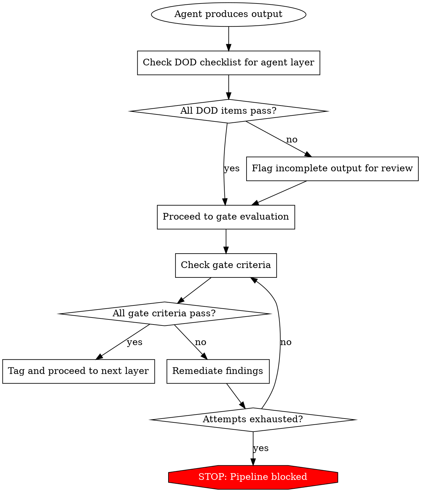

# Validation Methodology

Specifications are claims. Claims require proof. This skill defines how the pipeline transforms claims into proof.

## Acceptance Criteria Format

Every module spec receives formal acceptance criteria during Layer 4. Criteria use Given/When/Then format:

```markdown
### AC-CONFIG-001: Config File Load
**Given** a valid config file exists at the documented path
**When** the application starts
**Then**
- The application reads every declared key from the file
- Unknown keys are logged as warnings, not errors
- Missing optional keys fall back to documented defaults

**Source:** official-docs, source-code, runtime-observation
**Confidence:** confirmed
**Priority:** P0
**Verification:** Automated test
```

### ID Format: `AC-{DOMAIN}-{NNN}`

- `{DOMAIN}`: Short uppercase token for the behavioral domain (matches the spec's domain tokens — e.g., `CLI`, `CONFIG`, `API`, `AUDIO`, `PARSER`)
- `{NNN}`: Zero-padded three-digit sequence (001, 002, ...)
- IDs are immutable — retired, never reused

### Field Rules

**Given/When/Then:**
- Use observable terms, not implementation details
- "Given a valid config file exists" not "Given the ConfigLoader is initialized"
- Each Then outcome must be verifiable without implementation internals
- Describe observable state, not UI mechanisms — "system rejects malformed input" not "error banner is visible." Criteria must be testable across any frontend platform.

**Priority:**
- P0: Must pass. Blocks pipeline. Implementation cannot ship without satisfying.
- P1: Should pass. Reported as warnings. Divergence requires documented rationale.
- P2: Nice to pass. Advisory.

**Verification:** One of the 5 methods below.

### Output Location

```
workspace/raw/specs/validation/acceptance-criteria/
    _index.md                   # Summary with counts and links
    config-loading.md           # AC-CONFIG-001 through AC-CONFIG-NNN
    cli-flags.md                # AC-CLI-001 through ...
    ...
```

## Verification Methods

Every acceptance criterion specifies how the implementer will verify it:

| Method | ID | When to Use |
|--------|-----|------------|
| **Automated Test** | `automated-test` | Precondition, action, and outcome are all programmable |
| **Manual Inspection** | `manual-inspection` | Outcome requires human judgment (UX quality, clarity) |
| **Runtime Observation** | `runtime-observation` | Behavior involves timing, async events, sustained observation |
| **Protocol Capture** | `protocol-capture` | Wire format, headers, API protocol compliance |
| **Code Review** | `code-review` | Architectural or quality criteria not directly testable at runtime |

## Quality Gate Criteria



### Gate 1 (spec-verifier, after Layer 3)

- [ ] Zero contradictions between specs
- [ ] All crypto claims and constants verified against source (not assumed)
- [ ] Every behavioral claim has a provenance citation
- [ ] Assumed claims are a small minority — most claims have direct evidence. A module dominated by assumptions needs more intelligence gathering before proceeding
- [ ] All modules have specs
- [ ] Zero uncited behavioral claims in output candidates

### Gate 2 (spec-reviewer, after Layer 4)

- [ ] Zero implementation leakage in specs
- [ ] Zero P0 completeness gaps
- [ ] All ACs have IDs and are linked to specs
- [ ] P0 ACs have test vectors
- [ ] All ACs are testable
- [ ] All modules have ACs
- [ ] Gap report reviewed
- [ ] Zero contamination in output

### Implementation Leakage Definition

"Zero implementation leakage" means every identifier, name, and reference in the output specs passes the reimplementor test: **"Could the reimplementor reasonably redesign this?"** If yes, it's an implementation detail that should have been abstracted. If no, it's an external contract that belongs in the spec.

**Implementation details (must not appear in output specs):**

| Category | What to look for |
|----------|-----------------|
| Internal names | Variable names, function signatures, class names, method names from the source — any language |
| Internal architecture | Module boundaries, file organization, inheritance hierarchies described in prose |
| Framework-specific patterns | State management internals, ORM patterns, framework lifecycle hooks by internal name |
| Build/deployment artifacts | Source file paths, line numbers, chunk IDs, minified identifiers |
| Code structure language | "calls X then Y", "inherits from Z", "implements interface W" |
| Internal feature gates | Feature flags, A/B test names, internal telemetry event names |

**External contracts (must be preserved):**

| Category | What to look for |
|----------|-----------------|
| User-facing identifiers | CLI flags, env vars, config keys, config file paths |
| Wire protocol fields | API endpoints, request/response field names, header names |
| External system schemas | Database tables/columns (shared), third-party API contracts, external CLI tool flags |
| Published constants | Error message text, exit codes, timeout values |
| Standard names | Protocol names (OAuth, JWT), encoding names (UTF-8), algorithm names (SHA-256) |

See the **spec-sanitization skill** for the full semantic classification (Implementation Detail vs. External Contract) and rewrite guidance.

## Definition of Done Checklists

### Layer 1 Agent DOD

- [ ] All output files at correct workspace directory for source origin
- [ ] All behavioral claims have `<!-- cite: -->` provenance citations
- [ ] Output follows standard format for this agent's intelligence source
- [ ] Session JSONL captured to `workspace/provenance/sessions/`
- [ ] No raw source code excerpts longer than one line

### Layer 2 Agent DOD

- [ ] Feature inventory covers all sources consulted
- [ ] Architecture document covers all identified components
- [ ] API surface covers all discovered interfaces
- [ ] Module map is complete (name, description, priority, dependencies)
- [ ] No known gaps (or gaps explicitly documented with `[GAP]` marker)
- [ ] Cross-references to Layer 1 artifacts are valid
- [ ] Session JSONL captured

### Layer 3 Agent DOD

- [ ] Spec covers: entry points, decision trees, state machines, error handling, edge cases
- [ ] Zero implementation details (no function names, variable names, line numbers)
- [ ] All behavioral claims have provenance citations
- [ ] Assumed claims are a small minority; most claims have direct evidence
- [ ] Self-assessment verification checklist completed at end of spec
- [ ] Session JSONL captured

### Layer 3 Spec Self-Assessment Checklist

Every Layer 3 spec file ends with:

```markdown
## Verification Checklist
- [ ] All entry points documented
- [ ] All decision trees traced (every branch, including error paths)
- [ ] All state machines documented (states, transitions, triggers)
- [ ] All error conditions listed with observable symptoms
- [ ] All edge cases identified and documented
- [ ] Zero source code identifiers in this document
- [ ] All behavioral claims have provenance citations
- [ ] Assumed claims are a small minority; most claims have direct evidence
- [ ] No sections are empty or placeholder-only
- [ ] Cross-references to other specs are valid
```

### Layer 4 Agent DOD

- [ ] Test vectors have concrete input/output pairs (not abstract descriptions)
- [ ] Runnable test harness scripts produced where feasible
- [ ] ACs have `AC-{MODULE}-{NNN}` IDs and Given/When/Then structure
- [ ] Every AC has a verification method assigned
- [ ] Every AC has provenance links
- [ ] Every P0 module has test vectors and ACs
- [ ] Session JSONL captured

### Gate Agent DOD

- [ ] Report written to correct path
- [ ] Clear PASS or FAIL status in summary
- [ ] Every failing criterion individually documented
- [ ] Quantitative summary (claims checked, contradictions, gaps, coverage %)
- [ ] Session JSONL captured

### Layer 5 Agent DOD

- [ ] All raw specs have clean counterparts in `workspace/output/`
- [ ] Zero source code identifiers in the output files
- [ ] All 17 contamination detection patterns return 0 on `workspace/output/` (see Implementation Leakage Definition)
- [ ] All behavioral information preserved (feature count, AC count identical)
- [ ] Provenance metadata preserved (confidence, source types present)
- [ ] Validation artifacts sanitized and copied to the output
- [ ] Session JSONL captured

### Layer 6 Agent DOD (Second-Pass Review)

- [ ] All 8 structural leakage checks executed
- [ ] All 12 content contamination checks executed
- [ ] All 9 behavioral completeness checks executed
- [ ] Detailed audit reports written to `workspace/raw/audit/`
- [ ] Clean audit summaries written to `workspace/output/audit/` (outcomes only)
- [ ] Overall PASS determination (or FAIL after 3 remediation attempts)
- [ ] `review-complete` git tag applied
- [ ] Session JSONL captured

## Confidence Principles

The goal is specs you'd trust enough to implement from. Apply judgment, not arithmetic:

- **Every claim needs provenance.** An uncited behavioral claim is an unverified claim. Zero uncited claims in output — this is a hard gate.
- **Assumed claims are a warning sign.** A few assumptions are inevitable (indirect reasoning, naming conventions). But a module where most claims are assumed hasn't been analyzed — it's been guessed at. Gather more intelligence.
- **Confirmed claims build trust.** Claims corroborated by multiple independent sources (source + runtime, source + docs) are the foundation. Critical modules should be dominated by confirmed claims.
- **P0 behaviors need test vectors.** Every P0 acceptance criterion must have a concrete test vector. No exceptions.

## When Confidence Is Low

- **Too many assumptions:** Dispatch additional intelligence-gathering agents. Try a different mode (runtime observation often confirms what source analysis can only infer).
- **Claims lack corroboration:** Check if other modes have evidence. A claim from source alone is `inferred`; the same claim confirmed by runtime observation becomes `confirmed`.
- **Uncited claims in output/:** Hard failure — pipeline blocked until resolved. Trace each uncited claim back to its originating agent and require a citation.
